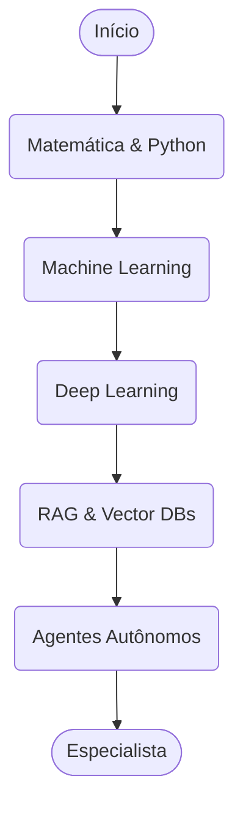

# 🤖 Trilha de Inteligência Artificial: Ensinando as Máquinas a Pensar

> **Edição 2026:** Atualizado com a nova era de Sistemas de IA Compostos e Agentes Autônomos.

Em 2026, a Inteligência Artificial não é apenas sobre usar APIs. A especialização exige treinar, alinhar e orquestrar modelos open-source poderosos para atuar em sistemas complexos e resolver problemas de alto impacto em larga escala. Aprenda a ensinar computadores a reconhecer padrões sutis e tomar decisões em ambientes altamente dinâmicos com Agentes Autônomos.

## 🐣 Nível Iniciante (Júnior): A Base Científica e Sintática

Nesta fase, você aprende a fundação de como os dados viram inteligência estruturada. Não pule a matemática, ou os modelos serão caixas pretas incontroláveis para você.

- **Matemática e Estatística:** Álgebra Linear (vetores/matrizes), Cálculo (gradientes e derivadas parciais), Probabilidade (teorema de Bayes) e Estatística Básica.
- **Python para Dados:** Domínio fluente em ecossistemas de dados como NumPy (álgebra), pandas (limpeza/tabular), matplotlib/seaborn (visualização de padrões) e scikit-learn.
- **Machine Learning (ML Clássico):** Compreensão sólida de Regressão Linear/Logística, Classificação, Clustering (K-Means), Árvores de Decisão, Random Forest e Support Vector Machines (SVM). Como mensurar erros corporativos (RMSE, F1-Score).
- **GenAI Básica e Interação Científica:** Como integrar e usar as APIs da OpenAI/Anthropic em código, e técnicas fundacionais de Prompt Engineering científico (Zero-Shot, Few-Shot, Chain of Thought - CoT) para moldar e forçar o determinismo nas respostas dos modelos textuais corporativos.

## 🚀 Nível Intermediário (Pleno): Deep Learning & O Ecossistema RAG

Aqui você constrói aplicações de Inteligência Artificial que aprendem contextos invisíveis e utilizam dados corporativos privados para alucinar menos.

- **Deep Learning (Redes Neurais):** O coração da Inteligência de 2026. Dominar PyTorch (o padrão ouro da indústria). Entender a arquitetura de Funções de Ativação (ReLU, Sigmoid), Backpropagation, Gradiente Descendente e as camadas ocultas (Hidden Layers).
- **Processamento de Linguagem Natural (NLP) e Visão Computacional:** Teoria de Embeddings Semânticos (Word2Vec) para transformar palavras em números posicionais, Redes Neurais Convolucionais (CNNs) para reconhecimento de imagens, as arquiteturas Transformers modernas, e Modelos Multimodais (VLM) capazes de cruzar e inferir lógicas a partir da soma de textos e imagens.
- **Engenharia GenAI Corporativa & RAG (Retrieval-Augmented Generation):** Arquitetar o RAG corporativo básico para sanar a falha de modelos desatualizados. Vector Databases (Pinecone, Milvus, Weaviate, `pgvector`), manipulação dos motores de busca (Cosine Similarity), e estratégias cruciais de Chunking para dados muito longos (Text Splitters).
- **MLOps Fundacional:** Experiment Tracking com MLflow ou Weights & Biases (W&B) para catalogar, monitorar o treinamento, e Versionamento de Dados/Modelos na pipeline de CI/CD (Model Registry) assegurando a reprodutibilidade.

## 🧙‍♂️ Nível Avançado (Sênior / Especialista): A Nova Fronteira

Sêniores projetam agentes corporativos cognitivos e reduzem dependência (e custo financeiro massivo) criando redes autossustentáveis. Em 2026, a divisão técnica acontece em dois grandes pilares:

### 🔬 Caminho A: AI Research & Core ML (Laboratório e Pesquisa Profunda)

- **Fine-Tuning & Alinhamento Semântico Corporativo:** Uso intensivo de PEFT (Parameter-Efficient Fine-Tuning) através de metodologias cruciais de mercado como LoRA e QLoRA. Treinar e alinhar modelos compactos (SLMs) como Phi-3 ou versões menores do Llama 3 e Mistral a partir de computação escassa e hardwares limitados no ambiente corporativo (DPO, RLHF - Reinforcement Learning from Human Feedback).
- **Novas Arquiteturas Físicas de Memória:** O domínio e arquitetura estrutural de substitutos para o gargalo computacional da arquitetura Attention, dominando implementações focadas como os Modelos State Space Mamba e as arquiteturas MoE (Mixture of Experts) focadas em alta performance através da ativação esparsa de parâmetros e eficiência computacional.

### 🛠️ Caminho B: AI Engineering & Orquestração Composta (Produção e Negócios)

- **Advanced RAG e Escalabilidade:** Criação do GraphRAG corporativo conectando RAG tradicional às imensas redes de Knowledge Graphs locais (Neo4j). Implementar sistemas de Hybrid Search absolutos na malha em conjunto com o poderoso Reranking semântico (Cohere Rerank), finalizando com a implementação analítica de Self-RAG.
- **Ecossistema de Agentes Autônomos (Compound AI):** Substituição brutal do fluxo síncrono da API pelo planejamento autônomo e assíncrono das LLMs. Frameworks complexos de loop cognitivo (LangGraph, CrewAI, AutoGen). DSPy (programar e compilar as heurísticas ao invés de codificar strings de prompts frágeis e longos), orquestração de Agentes usando ferramentas da internet/terminal da máquina (Tool Use) integrado ao MCP (Model Context Protocol).
- **LLM Ops Corporativo:** Total Observabilidade do RAG via plataformas maduras (LangSmith, Langfuse). Uso analítico intensivo de Evals e IA-as-a-Judge para automatizar testes (Ragas). Model Serving corporativo seguro de SLMs on-premise com vLLM e Ollama em clusters Kubernetes, para privacidade extrema na arquitetura Local First AI corporativa sem dependência externa em dados Sigilosos bancários (Zero-Trust Local).

## 🛡️ IA Responsável e Alinhamento Ético Corporativo (Obrigatório em 2026)

- **Segurança Cognitiva:** Engenharia intensa de proteção massiva de agentes contra as temidas falhas de Prompt Injection corporativo, corrupção da base analítica e envenenamento oculto (Data Poisoning).
- **Ética Sistêmica:** Implementação rigorosa do fator humano na matriz, evitando Fairness e algoritmia discriminatória, atrelado a frameworks globais de Transparência analítica (NeMo Guardrails, Llama Guard corporativos para proteger interfaces da IA Gerativa da alucinação sistêmica violenta).

## 🏆 Desafios Práticos Laboratoriais

- **Júnior:** Criação absoluta e independente de um Dashboard analítico e funcional no Streamlit Python manipulando e avaliando visualmente dados abertos de saúde pública do mercado governamental, identificando falhas estatísticas sem uso de inteligência geradora no processo.
- **Pleno:** Crie um aplicativo avançado completo que avalia e reconhece diferentes espectros em imagens médicas através do uso intensivo das matrizes do PyTorch servidas por uma API ultrarrápida do framework Python FastAPI orquestrada para ambiente isolado na nuvem.
- **Sênior:** Crie e gerencie na AWS uma Arquitetura de RAG Avançada baseada no modelo relacional Open-Source (Ollama Local) orquestrado rigorosamente via o poderoso workflow de Agentes e grafos do LangGraph, para validar e solucionar incidentes no código legado sem assistência da equipe, documentando todo o sistema local.

## 📚 Materiais de Estudo Recomendados do Arquiteto

**Para o Júnior (A Base Científica e Algorítmica):**

- **[DeepLearning.AI (Andrew Ng)](https://www.deeplearning.ai/):** A principal universidade aberta em inteligência do planeta. Cursos indispensáveis como AI for Everyone para moldar mentes e a fabulosa ML Specialization baseada em Python.
- **[Fast.ai](https://course.fast.ai/):** Metodologia incrivelmente focada em top-down, que permite programadores iniciantes gerarem incríveis visualizações com Redes Neurais nas suas primeiras semanas antes da matemática pesada exaurir seus cérebros estatísticos.

**Para o Pleno (Machine Learning, RAG e Observabilidade Cognitiva):**

- **[Hugging Face NLP Courses](https://huggingface.co/learn):** Foco maciço em compreender todo o motor prático e aplicabilidade extrema das arquiteturas Transformers, Processamento de Textos Naturais Corporativos e as métricas absolutas em Reinforcement Learning e otimização RLHF na nuvem.
- **[Cohere LLM University](https://llm.university/):** Todo o aprimoramento em matemática de álgebra posicional da teoria gigantesca de embeddings e sua aplicabilidade definitiva em arquiteturas corporativas de RAG complexo com busca híbrida de extrema conversão local e empresarial na indústria mundial de T.I.

**Para o Sênior/Especialista (Modelos, Agentes Autônomos e Escalabilidade Pura):**

- **[LangChain Academy](https://academy.langchain.com/):** Masterclass absoluta, pesada e atualizada na indústria global focado imensamente em arquitetar complexos ecossistemas na matriz baseada em grafos do LangGraph com os autônomos e maravilhosos Agentes cognitivos.
- **[Anthropic Prompt Engineering Tutorial](https://github.com/anthropics/courses):** O principal curso corporativo atual focado nas diretrizes massivas de heurísticas sintáticas avançadas (Zero-Shot avançado, Cadeias Dinâmicas de Raciocínio, Avaliações Massivas Corporativas baseadas em Nuvem e Agentes Avaliadores independentes).
- **Livros Obrigatórios de Cabeceira do Mestre:** "Designing Machine Learning Systems" pela fenomenal engenheira Chip Huyen aborda a construção sustentável da engenharia local corporativa na produção da indústria moderna de forma holística em 2026. E "The Little Book of Deep Learning" (François Fleuret) entregando em páginas reduzidas na tela todo contexto matemático exigido do especialista sem peso gigante acadêmico exaustivo do mercado comum mundial.

## ↩️ Navegação

- [**Voltar para o Início**](../../index.md)
- [**Ver Conselhos de Carreira**](../../advices.md)
