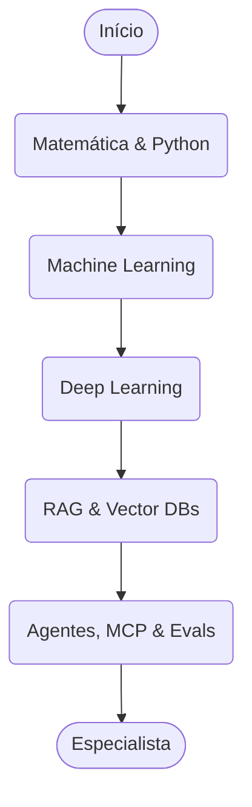

# 🤖 Trilha de Inteligência Artificial: Do Modelo ao Agente em Produção

> **Edição 2026:** Atualizada para sistemas de IA compostos, agentes, MCP/A2A, evals e conformidade (EU AI Act).


```mermaid
flowchart TD
    Start([Início]) --> Math(Matemática & Python)
    Math --> ML(Machine Learning)
    ML --> DL(Deep Learning)
    DL --> RAG(RAG & Vector DBs)
    RAG --> Agents(Agentes, MCP & Evals)
    Agents --> Spec([Especialista])
```

Em 2026, usar uma API de LLM é o ponto de partida, não a especialização. O diferencial está em construir sistemas confiáveis: dados bem preparados, contexto bem montado, agentes com ferramentas controladas, avaliação contínua, custo e latência sob controle, e conformidade com a regulação.

## 🐣 Nível Iniciante (Júnior): A Base Científica e Sintática

Aqui você aprende como dados viram modelos. Não pule a matemática: ela é o que permite depurar um modelo em vez de tratá-lo como caixa-preta.

- **Matemática e Estatística:** Álgebra linear (vetores/matrizes), cálculo (gradientes, derivadas parciais), probabilidade (Bayes) e estatística básica.
- **Python para Dados:** NumPy, pandas (ou Polars para dados maiores), matplotlib/seaborn, scikit-learn e Jupyter. Gerencie ambientes com `uv`.
- **Machine Learning clássico:** Regressão linear/logística, árvores, Random Forest, gradient boosting (XGBoost, LightGBM), clustering (K-Means). Métricas: RMSE, F1, AUC, e por que separar treino, validação e teste (evite vazamento de dados).
- **Uso de LLMs via API:** Chamadas às APIs de OpenAI, Anthropic e Google Gemini, saídas estruturadas (JSON Schema), tool calling, streaming e controle de custo por tokens. Prompting básico: instruções claras, exemplos (few-shot) e formato de saída. Modelos de raciocínio (reasoning) já vêm com cadeia de pensamento interna; peça o resultado, não "pense passo a passo".
- **Assistentes de código:** Aprender com Claude Code, GitHub Copilot ou Cursor, sempre lendo e testando o que o assistente gera.

## 🚀 Nível Intermediário (Pleno): Deep Learning, RAG e Context Engineering

Aqui você constrói aplicações que usam dados privados da empresa e reduzem alucinações com fontes verificáveis.

- **Deep Learning:** PyTorch como padrão de mercado. Backpropagation, otimizadores (AdamW), regularização, treino em GPU e noções de precisão mista.
- **NLP, Visão e Multimodal:** Embeddings, tokenização, arquitetura Transformer, CNNs/ViTs e modelos multimodais (texto, imagem, áudio, documentos). Hugging Face Transformers para treinar e servir.
- **RAG (Retrieval-Augmented Generation):** Ingestão, chunking, embeddings, busca vetorial e reranking. Bancos: `pgvector`, Qdrant, Milvus, Weaviate, Pinecone. Avalie a recuperação (recall, MRR) separadamente da geração.
- **Context Engineering:** Decidir o que entra na janela de contexto a cada passo: instruções, memória, resultados de ferramentas e documentos. Técnicas: prompt caching, compactação de histórico, recuperação sob demanda e isolamento de contexto entre subagentes.
- **MLOps fundacional:** Tracking com MLflow ou Weights & Biases, versionamento de dados e modelos (DVC, model registry), CI/CD para pipelines de ML e monitoramento de drift.
- **Custo e sustentabilidade (Green AI):** Escolher o menor modelo que resolve a tarefa, usar cache e batch, quantização e medir consumo (ex.: CodeCarbon).

## 🧙‍♂️ Nível Avançado (Sênior / Especialista): Pesquisa ou Engenharia

Em 2026 a divisão técnica acontece em dois caminhos.

### 🔬 Caminho A: AI Research & Core ML

- **Fine-tuning e alinhamento:** PEFT com LoRA/QLoRA, SFT, DPO e aprendizado por reforço com recompensas verificáveis (RLVR/GRPO) para raciocínio. Bibliotecas: Hugging Face TRL, PEFT e Unsloth. Use modelos de pesos abertos de porte pequeno e médio (famílias Llama, Qwen, Gemma, Mistral, DeepSeek, gpt-oss) conforme a licença.
- **Arquiteturas:** Mixture of Experts (MoE), atenção eficiente (FlashAttention, GQA, KV cache), modelos de espaço de estados e híbridos (Mamba), decodificação especulativa e destilação.
- **Avaliação de pesquisa:** Benchmarks com cuidado contra contaminação de dados; reporte variância e custo, não só a média.

### 🛠️ Caminho B: AI Engineering & Sistemas Compostos

- **Advanced RAG:** Busca híbrida (BM25 + vetorial), reranking, GraphRAG com grafos de conhecimento (Neo4j), recuperação agêntica (o modelo decide quando e o que buscar) e RAG multimodal sobre PDFs e imagens.
- **Agentes e orquestração:** Comece pelo fluxo mais simples que resolve; só use agente autônomo quando o caminho não for previsível. Opções: LangGraph (grafos com estado e checkpoints), OpenAI Agents SDK, Claude Agent SDK, Google ADK, Pydantic AI (agentes tipados em Python), CrewAI e Microsoft Agent Framework (sucessor de AutoGen e Semantic Kernel). Padrões: planejamento, uso de ferramentas, subagentes, human-in-the-loop e retomada de execução.
- **Protocolos abertos:** **MCP (Model Context Protocol)** para conectar agentes a ferramentas e dados (servidores MCP, autenticação OAuth, permissões mínimas) e **A2A (Agent2Agent)** para comunicação entre agentes de fornecedores diferentes. Ambos hoje sob a Linux Foundation. Complementa com `AGENTS.md` e Agent Skills para instruir agentes de código.
- **DSPy:** Programar e otimizar prompts a partir de métrica e exemplos, em vez de editar strings à mão (veja o guia abaixo).
- **Evals e observabilidade:** Conjuntos de teste versionados, LLM-as-a-judge calibrado com revisão humana, avaliação de trajetórias de agentes (não só da resposta final), e traces com OpenTelemetry (convenções GenAI). Ferramentas: Langfuse, LangSmith, Arize Phoenix, Ragas, DeepEval, promptfoo. Rode evals no CI e em produção (amostragem de tráfego real).
- **Serving e Local AI:** vLLM e SGLang para servir em GPU com alta vazão, llama.cpp e Ollama para inferência local, MLX em Apple Silicon, Kubernetes com KServe/llm-d para escala. Use quantização (GGUF, AWQ, FP8) e roteamento entre modelos pequenos e grandes. Local AI é a opção quando privacidade, latência ou custo exigem.
- **Gateways e custos:** Proxy de modelos (LiteLLM), fallback entre provedores, limites de orçamento, cache semântico e fila para tarefas em lote.

### 🧪 Guia Prático: DSPy (Otimização de Prompts)

Em vez de ajustar prompts à mão, você declara _o que_ o modelo deve fazer e deixa o DSPy _compilar_ o prompt.

1. **Signature:** descreva entrada e saída (`"pergunta -> resposta"`).
2. **Module:** escolha a estratégia (`dspy.Predict`, `dspy.ChainOfThought`, `dspy.ReAct`).
3. **Métrica:** crie uma função que pontua a resposta (exact match ou LLM-as-a-judge).
4. **Optimizer:** rode `MIPROv2` ou `BootstrapFewShot` sobre 20-50 exemplos para gerar o prompt otimizado.
5. **Avalie e versione:** compare antes/depois com `dspy.Evaluate` e salve o programa compilado.

```python
import dspy

# troque pelo modelo pequeno do seu provedor (formato "provedor/modelo")
dspy.configure(lm=dspy.LM("openai/<modelo>"))
qa = dspy.ChainOfThought("pergunta -> resposta")
print(qa(pergunta="O que é Local-First?").resposta)
```

- 📖 [Tutoriais oficiais do DSPy](https://dspy.ai/tutorials/)

## 🛡️ IA Responsável, Segurança e Regulação

- **Segurança de agentes:** Prompt injection (direta e indireta, por documentos e páginas web) é o risco central. Mitigue com privilégio mínimo para ferramentas, confirmação humana em ações sensíveis, sandbox, validação de saídas e isolamento de segredos. Referência: [OWASP Top 10 para Aplicações LLM (2025)](https://genai.owasp.org/llm-top-10/).
- **Guardrails:** NeMo Guardrails, Llama Guard e validação estruturada de saídas. Guardrails reduzem risco, não o eliminam.
- **Privacidade e dados:** Minimização de dados pessoais (LGPD), anonimização antes de enviar a provedores externos, e Local AI quando o dado não pode sair.
- **Regulação:** O **EU AI Act** está em aplicação escalonada (proibições e alfabetização em IA desde 2025, obrigações para modelos de propósito geral desde agosto/2025, regras para sistemas de alto risco a partir de 2026-2027 conforme o calendário vigente). No Brasil, acompanhe o PL 2338/2023 e a LGPD. Use o **NIST AI RMF** e a **ISO/IEC 42001** como estrutura de gestão de risco.
- **Viés e transparência:** Avalie desempenho por subgrupo, documente modelos e dados (model cards, datasheets) e registre decisões automatizadas.

## 🏆 Desafios Práticos

- **Júnior:** Dashboard em Streamlit com dados abertos de saúde pública (ex.: dados.gov.br ou OpenDataSUS). Inclua análise exploratória e um modelo scikit-learn simples com métrica e limitações documentadas.
- **Pleno:** API em FastAPI que serve um classificador de imagens treinado em PyTorch (ou ajustado do Hugging Face), com testes, Docker e deploy em nuvem. Em paralelo, um RAG sobre documentos públicos com avaliação de recuperação.
- **Sênior:** Agente em LangGraph com modelo local (Ollama ou vLLM) que investiga issues de um repositório legado usando um servidor MCP próprio. Inclua checkpoints, aprovação humana antes de ações de escrita, traces no Langfuse, suíte de evals no CI e documentação de riscos conforme o NIST AI RMF.

## 📚 Materiais de Estudo Recomendados

Para formar o Desenvolvedor Completo em 2026 (do Júnior ao Especialista), reunimos os conteúdos mais atualizados e de altíssima qualidade do mercado:

### 🐣 Para Nível Júnior

- **[DeepLearning.AI](https://www.deeplearning.ai/):** Machine Learning Specialization, AI Python for Beginners e cursos curtos sobre LLMs, RAG e agentes.
- **[Fast.ai](https://course.fast.ai/):** Abordagem prática, de cima para baixo, para deep learning.
- **[Kaggle Learn](https://www.kaggle.com/learn):** Microcursos gratuitos de Python, pandas e ML com exercícios.

### 🚀 Para Nível Pleno

- **[Hugging Face Learn](https://huggingface.co/learn):** Cursos de LLMs, agentes, visão e áudio com Transformers.
- **[PyTorch Tutorials](https://pytorch.org/tutorials/):** Documentação oficial com receitas de treino e deploy.
- **[Cohere LLM University](https://cohere.com/llmu):** Embeddings, busca semântica e RAG.
- **[Anthropic Courses](https://github.com/anthropics/courses):** Prompting, tool use e avaliações.

### 🏛️ Para Nível Sênior/Especialista

- **[LangChain Academy](https://academy.langchain.com/):** LangGraph e agentes com estado.
- **[Model Context Protocol](https://modelcontextprotocol.io/):** Especificação e guias para criar servidores e clientes MCP.
- **[A2A Protocol](https://a2a-protocol.org/):** Especificação do protocolo Agent2Agent.
- **[DSPy](https://dspy.ai/):** Documentação oficial.
- **[vLLM](https://docs.vllm.ai/) e [Ollama](https://docs.ollama.com/):** Serving de alta vazão e inferência local.
- **[Langfuse Docs](https://langfuse.com/docs):** Observabilidade e evals de aplicações LLM.
- **[NIST AI RMF](https://www.nist.gov/itl/ai-risk-management-framework) e [EU AI Act Explorer](https://artificialintelligenceact.eu/):** Gestão de risco e texto da regulação.
- **Livros:** "AI Engineering" e "Designing Machine Learning Systems" (Chip Huyen); "The Little Book of Deep Learning" (François Fleuret, gratuito).

## ↩️ Navegação

- [**Voltar para o Início**](../../index.md)
- [**Ver Conselhos de Carreira**](../../advices.md)
