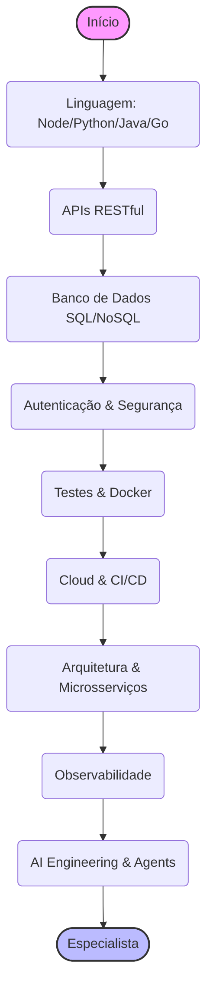

# ⚙️ Trilha Backend: Os Bastidores da Mágica

> **Edição 2026:** Atualizado para incluir Engenharia de IA, MCP e Observabilidade para LLMs.

Se o frontend é o palco, o backend é tudo o que acontece por trás das cortinas: os atores se preparando, os cenários mudando, as luzes sendo controladas. É aqui que a lógica de negócio, o banco de dados e a "inteligência" da aplicação vivem.

Esta trilha está dividida em níveis para guiar sua evolução profissional.

---

## 🐣 Nível Iniciante (Júnior)

O foco aqui é construir uma base sólida. Você precisa entender como a web funciona, dominar uma linguagem e conseguir criar APIs simples.

### 🏛️ Paradigmas de Programação
- **Programação Orientada a Objetos (POO):** Classes, Objetos, Herança e Polimorfismo. Pense em LEGO: blocos reutilizáveis que formam estruturas maiores.
- **Recursos:**
  - 📖 [Refactoring Guru: Padrões de Projeto](https://refactoring.guru/pt-br/design-patterns)

### 🛠️ Linguagens e Frameworks (Escolha Um)
Não tente aprender tudo de uma vez. Escolha uma stack e aprofunde-se.

- **Node.js (JavaScript/TypeScript):**
  - **Frameworks:** Express.js (simples e direto) ou Fastify (focado em performance).
  - **Foco:** Assincronismo, Event Loop e APIs REST.
- **Python:**
  - **Frameworks:** Flask (minimalista) ou FastAPI (moderno e rápido).
  - **Foco:** A linguagem da IA. Mesmo que não seja sua stack principal, aprenda o básico para interagir com scripts de Data Science e modelos de IA.
- **Java:**
  - **Frameworks:** Spring Boot (padrão de mercado).
  - **Foco:** Tipagem forte, estrutura robusta e ecossistema corporativo.
- **Go:**
  - **Foco:** Concorrência, simplicidade e alta performance para microsserviços.
- **Rust:**
  - **Frameworks:** Actix-web ou Axum.
  - **Foco:** Performance extrema, segurança de memória e ferramentas de infraestrutura. A escolha para quem quer o máximo de controle.

### 🔌 APIs RESTful
- Entenda os verbos HTTP (GET, POST, PUT, DELETE).
- Status Codes (200 OK, 404 Not Found, 500 Internal Error).
- JSON como formato padrão de troca de dados.

### 🗄️ Banco de Dados (O Básico)
- **SQL (Relacional):** Aprenda a criar tabelas e fazer consultas (SELECT, INSERT, UPDATE, JOINs).
  - *Ferramentas:* PostgreSQL ou MySQL.
- **NoSQL (Documentos):** Entenda quando usar (flexibilidade de schema).
  - *Ferramentas:* MongoDB.

---

## 🚀 Nível Intermediário (Pleno)

Aqui você deixa de apenas "fazer funcionar" e começa a "fazer bem feito", com segurança, testes e escala.

### 🔑 Autenticação e Segurança
- **OAuth 2.0 & OpenID Connect:** Delegar autenticação para Google/GitHub.
- **JWT (JSON Web Token):** Autenticação stateless para APIs modernas.
- **OWASP Top 10:** Conheça e previna as falhas de segurança mais comuns.

### 🧪 Testes Automatizados (O Oráculo)
- **Testes de Unidade:** Jest, JUnit, PyTest. Teste a menor parte do código.
- **Testes de Integração:** Usando **Testcontainers** para subir bancos reais em Docker durante os testes, evitando mocks frágeis.

### 🐳 DevOps Básico
- **Docker:** Como criar imagens e rodar sua aplicação em containers, garantindo que "funcione na minha máquina" e em produção.
- **CI/CD:** Pipelines de deploy automático (GitHub Actions). A esteira de produção do Tony Stark.

### 📨 Mensageria e Assincronismo
Sistemas distribuídos precisam conversar sem travar.
- **Conceitos:** Filas (Queues), Tópicos (Pub/Sub), Dead Letter Queues.
- **Ferramentas:** RabbitMQ (Filas tradicionais), Redis (Cache e PubSub rápido).

### 💾 Banco de Dados Intermediário
- **ORM vs Query Builders:** Prisma, TypeORM, Hibernate, Drizzle.
- **Modelagem de Dados:** Normalização, Índices para performance e Transações (ACID).

---

## 🧙‍♂️ Nível Avançado (Sênior / Especialista)

Onde você projeta sistemas complexos, escaláveis e inteligentes.

### 🏗️ Arquitetura de Software
- **Microsserviços:** Quando usar (e principalmente quando NÃO usar).
- **Domain-Driven Design (DDD):** Modelando o software de acordo com a complexidade do negócio.
- **Serverless:** AWS Lambda, Cloudflare Workers. Foco no código, zero infra.
- **Event-Driven Architecture:** Kafka e sistemas reativos para alto volume de dados.

### 🔭 Observabilidade (OpenTelemetry)
O "Olho de Sauron" para o bem.
- **Pilares:** Logging, Métricas e Tracing Distribuído.
- **Ferramentas:** Prometheus, Grafana, Jaeger.
- **Tracing de IA:** Monitorar cadeias de execução de LLMs e custo de tokens.

### 🌿 Green Software & FinOps
Sustentabilidade e eficiência de custos caminham juntas.
- **FinOps:** Monitoramento contínuo de custos de nuvem. Use Tags e Alertas para não ter surpresas na conta da AWS/Azure.
- **Green Coding:** Otimizar algoritmos para reduzir consumo de CPU e memória, diminuindo a pegada de carbono do software.
- **Ferramentas:** Cloud Carbon Footprint.

### 🤖 IA Engineering para Backend (O Diferencial de 2026)
O Backend agora precisa saber servir IA, não apenas JSON.

- **Orquestração de Agentes:**
  - **LangChain / LangGraph:** Criar fluxos complexos onde a IA toma decisões e mantém estado.
  - **Function Calling:** Permitir que o LLM chame suas APIs de backend para executar ações reais (ex: consultar saldo, agendar reunião).
  - **MCP (Model Context Protocol):** Padrão aberto para conectar dados e ferramentas aos assistentes de IA.

- **Engenharia de Dados para IA (RAG):**
  - **Vector Databases:** pgvector, Qdrant. Como armazenar e buscar por significado (busca semântica) e não apenas palavras-chave.
  - **Hybrid Search:** Combinar busca vetorial com busca textual (BM25) e Reranking.

- **Inference Servers & SLMs:**
  - Rodar modelos locais (Llama 3, Mistral, Gemma) usando **Ollama** ou **vLLM**.
  - **Fine-tuning eficiente:** Ajustar modelos pequenos para tarefas específicas do seu negócio.

---

## ↩️ Navegação

*   [**Voltar para o Início**](../../index.md)
*   [**Ver Conselhos de Carreira**](../../advices.md)
