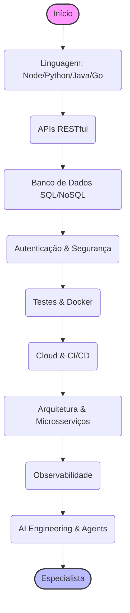

# ⚙️ Trilha Backend: Os Bastidores da Mágica

> **Edição 2026:** Atualizado para incluir Engenharia de IA, MCP e Observabilidade para LLMs.

```mermaid
flowchart TD
    Start([Início]) --> Lang(Linguagem: Node/Python/Java/Go)
    Lang --> API(APIs RESTful)
    API --> DB(Banco de Dados SQL/NoSQL)
    DB --> Auth(Autenticação & Segurança)
    Auth --> Test(Testes & Docker)
    Test --> Cloud(Cloud & CI/CD)
    Cloud --> Arch(Arquitetura & Microsserviços)
    Arch --> Obs(Observabilidade)
    Obs --> AI(AI Engineering & Agents)
    AI --> Spec([Especialista])

    style Start fill:#f9f,stroke:#333,stroke-width:2px
    style Spec fill:#bbf,stroke:#333,stroke-width:2px
```

Se o frontend é o palco, o backend é tudo o que acontece por trás das cortinas: os atores se preparando, os cenários mudando, as luzes sendo controladas. É aqui que a lógica de negócio, o banco de dados e a "inteligência" da aplicação vivem.

Esta trilha está dividida em níveis para guiar sua evolução profissional.

---

## 🐣 Nível Iniciante (Júnior)

O foco aqui é construir uma base sólida. Você precisa entender como a web funciona, dominar uma linguagem e conseguir criar APIs simples.

### 🏛️ Paradigmas de Programação
- **Programação Orientada a Objetos (POO):** Classes, Objetos, Herança e Polimorfismo. Pense em LEGO: blocos reutilizáveis que formam estruturas maiores.
- **Recursos:**
  - 📖 [Refactoring Guru: Padrões de Projeto](https://refactoring.guru/pt-br/design-patterns)

### 🛠️ Linguagens e Frameworks (Escolha Um)
Não tente aprender tudo de uma vez. Escolha uma stack e aprofunde-se.

- **Node.js (JavaScript/TypeScript):**
  - **Frameworks:** Express.js (simples e direto) ou Fastify (focado em performance).
  - **Foco:** Assincronismo, Event Loop e APIs REST.
- **Python:**
  - **Frameworks:** Flask (minimalista) ou FastAPI (moderno e rápido).
  - **Foco:** A linguagem da IA. Mesmo que não seja sua stack principal, aprenda o básico para interagir com scripts de Data Science e modelos de IA.
- **Java:**
  - **Frameworks:** Spring Boot (padrão de mercado).
  - **Foco:** Tipagem forte, estrutura robusta e ecossistema corporativo.
- **Go:**
  - **Foco:** Concorrência, simplicidade e alta performance para microsserviços.
- **Rust:**
  - **Frameworks:** Actix-web ou Axum.
  - **Foco:** Performance extrema, segurança de memória e ferramentas de infraestrutura. A escolha para quem quer o máximo de controle.

### 🔌 APIs RESTful
- Entenda os verbos HTTP (GET, POST, PUT, DELETE).
- Status Codes (200 OK, 404 Not Found, 500 Internal Error).
- JSON como formato padrão de troca de dados.

### 🗄️ Banco de Dados (O Básico)
- **SQL (Relacional):** Aprenda a criar tabelas e fazer consultas (SELECT, INSERT, UPDATE, JOINs).
  - *Ferramentas:* PostgreSQL ou MySQL.
- **NoSQL (Documentos):** Entenda quando usar (flexibilidade de schema).
  - *Ferramentas:* MongoDB.

---

## 🚀 Nível Intermediário (Pleno)

Aqui você deixa de apenas "fazer funcionar" e começa a "fazer bem feito", com segurança, testes e escala.

### 🔑 Autenticação e Segurança
- **OAuth 2.0 & OpenID Connect:** Delegar autenticação para Google/GitHub.
- **JWT (JSON Web Token):** Autenticação stateless para APIs modernas.
- **OWASP Top 10:** Conheça e previna as falhas de segurança mais comuns.

### 🧪 Testes Automatizados (O Oráculo)
- **Testes de Unidade:** Jest, JUnit, PyTest. Teste a menor parte do código.
- **Testes de Integração:** Usando **Testcontainers** para subir bancos reais em Docker durante os testes, evitando mocks frágeis.

### 🐳 DevOps Básico
- **Docker:** Como criar imagens e rodar sua aplicação em containers, garantindo que "funcione na minha máquina" e em produção.
- **CI/CD:** Pipelines de deploy automático (GitHub Actions). A esteira de produção do Tony Stark.

### 📨 Mensageria e Assincronismo
Sistemas distribuídos precisam conversar sem travar.
- **Conceitos:** Filas (Queues), Tópicos (Pub/Sub), Dead Letter Queues.
- **Ferramentas:** RabbitMQ (Filas tradicionais), Redis (Cache e PubSub rápido).

### 💾 Banco de Dados Intermediário
- **ORM vs Query Builders:** Prisma, TypeORM, Hibernate, Drizzle.
- **Modelagem de Dados:** Normalização, Índices para performance e Transações (ACID).

---

## 🧙‍♂️ Nível Avançado (Sênior / Especialista)

Onde você projeta sistemas complexos, escaláveis e inteligentes.

### 🏗️ Arquitetura de Software e Alta Performance
- **Rust & Go para Microsserviços (Green Software):** O uso de linguagens compiladas não é mais só para startups tech; grandes empresas estão migrando microsserviços pesados de Node/Java para Rust/Go, visando redução de custos na nuvem e menor uso de CPU/Memória (FinOps e Sustentabilidade).
- **WebAssembly (Wasm) no Backend:** O Wasm permite escrever módulos seguros, isolados em sandboxes e super rápidos. Ferramentas como Wasmtime ou Spin rodam nativamente no Edge sem o peso de um container Docker, resolvendo o problema de "Cold Start".
- **Microsserviços e Modular Monoliths:** Saber quando quebrar a aplicação (microsserviços) e quando usar um monolito modular bem escrito (com namespaces claros), uma tendência forte em 2026 para evitar complexidade prematura de deploy.
- **Domain-Driven Design (DDD) e CQRS:** O especialista modela o backend acompanhando exatamente os eventos do negócio e separa as rotas de Leitura (Queries) e Escrita (Commands).
- **Serverless e Edge Computing:** Usar AWS Lambda ou Cloudflare Workers para processamento distribuído mundialmente, respondendo a latências quase nulas.
- **Event-Driven Architecture:** Kafka, Redpanda e RabbitMQ. Sistemas totalmente assíncronos e orientados a eventos.

### 📊 Engenharia de Dados para Devs
O Backend moderno lida com pipelines de dados, não apenas CRUD.
- **ETL vs ELT:** Extrair, Transformar e Carregar. Ferramentas como **dbt** (data build tool) são padrão de mercado.
- **Data Warehouses:** Snowflake, BigQuery. Entenda a diferença para um banco tradicional (OLTP vs OLAP).
- **Data Lakes:** Onde jogamos dados brutos (S3, Parquet) para a IA consumir depois.

### 🔭 Observabilidade (OpenTelemetry) e LLMOps
O "Olho de Sauron" para o bem, agora com foco em IA.
- **Pilares Tradicionais:** Logging, Métricas e Tracing Distribuído.
- **Ferramentas Clássicas:** Prometheus, Grafana, Jaeger, Datadog.
- **LLMOps e Tracing de Agentes:** Monitorar o Backend mudou. Você precisa saber *por que* um agente alucinou ou quanto custou uma chamada de RAG.
  - **Ferramentas:** **LangSmith** (excelente integração com LangChain) ou **Arize Phoenix**.
  - **Métricas Chave:** Latência (Time to First Token - TTFT), Custo por Token, e Score de Relevância (RAG Evaluation).

### 🌿 Green Software & FinOps
Sustentabilidade e eficiência de custos caminham juntas.
- **FinOps:** Monitoramento contínuo de custos de nuvem. Use Tags e Alertas para não ter surpresas na conta da AWS/Azure.
- **Green Coding:** Otimizar algoritmos para reduzir consumo de CPU e memória, diminuindo a pegada de carbono do software.
- **Ferramentas:** Cloud Carbon Footprint.

### 🤖 IA Engineering para Backend (O Diferencial de 2026)
O Backend evoluiu de servir apenas JSON para orquestrar "cérebros" de forma confiável. Em 2026, você precisa construir Sistemas Compostos de IA (Compound AI Systems).

- **Orquestração de Agentes e Fluxos Autônomos:**
  - **LangChain / LangGraph / CrewAI:** O Especialista não usa mais modelos como "caixas de texto". Ele projeta "Agentes" que possuem Loops, Memória, Planejadores e Executores (Agentic Workflow). O LangGraph permite criar grafos de estado com controle de falha absoluto, sendo o padrão ouro.
  - **LlamaIndex & Semantic Kernel:** Além do LangChain, o LlamaIndex domina a ingestão de dados para RAG, enquanto o Semantic Kernel (Microsoft) é a escolha robusta para ecossistemas C# e corporativos.
  - **Structured Outputs (Garantia de Tipagem em LLMs):** Como um LLM só fala texto, você precisa forçá-lo a falar em objetos definidos. Ferramentas como **Instructor** (Python) e **Zod + Vercel AI SDK** (Node) obrigam o modelo a entregar JSON perfeitamente válido, pronto para o banco de dados.
  - **Function Calling / Tool Use:** Onde o LLM sai do "pensamento" e parte para a "ação". Permitir que ele rode funções do seu código (consultar saldo bancário, enviar e-mail via SendGrid, acionar banco SQL).
  - **MCP (Model Context Protocol) Avançado:** Não integre APIs aos Agentes na mão. O MCP padronizou como os Agentes se conectam a recursos externos (Bancos, Sistemas de Arquivos, APIs SaaS), sendo obrigatório entender para escalar infraestruturas de IA corporativa.
  - **LLM Gateways & Routing:** Quando você tem dezenas de modelos (GPT-4o, Claude 3.5, Llama 3), você precisa de um "API Gateway para IA". Ferramentas como **LiteLLM** ou **Kong AI Gateway** gerenciam fallback automático (se a OpenAI cair, usa o Anthropic), rate limiting e balanceamento de carga entre chaves de API.

- **Arquiteturas RAG Profundas (Retrieval-Augmented Generation):**
  - Não confie só em "busca vetorial simples" (Naive RAG).
  - **Vector Databases Especializados:** Dominar `pgvector`, Pinecone ou Qdrant.
  - **Advanced RAG Patterns:**
    - **Hybrid Search & Reciprocal Rank Fusion (RRF):** Unir Keyword Search (BM25) com Busca Semântica (Embeddings) e usar um modelo de *Re-ranker* (Cohere) no final para extrair a resposta mais relevante.
    - **GraphRAG:** Utilizar Grafos de Conhecimento (Knowledge Graphs, ex: Neo4j) extraídos de relatórios em vez de meros chunks vetoriais. Permite responder a conexões intrínsecas (ex: "Empresa X é subsidiária de quem?").
    - **Corrective RAG (CRAG) & Self-RAG:** Agentes que testam a própria resposta, descartam contexto ruim e buscam no Google ou Wikipedia autonomamente se os dados do Vector DB forem insuficientes.

- **Inference Servers, MLOps e Modelos Locais (SLMs):**
  - Servir modelos em GPU não é tarefa do Data Scientist, é do Engenheiro de Backend.
  - Como entregar latência (Tokens/Segundo) usando **vLLM** ou **TGI (Text Generation Inference)**.
  - Economia na Cloud: Rodar *Small Language Models* (SLMs, ex: Llama 3 8B, Phi-3) com **Ollama** via APIs Dockerizadas internamente em instâncias mais baratas ao invés de depender cegamente do faturamento estratosférico da OpenAI API.

### 📚 Livros e Leituras Obrigatórias (Sênior)
Para chegar ao nível especialista, a prática não basta. Você precisa de teoria sólida.
- **"Designing Data-Intensive Applications" (Martin Kleppmann):** A bíblia dos sistemas distribuídos. Entenda como bancos de dados realmente funcionam (B-Trees, SSTables, Replication, Partitioning).
- **"System Design Primer":** O guia definitivo para entender como projetar sistemas que aguentam milhões de usuários.

### 📺 Canais de System Design (YouTube)
- **[ByteByteGo (Alex Xu)](https://www.youtube.com/@ByteByteGo):** As melhores explicações visuais de sistemas complexos (YouTube e Newsletter).
- **[Hussein Nasser](https://www.youtube.com/@hnasr):** Engenharia de Backend pura e profunda (Protocolos, Database Internals).
- **[Arpit Bhayani](https://www.youtube.com/@ArpitBhayani):** System Design para o mundo real e alta escala.

### 🧠 Soft Skills & Diferencial Humano
- **Negociação com Stakeholders:** Você será pressionado por prazos. Aprenda a explicar "Débito Técnico" como uma dívida financeira: "Se não pagarmos agora, os juros (bugs e lentidão) vão inviabilizar o projeto".
- **Comunicação com Frontend:** Não jogue o JSON por cima do muro. Combine o contrato da API (Swagger/OpenAPI) *antes* de começar a codar.
- **Pragmatismo:** Nem tudo precisa ser microsserviços. Nem tudo precisa ser Kubernetes. A solução mais simples que resolve o problema é a melhor.

### 🏆 Desafios Práticos (Projetos)

- **Júnior:** Crie uma API REST para um gerenciador de tarefas (To-Do List) com CRUD completo, autenticação JWT e documentação no Swagger. Use PostgreSQL.
- **Pleno:** Desenvolva um serviço de encurtador de URLs (bit.ly clone). Requisitos: Cache com Redis para redirecionamento rápido, Docker Compose para rodar tudo e testes de integração.
- **Sênior:** Projete e implemente um sistema de chat em tempo real escalável (WhatsApp clone). Requisitos: WebSockets, filas (RabbitMQ/Kafka) para processamento assíncrono de mensagens e banco NoSQL (Cassandra/DynamoDB) para armazenar histórico.

---

## ↩️ Navegação

*   [**Voltar para o Início**](../../index.md)
*   [**Ver Conselhos de Carreira**](../../advices.md)
