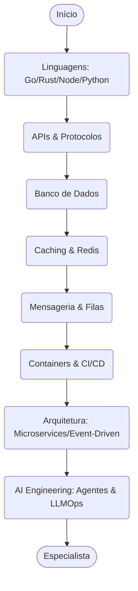

# 🗄️ Trilha Backend: O Arquiteto dos Bastidores

> **Edição 2026:** Focado em Microsserviços, Rust/Go, IA Engineering e Local-First.

```mermaid
flowchart TD
    Start([Início]) --> Lang(Linguagens: Go/Rust/Node/Python)
    Lang --> API(APIs & Protocolos)
    API --> DB(Banco de Dados)
    DB --> Cache(Caching & Redis)
    Cache --> Async(Mensageria & Filas)
    Async --> DevOps(Containers & CI/CD)
    DevOps --> Arch(Arquitetura: Microservices/Event-Driven)
    Arch --> AI(AI Engineering: Agentes & LLMOps)
    AI --> Spec([Especialista])
```

Seja o engenheiro que projeta sistemas distribuídos de alta escala e integra Agentes Autônomos em 2026.

## 🐣 Nível Iniciante (Júnior): O Construtor

- **Linguagens e Frameworks:** Node.js (NestJS/Express), Python (FastAPI/Django), Java (Spring Boot), ou C# (.NET).
- **APIs e Protocolos:** HTTP/REST, JSON, status codes, CORS.
- **Bancos de Dados Relacionais (SQL):** PostgreSQL, MySQL. Entenda queries, joins, modelagem e normalização.
- **Git & Versionamento:** Controle de versão no dia a dia.

## 🚀 Nível Intermediário (Pleno): O Otimizador

- **Autenticação & Segurança:** JWT, OAuth 2.0, Hashing (Bcrypt), Rate Limiting.
- **APIs Modernas:** GraphQL, gRPC (para comunicação rápida entre serviços).
- **Bancos NoSQL:** MongoDB, DynamoDB, Redis (Cache). Quando não usar SQL.
- **Docker e Containers:** Empacote suas aplicações.
- **Mensageria e Filas:** RabbitMQ, Apache Kafka, AWS SQS. Trabalhos assíncronos.
- **Testes Backend:** Testes unitários (Jest, PyTest), Integração, e Mocks (TDD).

## 🧙‍♂️ Nível Avançado (Sênior / Especialista): O Arquiteto

- **Arquitetura de Sistemas (System Design):** Microsserviços vs Monolitos modulares, Event-Driven Architecture, CQRS, Saga Pattern.
- **Linguagens de Alta Performance:** Rust (Segurança de memória, WebAssembly), Go (Concorrência, Cloud Native).
- **Engenharia de Dados Básica:** ETL vs ELT, Data Warehouses (Snowflake), Data Lakes.
- **Observabilidade:** OpenTelemetry, Prometheus, Grafana, Logs e Tracing Distribuído.
- **Green Software & FinOps:** Otimização para nuvem, custo computacional e pegada de carbono.
- **Web3 & Smart Contracts:** Solidity, Rust para Solana, Descentralização.

### 🤖 IA Engineering para Backend (O Diferencial de 2026)

- **Orquestração de Agentes:** LangChain, LangGraph, CrewAI. Loops, memória, planners.
- **Function Calling & MCP:** Conectar LLMs a bancos SQL e APIs via Model Context Protocol.
- **Gateways e Routing:** LiteLLM, Kong AI Gateway (Load balancing de LLMs).
- **Advanced RAG:** Vector Databases (pgvector, Pinecone), GraphRAG (Knowledge Graphs), Hybrid Search + Reranking.
- **Modelos Locais & MLOps:** vLLM, Ollama, rodando Small Language Models (SLMs) para economizar custos da Cloud.

## 🏆 Desafios Práticos

- **Júnior:** API REST de To-Do com Auth JWT e PostgreSQL.
- **Pleno:** Encurtador de URLs usando Redis como cache e Docker.
- **Sênior:** Chat real-time escalável com WebSockets, RabbitMQ e Apache Cassandra.

## 📚 Materiais de Estudo Recomendados

**Para o Júnior:**

- **[Boot.dev](https://www.boot.dev/):** Plataforma gamificada focada no backend.
- **[FreeCodeCamp](https://www.freecodecamp.org/):** Cursos de APIs e Node.js.
- **Documentações Oficiais:** Express.js, FastAPI, Spring Boot ou Go.

**Para o Pleno:**

- **[Hussein Nasser (YouTube)](https://www.youtube.com/@hnasr):** Database Internals e Protocolos profundos.
- **[Test-Driven Development with Python](https://www.obeythetestinggoat.com/):** Livro sobre TDD com Django.
- **[Full Cycle](https://fullcycle.com.br/):** Referência em arquitetura moderna, Docker e RabbitMQ.
- **[Práticas de Cloud (AWS Skill Builder)](https://explore.skillbuilder.aws/):** Serverless e nuvem.

**Para o Sênior/Especialista:**

- **[Designing Data-Intensive Applications](https://dataintensive.net/):** Bíblia do engenheiro sênior.
- **[ByteByteGo (Alex Xu)](https://bytebytego.com/):** System Design Interview e canal no YouTube.
- **[Arpit Bhayani (YouTube)](https://www.youtube.com/@ArpitBhayani):** Engenharia de altíssima escala.
- **[LangChain Academy](https://academy.langchain.com/):** Orquestração de agentes e arquiteturas RAG avançadas.
- **[The Rust Programming Language Book](https://doc.rust-lang.org/book/):** A introdução oficial para Rust.

## ↩️ Navegação

- [**Voltar para o Início**](../../index.md)
- [**Ver Conselhos de Carreira**](../../advices.md)
