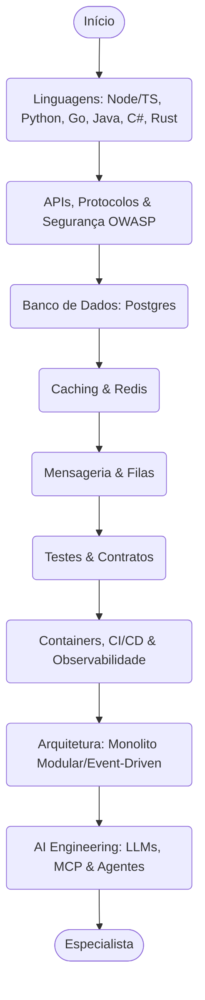

# 🗄️ Trilha Backend: O Arquiteto dos Bastidores

> **Edição 2026:** TypeScript/Go/Python/Java/Rust, APIs seguras, dados confiáveis, observabilidade e integração de LLMs e agentes.

```mermaid
flowchart TD
    Start([Início]) --> Lang(Linguagens: Node/TS, Python, Go, Java, C#, Rust)
    Lang --> API(APIs, Protocolos & Segurança OWASP)
    API --> DB(Banco de Dados: Postgres)
    DB --> Cache(Caching & Redis)
    Cache --> Async(Mensageria & Filas)
    Async --> Test(Testes & Contratos)
    Test --> DevOps(Containers, CI/CD & Observabilidade)
    DevOps --> Arch(Arquitetura: Monolito Modular/Event-Driven)
    Arch --> AI(AI Engineering: LLMs, MCP & Agentes)
    AI --> Spec([Especialista])
```

Esta trilha cobre o caminho de quem constrói APIs e serviços confiáveis, seguros e com custo sob controle, incluindo a integração com LLMs e agentes.

## 🐣 Nível Iniciante (Júnior): O Construtor

Foco: lógica fundamental, bancos de dados e endpoints que o frontend consiga consumir.

- **Linguagens e Frameworks (escolha uma e vá fundo):**
  - Node.js 24 LTS com TypeScript (NestJS, Fastify, Hono, Express 5). Bun 1.x e Deno 2 são alternativas de runtime.
  - Python 3.13+ (FastAPI, Django) com `uv` para dependências e ambientes.
  - Java 25 LTS (Spring Boot 4) ou C# com .NET 10 LTS (ASP.NET Core).
  - Go 1.2x (biblioteca padrão `net/http` já resolve muita coisa).
- **APIs e Protocolos Web:** HTTP/REST, JSON, status codes corretos (ex: 201 Created, 409 Conflict), headers, CORS, idempotência e paginação. Documente com OpenAPI.
- **Bancos Relacionais (SQL):** PostgreSQL 18 (ou MySQL). `SELECT`, `JOIN`, `GROUP BY`, modelagem, normalização (1FN a 3FN), chaves e integridade referencial. Use migrations versionadas.
- **Git & Versionamento:** branches, pull requests, commits claros e resolução de conflitos.
- **Tratamento de Erros e Logs:** não retorne stack traces ao cliente. Use middleware de erro centralizado, formato padronizado (Problem Details, RFC 9457) e logs estruturados em JSON.
- **Segurança básica:** valide toda entrada (Zod, Pydantic, Bean Validation), use queries parametrizadas, nunca versione segredos e leia o [OWASP Top 10](https://owasp.org/www-project-top-ten/).

## 🚀 Nível Intermediário (Pleno): O Otimizador

Foco: concorrência, segurança, desempenho e baixo acoplamento.

- **Autenticação & Autorização:** OAuth 2.0 / OpenID Connect, JWT com expiração curta, cookies de sessão seguros (`HttpOnly`, `Secure`, `SameSite`), hash de senha com Argon2id, RBAC/ABAC e rate limiting.
- **Segurança de API (OWASP API Security Top 10):** autorização por objeto (BOLA) e por função, mass assignment, SSRF, limites de tamanho e de recursos, inventário de endpoints, CORS restritivo, segredos em cofre (Vault, AWS Secrets Manager) e varredura de dependências (Dependabot, `npm audit`, Trivy).
- **APIs e Comunicação:** REST bem desenhado, GraphQL quando o cliente precisa de composição flexível, gRPC (Protocol Buffers) entre serviços internos, WebSockets/SSE para tempo real. Em stacks TypeScript, tRPC e Hono RPC dão tipagem ponta a ponta.
- **ORMs e Acesso a Dados:** Drizzle ou Prisma (TypeScript), SQLAlchemy/SQLModel (Python), JPA/jOOQ (Java), EF Core (.NET), sqlc (Go). Saiba ler o SQL que o ORM gera e evite consultas N+1.
- **Otimização SQL:** índices (B-tree, GIN, parciais), `EXPLAIN (ANALYZE)`, transações ACID, níveis de isolamento, connection pooling (PgBouncer) e `JSONB` quando fizer sentido.
- **NoSQL:** MongoDB e DynamoDB para modelos de acesso bem definidos. Não troque Postgres por NoSQL só por moda.
- **Cache:** Redis ou Valkey. Padrão cache-aside, TTL, invalidação, proteção contra cache stampede e cache HTTP (`ETag`, `Cache-Control`, CDN).
- **Mensageria e Filas:** processamento assíncrono com RabbitMQ, Apache Kafka, NATS, AWS SQS ou BullMQ/Celery. Garanta idempotência dos consumidores, retries com backoff, dead-letter queue e o padrão Outbox para publicar eventos de forma consistente com o banco.
- **Docker e Containers:** imagens multi-stage, usuário não-root, healthchecks e Docker Compose para o ambiente local.
- **Testes:** pirâmide de testes (Vitest/Jest, pytest, JUnit 5, `go test`), testes de integração com Testcontainers e **testes de contrato** (Pact ou schema OpenAPI) para evitar quebra entre serviços.
- **CI/CD:** GitHub Actions com lint, testes, build da imagem e scan de vulnerabilidades a cada pull request.

## 🧙‍♂️ Nível Avançado (Sênior / Especialista): O Arquiteto

Foco: arquitetura, resiliência, observabilidade e custo.

- **System Design:** comece por um monolito modular e extraia microsserviços só quando houver motivo claro (escala, times, ciclo de deploy). Event-Driven Architecture, CQRS, Event Sourcing (onde cabe) e Saga para transações distribuídas.
- **Resiliência:** timeouts, retries com jitter, circuit breaker, bulkhead, backpressure, degradação graciosa e SLOs com error budget.
- **Linguagens de Alta Performance:** Go para serviços de rede e ferramentas cloud native; Rust (Axum, Tokio) quando memória e latência pesam; JVM com virtual threads (Java 21+) para alta concorrência. Meça antes de reescrever.
- **Dados e Engenharia de Dados:** ETL vs ELT, Data Warehouses (BigQuery, Snowflake), formatos abertos (Parquet, Iceberg), CDC com Debezium. Migrações de schema sem downtime (expand/contract).
- **Observabilidade:** [OpenTelemetry](https://opentelemetry.io/) para traces, métricas e logs; Prometheus, Grafana, Loki e Tempo (ou um backend OTLP gerenciado). Defina SLIs/SLOs e alertas que acionam ação.
- **Kubernetes e Platform Engineering:** Deployments, HPA, probes e Helm/Kustomize. Entenda o básico antes de adotar service mesh.
- **Segurança avançada:** threat modeling, mTLS entre serviços, SBOM e assinatura de imagens (Sigstore), princípio do menor privilégio e auditoria.
- **FinOps & Green Software:** meça custo por serviço e por requisição, ajuste dimensionamento (right-sizing), use cache e processamento em lote, e prefira regiões com menor intensidade de carbono. Veja os princípios da [Green Software Foundation](https://learn.greensoftware.foundation/).
- **Edge e WebAssembly (opcional):** Cloudflare Workers, Deno Deploy e Wasm com WASI para lógica leve próxima ao usuário.

### 🤖 IA Engineering para Backend

Backend é quem expõe dados e ações para modelos de forma segura, medida e com custo previsível.

- **Chamadas a LLMs:** use os SDKs oficiais dos provedores, saídas estruturadas (JSON Schema), streaming, timeouts, retries e limites de tokens. Trate a saída do modelo como entrada não confiável.
- **Function Calling e MCP (Model Context Protocol):** crie **MCP servers** que exponham ferramentas, recursos e prompts de seus sistemas, usando os SDKs oficiais (TypeScript, Python, Go, Java, C#, Rust). Autenticação OAuth 2.1, escopos mínimos, confirmação humana em ações destrutivas e proteção contra prompt injection.
- **Agentes e Multi-Agente:** orquestração com LangGraph, OpenAI Agents SDK, Claude Agent SDK, Google ADK, Mastra ou Pydantic AI. Comece com fluxo simples e só adicione autonomia quando necessário. Para agentes de times ou fornecedores diferentes, conheça o protocolo **A2A (Agent2Agent)**.
- **Gateways de LLM:** LiteLLM, Kong AI Gateway ou Cloudflare AI Gateway para roteamento, fallback, cache, limites por chave e controle de orçamento.
- **RAG e Busca:** PostgreSQL com `pgvector` cobre muitos casos; Qdrant, Milvus ou Pinecone para escala maior. Combine busca híbrida (BM25 + vetor) com reranking e avalie com um conjunto de perguntas de referência.
- **Modelos Abertos e Locais:** vLLM, Ollama e llama.cpp para modelos abertos (Llama, Mistral, Qwen, Gemma) quando privacidade, latência ou custo justificarem hospedar.
- **Avaliação e Observabilidade de IA:** evals automatizados, tracing com OpenTelemetry (convenções GenAI), Langfuse, LangSmith ou Arize Phoenix.
- **Custos de IA:** acompanhe tokens por feature e por cliente, use prompt caching, modelos menores para tarefas simples, processamento em lote (batch) e limites de orçamento por agente.
- **Segurança de IA:** consulte o [OWASP Top 10 para aplicações LLM](https://genai.owasp.org/llm-top-10/): injeção de prompt, vazamento de dados, uso excessivo de permissões (excessive agency).

## 🏆 Desafios Práticos

- **Júnior:** API REST de To-Do ou Blog (Express/Fastify ou FastAPI) com autenticação JWT, CRUD com relacionamentos em PostgreSQL (Drizzle, Prisma ou SQLAlchemy), validação de entrada e documentação OpenAPI.
- **Pleno:** encurtador de URLs. Redis para cache, Postgres para persistência, rate limiting, fila para contagem de cliques, Docker Compose, testes de integração com Testcontainers e checagem contra o OWASP API Top 10.
- **Sênior:** chat corporativo distribuído com IA. WebSockets em Go ou Node, pub/sub no Redis ou NATS entre instâncias, `pgvector` para busca semântica, um **MCP server** que expõe a busca de mensagens, um agente (LangGraph) que resume threads via LiteLLM, traces com OpenTelemetry e painel de custo por tenant.

## 📚 Materiais de Estudo Recomendados

Para formar o Desenvolvedor Completo em 2026 (do Júnior ao Especialista), reunimos os conteúdos mais atualizados e de altíssima qualidade do mercado:

### 🐣 Para Nível Júnior

- **[Boot.dev](https://www.boot.dev/):** trilhas práticas de backend (Python, Go, SQL, Docker).
- **[freeCodeCamp](https://www.freecodecamp.org/):** currículo aberto com Node.js, APIs e bancos de dados.
- **Documentação oficial:** [Node.js](https://nodejs.org/en/docs), [FastAPI](https://fastapi.tiangolo.com/), [Spring Boot](https://spring.io/projects/spring-boot), [Go](https://go.dev/doc/), [PostgreSQL](https://www.postgresql.org/docs/).

### 🚀 Para Nível Pleno

- **[Hussein Nasser (YouTube)](https://www.youtube.com/@hnasr):** bancos de dados, proxies e redes (TCP, HTTP/3, gRPC).
- **[Full Cycle](https://fullcycle.com.br/):** formação em arquitetura, Go, Docker e Kubernetes (em português).
- **[OWASP API Security Project](https://owasp.org/www-project-api-security/):** riscos e mitigações para APIs.
- **[Testcontainers](https://testcontainers.com/guides/):** guias de testes de integração por linguagem.
- **[Test-Driven Development with Python](https://www.obeythetestinggoat.com/):** TDD e testes robustos.

### 🏛️ Para Nível Sênior/Especialista

- **[Designing Data-Intensive Applications](https://dataintensive.net/):** referência em sistemas distribuídos (Martin Kleppmann).
- **[ByteByteGo](https://bytebytego.com/):** System Design com diagramas.
- **[Documentação do OpenTelemetry](https://opentelemetry.io/docs/):** instrumentação e Collector.
- **[Model Context Protocol](https://modelcontextprotocol.io/):** especificação e SDKs para criar MCP servers.
- **[A2A Protocol](https://a2a-protocol.org/):** especificação do protocolo Agent2Agent.
- **[LangChain Academy](https://academy.langchain.com/) e [LiteLLM Docs](https://docs.litellm.ai/docs/):** agentes, RAG e gateways de LLM.
- **[The Rust Programming Language](https://doc.rust-lang.org/book/):** introdução oficial a Rust.
- **[WebAssembly (MDN)](https://developer.mozilla.org/en-US/docs/WebAssembly):** conceitos de Wasm.

## ↩️ Navegação

- [**Voltar para o Início**](../../index.md)
- [**Ver Conselhos de Carreira**](../../advices.md)
