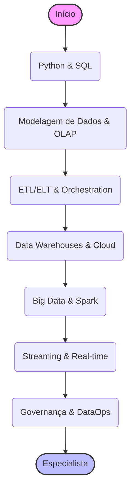

# 📊 Trilha Engenharia de Dados: O Petróleo do Século XXI

> **Edição 2026:** Focado em Lakehouse Architecture, Real-time Streaming e Data Governance para IA.

Dados são o novo petróleo, mas petróleo bruto não serve para nada. O Engenheiro de Dados é quem constrói as refinarias (pipelines) que transformam terabytes de logs brutos em insights valiosos e combustível para a Inteligência Artificial.

Esta trilha está dividida em níveis para guiar sua evolução profissional.

---

## 🐣 Nível Iniciante (Júnior)

O foco aqui é dominar as ferramentas básicas de manipulação e consulta de dados.

### 🐍 Python para Dados
- **Pandas:** A biblioteca essencial para manipulação tabular.
- **Scripting:** Automação de tarefas simples (mover arquivos, limpar CSVs).
- **APIs:** Consumir dados de APIs REST (biblioteca `requests`).

### 🗄️ SQL Avançado (A Língua Franca)
Não basta saber `SELECT *`.
- **Window Functions:** `RANK()`, `LEAD()`, `LAG()`, `ROW_NUMBER()`.
- **CTEs (Common Table Expressions):** Organizar queries complexas com `WITH`.
- **Performance:** Entender índices e planos de execução (Explain Analyze).

### 🏗️ Modelagem de Dados
- **Relacional (OLTP):** Normalização (3NF).
- **Dimensional (OLAP):** Star Schema vs Snowflake Schema. Fatos e Dimensões.
- **Conceitos:** Data Lake vs Data Warehouse.

### 🐧 Linux & Bash
- Manipulação de arquivos grandes via terminal (`awk`, `sed`, `grep`).
- Agendamento básico com `cron`.

---

## 🚀 Nível Intermediário (Pleno)

Aqui você constrói pipelines robustos e escaláveis na nuvem.

### 🔄 ETL vs ELT
- **ETL (Extract, Transform, Load):** Transformar antes de carregar (Legado/Segurança).
- **ELT (Extract, Load, Transform):** Carregar bruto e transformar no destino (Modern Data Stack). Ferramenta padrão: **dbt (data build tool)**.

### ☁️ Cloud Data Warehouses
Escolha um e domine:
- **Snowflake:** Separação de Compute e Storage. Zero-copy cloning.
- **Google BigQuery:** Serverless e escalabilidade massiva.
- **AWS Redshift:** O clássico da AWS.

### 🎼 Orquestração de Pipelines
Não use crontab para tudo.
- **Apache Airflow:** O padrão da indústria (Python-based). Entenda DAGs, Operators e Sensors.
- **Prefect / Dagster:** Alternativas modernas com foco em experiência do desenvolvedor.

### 🐳 Containerização
- **Docker:** Rodar seus pipelines e bancos de dados localmente de forma isolada.

---

## 🧙‍♂️ Nível Avançado (Sênior / Especialista)

Onde você lida com Big Data real, streaming e arquitetura de dados corporativa.

### 🐘 Processamento Distribuído (Big Data)
Quando o Pandas trava por falta de memória RAM.
- **Apache Spark:** Processamento em memória distribuído. (PySpark).
- **Databricks:** A plataforma unificada para dados e IA baseada em Spark.

### 🌊 Real-time Streaming
Dados que perdem valor em segundos (fraude, IoT, mercado financeiro).
- **Apache Kafka:** O backbone de mensagens. Tópicos, Partições, Offsets.
- **Stream Processing:** Kafka Streams, Apache Flink ou Spark Structured Streaming.

### 🏠 Lakehouse Architecture
O melhor dos dois mundos (Warehouse + Lake).
- **Formatos Abertos:** Parquet, Avro, Iceberg, Delta Lake. ACID em cima de object storage (S3).
- **Medallion Architecture:** Camadas Bronze (Bruto), Silver (Limpo/Enriquecido), Gold (Agregado para BI).

### 👮 Governança e DataOps
- **Catálogo de Dados:** DataHub, Amundsen. Onde está o dado? Quem é o dono?
- **Qualidade de Dados:** Great Expectations, Soda. Testes automáticos para seus dados (Data Contracts).
- **Privacidade:** LGPD/GDPR. Mascaramento de dados sensíveis (PII).

### 🧠 Soft Skills & Diferencial Humano
- **Data Storytelling:** Um CSV gigante não convence ninguém. Aprenda a contar a história por trás dos números para a diretoria.
- **Ética e Privacidade:** Você tem acesso a dados sensíveis. Seja o guardião da privacidade do usuário, não apenas quem move bytes.
- **Tradutor de Negócios:** Entenda que "quero ver as vendas" pode significar 10 métricas diferentes. Pergunte "para que decisão você precisa desse dado?".

### 🏆 Desafios Práticos (Projetos)

- **Júnior:** Baixe um dataset público (Kaggle), limpe-o com Python, modele um Star Schema e carregue em um banco Postgres. Crie queries SQL respondendo perguntas de negócio.
- **Pleno:** Crie um pipeline no Airflow que extrai dados de uma API (ex: CoinGecko), salva no S3 (MinIO local), transforma com dbt e carrega no Snowflake/BigQuery.
- **Sênior:** Implemente uma arquitetura Lakehouse (com Delta Lake ou Iceberg) processando um stream de eventos em tempo real (Kafka) e servindo métricas para um dashboard.

---

## ↩️ Navegação

*   [**Voltar para o Início**](../../index.md)
*   [**Ver Conselhos de Carreira**](../../advices.md)
