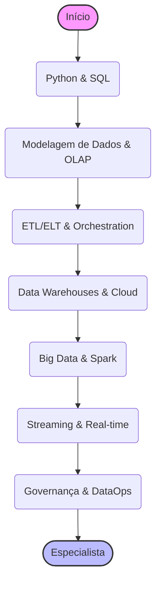

# 📊 Trilha Engenharia de Dados: O Petróleo do Século XXI

> **Edição 2026:** Focado em Lakehouse Architecture, Real-time Streaming e Data Governance para IA.

```mermaid
flowchart TD
    Start([Início]) --> Lang(Python & SQL)
    Lang --> Modeling(Modelagem de Dados & OLAP)
    Modeling --> ETL(ETL/ELT & Orchestration)
    ETL --> Warehouse(Data Warehouses & Cloud)
    Warehouse --> BigData(Big Data & Spark)
    BigData --> Stream(Streaming & Real-time)
    Stream --> Gov(Governança & DataOps)
    Gov --> Spec([Especialista])

    style Start fill:#f9f,stroke:#333,stroke-width:2px
    style Spec fill:#bbf,stroke:#333,stroke-width:2px
```

Dados são o novo petróleo, mas petróleo bruto não serve para nada. O Engenheiro de Dados é quem constrói as refinarias (pipelines) que transformam terabytes de logs brutos em insights valiosos e combustível para a Inteligência Artificial.

Esta trilha está dividida em níveis para guiar sua evolução profissional.

---

## 🐣 Nível Iniciante (Júnior)

O foco aqui é dominar as ferramentas básicas de manipulação e consulta de dados.

### 🐍 Python para Dados
- **Pandas:** A biblioteca essencial para manipulação tabular.
- **Scripting:** Automação de tarefas simples (mover arquivos, limpar CSVs).
- **APIs:** Consumir dados de APIs REST (biblioteca `requests`).

### 🗄️ SQL Avançado (A Língua Franca)
Não basta saber `SELECT *`.
- **Window Functions:** `RANK()`, `LEAD()`, `LAG()`, `ROW_NUMBER()`.
- **CTEs (Common Table Expressions):** Organizar queries complexas com `WITH`.
- **Performance:** Entender índices e planos de execução (Explain Analyze).

### 🏗️ Modelagem de Dados
- **Relacional (OLTP):** Normalização (3NF).
- **Dimensional (OLAP):** Star Schema vs Snowflake Schema. Fatos e Dimensões.
- **Conceitos:** Data Lake vs Data Warehouse.

### 🐧 Linux & Bash
- Manipulação de arquivos grandes via terminal (`awk`, `sed`, `grep`).
- Agendamento básico com `cron`.

---

## 🚀 Nível Intermediário (Pleno)

Aqui você constrói pipelines robustos e escaláveis na nuvem.

### 🔄 ETL vs ELT
- **ETL (Extract, Transform, Load):** Transformar antes de carregar (Legado/Segurança).
- **ELT (Extract, Load, Transform):** Carregar bruto e transformar no destino (Modern Data Stack). Ferramenta padrão: **dbt (data build tool)**.

### ☁️ Cloud Data Warehouses
Escolha um e domine:
- **Snowflake:** Separação de Compute e Storage. Zero-copy cloning.
- **Google BigQuery:** Serverless e escalabilidade massiva.
- **AWS Redshift:** O clássico da AWS.

### 🎼 Orquestração de Pipelines
Não use crontab para tudo.
- **Apache Airflow:** O padrão da indústria (Python-based). Entenda DAGs, Operators e Sensors.
- **Prefect / Dagster:** Alternativas modernas com foco em experiência do desenvolvedor.

### 🐳 Containerização
- **Docker:** Rodar seus pipelines e bancos de dados localmente de forma isolada.

---

## 🧙‍♂️ Nível Avançado (Sênior / Especialista)

Onde você lida com Big Data real, streaming e arquitetura de dados corporativa.

### 🐘 Processamento Distribuído (Big Data)
Quando o Pandas trava por falta de memória RAM.
- **Apache Spark:** Processamento em memória distribuído. (PySpark).
- **Databricks:** A plataforma unificada para dados e IA baseada em Spark.

### 🌊 Real-time Streaming
Dados que perdem valor em segundos (fraude, IoT, mercado financeiro).
- **Apache Kafka:** O backbone de mensagens. Tópicos, Partições, Offsets.
- **Stream Processing:** Kafka Streams, Apache Flink ou Spark Structured Streaming.

### 🏠 Arquitetura de Dados em 2026: Lakehouse, Data Mesh e Data Fabric
A arquitetura de dados não é mais um "monolito de DW onde os dados vão para morrer". Ela deve focar na distribuição, governança autônoma e em servir de combustível para GenAI.
- **Lakehouse Architecture (O Padrão Ouro):** A união entre a escalabilidade e o baixo custo de armazenamento (Data Lakes no S3/Blob) com a robustez e transações ACID dos bancos de dados tradicionais.
  - Formatos Open Table: **Apache Iceberg**, **Delta Lake**, **Apache Hudi**. Usar o formato correto evita a dependência de fornecedores (Vendor Lock-in).
  - Arquitetura Medalhão: A evolução passo a passo dos dados: *Bronze* (Dado Raw/Bruto como o JSON da API), *Prata* (Dado limpo, padronizado com schema, ex: data convertida de String para Timestamp) e *Ouro* (Agregações corporativas prontas para consumo e dashboards do PowerBI).
- **Data Mesh (Malha de Dados):** Paradigma cultural e arquitetural. Pare de ter um "time centralizado de dados" que vira gargalo na empresa. Trate "Dados como Produto", onde a equipe de RH gerencia e publica os dados do RH num formato padronizado na malha para as outras equipes consumirem por self-service.
- **Data Fabric:** O uso de IA e Machine Learning para descobrir e conectar padrões de metadados em toda a empresa automaticamente (automação extrema de governança e mapeamento).

### 👮 Governança, DataOps e Data Contracts
Dados com bugs geram modelos de IA perigosos. "Garbage in, Garbage out".
- **Catálogo de Dados (Data Discovery):** DataHub ou Collibra. Onde está o dado? Quem é o dono dele? Quando foi atualizado a última vez?
- **Qualidade de Dados & Data Contracts:** A evolução suprema do ETL. Um *Data Contract* é um acordo técnico assinado em código entre os Devs de Software e os Eng de Dados. Se o dev alterar a tabela de vendas retirando a coluna "Preço", a esteira CI/CD barra o deploy dele, pois quebrou o contrato que o Engenheiro de Dados validava lá embaixo. Ferramentas: **Great Expectations**, **Soda**.
- **Privacidade e Governança:** Mascaramento dinâmico de dados sensíveis em tempo real (PII - Personally Identifiable Information). LGPD/GDPR by design.
- **Vector Engineering (Data para GenAI):** Criar os pipelines automáticos (ETL vetorial) que transformam os Pdfs financeiros diários da empresa em Embeddings para popular os Vector Databases do time de Inteligência Artificial.

### 🧠 Soft Skills & Diferencial Humano
- **Data Storytelling:** Um CSV gigante não convence ninguém. Aprenda a contar a história por trás dos números para a diretoria.
- **Ética e Privacidade:** Você tem acesso a dados sensíveis. Seja o guardião da privacidade do usuário, não apenas quem move bytes.
- **Tradutor de Negócios:** Entenda que "quero ver as vendas" pode significar 10 métricas diferentes. Pergunte "para que decisão você precisa desse dado?".

### 🏆 Desafios Práticos (Projetos)

- **Júnior:** Baixe um dataset público (Kaggle), limpe-o com Python, modele um Star Schema e carregue em um banco Postgres. Crie queries SQL respondendo perguntas de negócio.
- **Pleno:** Crie um pipeline no Airflow que extrai dados de uma API (ex: CoinGecko), salva no S3 (MinIO local), transforma com dbt e carrega no Snowflake/BigQuery.
- **Sênior:** Implemente uma arquitetura Lakehouse (com Delta Lake ou Iceberg) processando um stream de eventos em tempo real (Kafka) e servindo métricas para um dashboard.

---

## ↩️ Navegação

*   [**Voltar para o Início**](../../index.md)
*   [**Ver Conselhos de Carreira**](../../advices.md)
