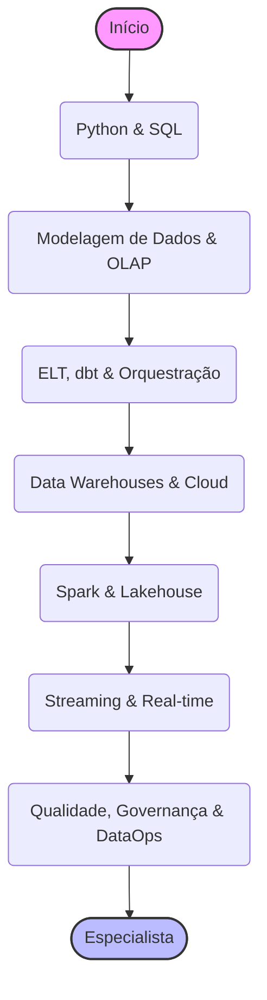

# 📊 Trilha Engenharia de Dados: Do Pipeline ao Lakehouse

> **Edição 2026:** Foco em Lakehouse com tabelas abertas, streaming, qualidade de dados e governança para IA.

```mermaid
flowchart TD
    Start([Início]) --> Lang(Python & SQL)
    Lang --> Modeling(Modelagem de Dados & OLAP)
    Modeling --> ETL(ELT, dbt & Orquestração)
    ETL --> Warehouse(Data Warehouses & Cloud)
    Warehouse --> BigData(Spark & Lakehouse)
    BigData --> Stream(Streaming & Real-time)
    Stream --> Gov(Qualidade, Governança & DataOps)
    Gov --> Spec([Especialista])

    style Start fill:#f9f,stroke:#333,stroke-width:2px
    style Spec fill:#bbf,stroke:#333,stroke-width:2px
```

O Engenheiro de Dados constrói os pipelines que transformam logs, eventos e tabelas brutas em dados confiáveis para análises, produtos e modelos de IA.

Esta trilha está dividida em níveis para guiar sua evolução profissional.

---

## 🐣 Nível Iniciante (Júnior)

O foco aqui é dominar as ferramentas básicas de manipulação e consulta de dados.

### 🐍 Python para Dados

- **Pandas e Polars:** Manipulação tabular. Polars é mais rápido e usa menos memória em dados médios.
- **DuckDB:** Banco analítico embutido; consulta Parquet e CSV com SQL direto no seu notebook ou script, sem servidor.
- **Scripting e APIs:** Automatize tarefas, consuma APIs REST (`requests`/`httpx`) e trate erros e retentativas.
- **Formatos:** CSV, JSON e principalmente **Parquet** (colunar e comprimido).

### 🗄️ SQL Avançado

- **Window Functions:** `RANK()`, `LEAD()`, `LAG()`, `ROW_NUMBER()`.
- **CTEs:** Organize queries complexas com `WITH`.
- **Performance:** Índices e planos de execução (`EXPLAIN ANALYZE`).

### 🏗️ Modelagem de Dados

- **Relacional (OLTP):** Normalização (3NF).
- **Dimensional (OLAP):** Star Schema, fatos e dimensões, SCD (dimensões que mudam no tempo).
- **Conceitos:** Data Lake vs Data Warehouse vs Lakehouse.

### 🐧 Linux, Git e Docker

- Terminal (`awk`, `sed`, `grep`), `cron` e Git.
- **Docker:** Rode pipelines e bancos localmente de forma isolada.

---

## 🚀 Nível Intermediário (Pleno)

Aqui você constrói pipelines robustos e escaláveis na nuvem.

### 🔄 ETL vs ELT

- **ETL:** Transforma antes de carregar; útil quando dados sensíveis precisam ser tratados antes de chegar ao destino.
- **ELT:** Carrega o dado bruto e transforma no warehouse/lakehouse. Ferramenta padrão: **dbt**, com modelos SQL versionados, testes, documentação e linhagem. Conheça também o **dbt Core** (open source) e a plataforma dbt.
- **Ingestão:** Airbyte, dlt ou Fivetran para conectores; CDC com Debezium para replicar bancos transacionais.

### ☁️ Cloud Data Warehouses

Escolha um e domine:

- **Snowflake:** Compute e storage separados, zero-copy cloning.
- **Google BigQuery:** Serverless, cobrança por bytes lidos ou slots.
- **AWS Redshift:** Integrado ao ecossistema AWS.
- **Databricks SQL:** Warehouse sobre o lakehouse.

### 🎼 Orquestração de Pipelines

Não use `cron` para tudo.

- **Apache Airflow 3:** O padrão de mercado. Entenda DAGs, operators, sensors, retries e backfills. Airflow 3 trouxe a nova API de execução de tarefas e agendamento orientado a assets.
- **Dagster:** Modelo orientado a assets, bom para testes e linhagem.
- **Prefect:** Fluxos Python simples e flexíveis.
- **Boas práticas:** Tarefas idempotentes, parâmetros de data (não `now()`), alertas de falha e SLAs de entrega.

### 🌐 Cloud e Infraestrutura

- Object storage (S3, GCS, ADLS), IAM com menor privilégio e Terraform/OpenTofu para provisionar o ambiente.

---

## 🧙‍♂️ Nível Avançado (Sênior / Especialista)

Onde você lida com grande volume, streaming e arquitetura de dados corporativa.

### 🐘 Processamento Distribuído

Quando uma máquina só não dá conta (e DuckDB/Polars já não resolvem).

- **Apache Spark 4.x:** Processamento distribuído (PySpark, Spark SQL). Destaques do 4.0: ANSI mode por padrão, tipo `VARIANT` para JSON semiestruturado, Spark Connect e Python Data Source API.
- **Databricks:** Plataforma gerenciada de lakehouse baseada em Spark e Delta Lake. Alternativas: EMR, Dataproc, Snowflake e Microsoft Fabric.
- **Otimização:** Particionamento, skew, shuffle, broadcast joins e compactação de arquivos pequenos.

### 🌊 Streaming e Real-time

Use streaming quando a latência de segundos ou minutos tem valor de negócio (fraude, IoT, operações). Caso contrário, batch é mais simples e barato.

- **Apache Kafka 4.x:** Funciona somente em modo **KRaft** (o ZooKeeper foi removido no Kafka 4.0). Entenda tópicos, partições, offsets, consumer groups, retenção, compactação e semântica de entrega (at-least-once, exactly-once). Alternativas compatíveis: Redpanda e serviços gerenciados (MSK, Confluent Cloud).
- **Schema Registry:** Avro/Protobuf com regras de compatibilidade evitam quebrar consumidores.
- **Processamento:** **Apache Flink 2.x** (estado, janelas, event time, watermarks), Kafka Streams ou Spark Structured Streaming.
- **Streaming + Lakehouse:** Gravar eventos em tabelas Iceberg/Delta com Flink ou Spark. Conceitos de CDC, late data e reprocessamento.

### 🏠 Arquitetura: Lakehouse, Data Mesh e Data Fabric

- **Lakehouse:** Object storage barato com transações ACID, schema evolution e time travel via tabelas abertas.
  - **Apache Iceberg:** Formato mais amplamente suportado entre engines (Spark, Flink, Trino, Snowflake, BigQuery, Athena, DuckDB). Catálogos REST permitem acesso multi-engine.
  - **Delta Lake:** Nativo no Databricks, com bom suporte no ecossistema Spark. **Apache Hudi** é forte em upserts/CDC. Há esforço de interoperabilidade (Delta UniForm, Apache XTable).
  - **Catálogos:** Unity Catalog, Apache Polaris, AWS Glue e Nessie. Escolha o catálogo com o mesmo cuidado que o formato.
  - **Manutenção:** Compactação, expiração de snapshots e remoção de arquivos órfãos.
  - **Arquitetura Medalhão:** _Bronze_ (bruto), _Silver_ (limpo, tipado) e _Gold_ (agregado para consumo).
- **Data Mesh:** Abordagem organizacional: domínios donos de seus dados como produto, com plataforma self-service e governança federada. Só faz sentido em organizações grandes; em times pequenos, uma plataforma central bem feita basta.
- **Data Fabric:** Conceito de integração baseada em metadados e automação; trate como visão de arquitetura, não como produto único.
- **Serving:** Trino/Athena para consultas federadas, ClickHouse, Druid ou Pinot para analytics em baixa latência.

### ✅ Qualidade de Dados e Observabilidade

- **Testes:** Testes do dbt (`not_null`, `unique`, relationships), **Great Expectations** ou **Soda** para regras de qualidade.
- **Dimensões de qualidade:** Frescor, volume, schema, completude, unicidade e validade.
- **Observabilidade de dados:** Monitore atrasos, anomalias de volume e mudanças de schema, com alertas para o dono do dado. Linhagem com **OpenLineage**.
- **Data Contracts:** Acordo versionado entre produtor e consumidor (schema, semântica, SLA de frescor, dono). Padrão aberto: **Open Data Contract Standard** (Bitol). Valide no CI do produtor para que mudanças que quebram consumidores sejam barradas antes do deploy.

### 👮 Governança e Privacidade

- **Catálogo e descoberta:** DataHub, OpenMetadata, Unity Catalog ou Collibra: dono, descrição, linhagem e classificação de cada dataset.
- **Controle de acesso:** RBAC/ABAC, row-level security e column masking.
- **Privacidade:** Classifique PII, aplique mascaramento, pseudonimização e política de retenção. LGPD/GDPR desde o desenho, com suporte a pedidos de exclusão.
- **Auditoria:** Registre quem acessou o quê.

### 🤖 Dados para IA

- **Pipelines de embeddings:** Extração e limpeza de documentos, chunking, geração de embeddings e carga em um banco vetorial. Atualização incremental e remoção de dados excluídos na origem.
- **Vector DBs:** **pgvector** (Postgres) atende a muitos casos; use Qdrant, Milvus, Weaviate ou OpenSearch quando precisar de escala e filtros avançados.
- **Qualidade e proveniência:** Versione datasets, registre origem e permissões dos dados usados em treino e RAG.

### 💰 FinOps de Dados

- Custo por pipeline, query e time (tags, labels e views de billing).
- Particione e clusterize tabelas, evite `SELECT *`, use materializações incrementais e defina políticas de ciclo de vida no storage.
- Limite custos com quotas, monitores de orçamento e desligamento automático de clusters ociosos.

### 🧠 Soft Skills

- **Data Storytelling:** Conte a história por trás dos números.
- **Ética e Privacidade:** Você acessa dados sensíveis; proteja-os.
- **Tradutor de Negócios:** Pergunte "que decisão você vai tomar com esse dado?" antes de construir.

### 🏆 Desafios Práticos (Projetos)

- **Júnior:** Baixe um dataset público (Kaggle), limpe com Python/DuckDB, modele um Star Schema e carregue em Postgres. Responda perguntas de negócio com SQL.
- **Pleno:** Pipeline no Airflow ou Dagster que extrai dados de uma API (ex.: CoinGecko), salva em object storage (MinIO local), transforma com dbt e carrega em BigQuery ou Snowflake, com testes de qualidade.
- **Sênior:** Lakehouse com Iceberg: eventos em Kafka (modo KRaft) processados com Flink ou Spark, gravados em tabelas Iceberg com data contract validado no CI, testes de qualidade, linhagem OpenLineage e métricas num dashboard.

---

## 📚 Materiais de Estudo Recomendados

### 🐣 Para Nível Júnior

- **[DuckDB Docs](https://duckdb.org/docs/):** SQL analítico local, ótimo para praticar.
- **[Kaggle Learn](https://www.kaggle.com/learn):** Cursos curtos de Python, Pandas e SQL, mais datasets para praticar.
- **[Mode SQL Tutorial](https://mode.com/sql-tutorial):** SQL do básico às window functions.

### 🚀 Para Nível Pleno

- **[dbt Learn](https://learn.getdbt.com/):** Cursos oficiais de dbt e Analytics Engineering.
- **[Apache Airflow Docs](https://airflow.apache.org/docs/):** Documentação e tutoriais oficiais.
- **[Dagster University](https://courses.dagster.io/):** Cursos gratuitos de Dagster.
- **Livro: "The Data Warehouse Toolkit" (Ralph Kimball):** Base da modelagem dimensional.

### 🏛️ Para Nível Sênior/Especialista

- **[Data Engineering Zoomcamp (DataTalks.Club)](https://github.com/DataTalksClub/data-engineering-zoomcamp):** Curso aberto e prático com Kafka, Spark, dbt e orquestração.
- **[Designing Data-Intensive Applications (Martin Kleppmann)](https://dataintensive.net/):** Referência sobre sistemas de dados distribuídos.
- **Livro: "Fundamentals of Data Engineering" (Joe Reis e Matt Housley):** Visão completa do ciclo de vida de dados.
- **[Apache Spark Docs](https://spark.apache.org/docs/latest/):** Guia de Spark 4.x.
- **[Apache Kafka Docs](https://kafka.apache.org/documentation/):** Kafka 4.x e KRaft.
- **[Apache Flink Docs](https://nightlies.apache.org/flink/flink-docs-stable/):** Streaming com estado.
- **[Apache Iceberg Docs](https://iceberg.apache.org/docs/latest/):** Formato de tabela aberto.
- **[Delta Lake Docs](https://docs.delta.io/latest/index.html):** Formato de tabela do ecossistema Spark/Databricks.
- **[Databricks Academy](https://www.databricks.com/learn/training/home):** Cursos de Spark, Delta Lake e lakehouse.
- **[OpenLineage](https://openlineage.io/docs/):** Padrão aberto de linhagem.
- **[Open Data Contract Standard](https://bitol-io.github.io/open-data-contract-standard/latest/):** Especificação de data contracts.
- **[DataHub Docs](https://datahubproject.io/docs/) e [OpenMetadata](https://docs.open-metadata.org/):** Catálogo e governança open source.
- **[FinOps Foundation](https://www.finops.org/framework/):** Práticas de gestão de custos em nuvem.
- **Livro: "Data Mesh" (Zhamak Dehghani):** Origem do conceito.

---

## ↩️ Navegação

- [**Voltar para o Início**](../../index.md)
- [**Ver Conselhos de Carreira**](../../advices.md)
