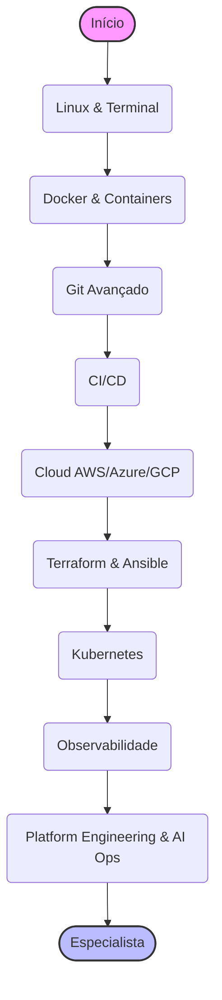

# ♾️ Trilha DevOps: A Ponte entre o Código e o Mundo

> **Edição 2026:** Focado em Platform Engineering, GitOps e Observabilidade com IA.

"DevOps não é um cargo, é uma cultura." Mas convenhamos, alguém precisa configurar o Kubernetes, certo? Esta trilha te transforma no guardião da infraestrutura, garantindo que o código saia da máquina do dev e chegue ao usuário final com segurança, rapidez e confiabilidade.

Esta trilha está dividida em níveis para guiar sua evolução profissional.

---

## 🐣 Nível Iniciante (Júnior)

O foco aqui é sair da interface gráfica e dominar a linha de comando e os fundamentos da infraestrutura.

### 🐧 Linux e Terminal (O Habitat Natural)
- **Shell Scripting:** Bash/Zsh. Automatize tarefas repetitivas. Se você faz algo mais de duas vezes, faça um script.
- **Permissões:** `chmod`, `chown`. Entenda quem pode fazer o que.
- **Networking Básico:** SSH (chaves, não senhas!), DNS, HTTP/S, Firewalls (iptables/ufw).

### 🐳 Containers (O Novo Binário)
- **Docker:** Como criar `Dockerfile` eficientes (Multi-stage builds).
- **Docker Compose:** Orquestrar múltiplos containers localmente.
- **Conceito:** Imutabilidade. Uma vez construída, a imagem não muda.

### 📜 Git Avançado
- **Branching Strategies:** Git Flow, Trunk Based Development.
- **Hooks:** Automatizar checagens antes do commit (Pre-commit hooks).

---

## 🚀 Nível Intermediário (Pleno)

Aqui você começa a tratar infraestrutura como código e automatizar o ciclo de vida do software.

### 🔄 CI/CD (Integração e Entrega Contínuas)
- **GitHub Actions / GitLab CI:** Pipelines que testam, buildam e deployam seu código automaticamente a cada push.
- **Conceitos:** Linting, SAST (Static Application Security Testing), Artifact Management.

### ☁️ Cloud Providers (A Nuvem)
Escolha uma principal, mas entenda os conceitos universais (Compute, Storage, Networking).
- **AWS:** EC2, S3, RDS, Lambda, VPC.
- **Azure/GCP:** Equivalentes (VMs, Blob Storage, Cloud Functions).
- **IAM:** Gerenciamento de identidade e permissões (Princípio do Menor Privilégio).

### 🏗️ Infrastructure as Code (IaC)
Nunca configure servidores manualmente (ClickOps).
- **Terraform / OpenTofu:** O padrão da indústria para provisionar infraestrutura. Entenda State Files e Modules.
- **Ansible:** Para configuração de servidores (Configuration Management).

### ☸️ Kubernetes (O Capitão)
- **Conceitos:** Pods, Deployments, Services, Ingress, ConfigMaps, Secrets.
- **Gerenciamento:** `kubectl`, Helm Charts (o "npm" do Kubernetes).

---

## 🧙‍♂️ Nível Avançado (Sênior / Especialista)

Onde você constrói plataformas para outros desenvolvedores e garante a estabilidade de sistemas globais.

### 🔭 Observabilidade (Não é só Monitoramento)
- **OpenTelemetry:** O padrão para coletar Logs, Métricas e Traces.
- **Ferramentas:** Prometheus (Métricas), Grafana (Dashboards), Jaeger/Tempo (Tracing).
- **SLIs, SLOs e SLAs:** Definindo e medindo a confiabilidade do serviço com dados reais.

### 🐙 GitOps
- **ArgoCD / Flux:** O estado do seu cluster Kubernetes deve espelhar um repositório Git. O deploy é um Pull Request.
- **Drift Detection:** Detectar e corrigir automaticamente quando a infraestrutura real difere do código.

### 🏗️ Platform Engineering
- **Internal Developer Platforms (IDP):** Construir portais (como **Backstage**) para que devs criem serviços padronizados com um clique ("Paved Roads").
- **Self-Service:** O dev não deve abrir ticket para pedir um banco de dados; ele deve provisionar via plataforma.

### 🛡️ DevSecOps: Segurança desde o Dia 1
Segurança não é responsabilidade só do time de InfoSec no final do projeto.
- **SAST & DAST:** Análise estática (SonarQube) e dinâmica de vulnerabilidades.
- **Container Scanning:** Nunca suba uma imagem Docker sem passar pelo **Trivy** ou **Grype** para achar CVEs.
- **Policy as Code:** Use **OPA (Open Policy Agent)** para impedir deploys inseguros (ex: bloquear containers rodando como root).
- **Supply Chain Security:** Assinar imagens (Cosign) e verificar dependências (SBOM - Software Bill of Materials) para evitar ataques à cadeia de suprimentos.
- **Secret Management:** HashiCorp Vault ou AWS Secrets Manager. Nunca commite senhas no Git (`.env` no `.gitignore` sempre!).

### 💰 FinOps: O Custo é um Requisito
- **Monitoramento de Custos:** Use **Kubecost** ou AWS Cost Explorer. Se você não mede, você não controla.
- **Rightsizing:** Ajustar CPU/RAM dos pods para o uso real. Não use um canhão para matar uma mosca.
- **Spot Instances:** Usar máquinas ociosas da nuvem com até 90% de desconto para workloads que podem ser interrompidos.

### 📚 Livros e Cultura (Leitura Obrigatória)
DevOps é cultura, e cultura se aprende com histórias e práticas.
- **["The Phoenix Project" (Gene Kim)](https://itrevolution.com/product/the-phoenix-project/):** Um romance (sim, uma história!) que explica porque o trabalho de TI costuma ser caótico e como o DevOps resolve isso. Leitura leve e essencial.
- **["The DevOps Handbook"](https://itrevolution.com/product/the-devops-handbook/):** O manual prático que segue o "Phoenix Project".
- **["Site Reliability Engineering" (Google)](https://sre.google/books/):** Como o Google mantém seus sistemas no ar. O nascimento do conceito de SRE.

### 🏆 Desafios Práticos (Projetos)

- **Júnior:** Configure um pipeline básico de CI/CD com GitHub Actions para uma aplicação Node.js. Requisitos: Rodar o lint, os testes e construir a imagem Docker apenas se passar nos testes.
- **Pleno:** Provisione a infraestrutura para uma aplicação de 3 camadas (Frontend, Backend, Banco) na AWS (pode usar LocalStack) usando Terraform. Requisitos: Use módulos para reutilização de código e armazene o estado no S3.
- **Sênior:** Implemente uma arquitetura GitOps completa com ArgoCD e Kubernetes. Requisitos: O cluster deve ter monitoramento (Prometheus/Grafana), auto-scaling (HPA) e políticas de segurança (OPA/Kyverno) para impedir deploys sem limits de CPU/RAM definidos.

---

## ↩️ Navegação

*   [**Voltar para o Início**](../../index.md)
*   [**Ver Conselhos de Carreira**](../../advices.md)
