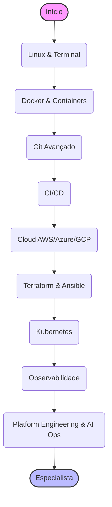

# ♾️ Trilha DevOps: A Ponte entre o Código e o Mundo

> **Edição 2026:** Focado em Platform Engineering, GitOps e Observabilidade com IA.

```mermaid
flowchart TD
    Start([Início]) --> Linux(Linux & Terminal)
    Linux --> Container(Docker & Containers)
    Container --> Git(Git Avançado)
    Git --> CICD(CI/CD)
    CICD --> Cloud(Cloud AWS/Azure/GCP)
    Cloud --> IaC(Terraform & Ansible)
    IaC --> K8s(Kubernetes)
    K8s --> Obs(Observabilidade)
    Obs --> Plat(Platform Engineering & AI Ops)
    Plat --> Spec([Especialista])

    style Start fill:#f9f,stroke:#333,stroke-width:2px
    style Spec fill:#bbf,stroke:#333,stroke-width:2px
```

"DevOps não é um cargo, é uma cultura." Mas convenhamos, alguém precisa configurar o Kubernetes, certo? Esta trilha te transforma no guardião da infraestrutura, garantindo que o código saia da máquina do dev e chegue ao usuário final com segurança, rapidez e confiabilidade.

Esta trilha está dividida em níveis para guiar sua evolução profissional.

---

## 🐣 Nível Iniciante (Júnior)

O foco aqui é sair da interface gráfica e dominar a linha de comando e os fundamentos da infraestrutura.

### 🐧 Linux e Terminal (O Habitat Natural)

- **Shell Scripting:** Bash/Zsh. Automatize tarefas repetitivas. Se você faz algo mais de duas vezes, faça um script.
- **Permissões:** `chmod`, `chown`. Entenda quem pode fazer o que.
- **Networking Básico:** SSH (chaves, não senhas!), DNS, HTTP/S, Firewalls (iptables/ufw).

### 🐳 Containers (O Novo Binário)

- **Docker:** Como criar `Dockerfile` eficientes (Multi-stage builds).
- **Docker Compose:** Orquestrar múltiplos containers localmente.
- **Conceito:** Imutabilidade. Uma vez construída, a imagem não muda.

### 📜 Git Avançado

- **Branching Strategies:** Git Flow, Trunk Based Development.
- **Hooks:** Automatizar checagens antes do commit (Pre-commit hooks).

---

## 🚀 Nível Intermediário (Pleno)

Aqui você começa a tratar infraestrutura como código e automatizar o ciclo de vida do software.

### 🔄 CI/CD (Integração e Entrega Contínuas)

- **GitHub Actions / GitLab CI:** Pipelines que testam, buildam e deployam seu código automaticamente a cada push.
- **Conceitos:** Linting, SAST (Static Application Security Testing), Artifact Management.

### ☁️ Cloud Providers (A Nuvem)

Escolha uma principal, mas entenda os conceitos universais (Compute, Storage, Networking).

- **AWS:** EC2, S3, RDS, Lambda, VPC.
- **Azure/GCP:** Equivalentes (VMs, Blob Storage, Cloud Functions).
- **IAM:** Gerenciamento de identidade e permissões (Princípio do Menor Privilégio).

### 🏗️ Infrastructure as Code (IaC)

Nunca configure servidores manualmente (ClickOps).

- **Terraform / OpenTofu:** O padrão da indústria para provisionar infraestrutura. Entenda State Files e Modules.
- **Ansible:** Para configuração de servidores (Configuration Management).

### ☸️ Kubernetes (O Capitão)

- **Conceitos:** Pods, Deployments, Services, Ingress, ConfigMaps, Secrets.
- **Gerenciamento:** `kubectl`, Helm Charts (o "npm" do Kubernetes).

### ☁️ Cloud Native & Serverless

A evolução natural de Containers.

- **Serverless Containers:** AWS Fargate, Google Cloud Run ou Azure Container Apps. Execute containers sem gerenciar as máquinas (EC2/Nodes).
- **Service Mesh:** Istio ou Linkerd. Desacoplar a lógica de rede, TLS, métricas e retentativas (retries) do código da aplicação, colocando tudo num "sidecar" ou via eBPF.

---

## 🧙‍♂️ Nível Avançado (Sênior / Especialista)

Onde você constrói plataformas para outros desenvolvedores e garante a estabilidade de sistemas globais.

### 🔭 Observabilidade Avançada (AI Ops & eBPF)

Em arquiteturas de milhões de reqs/s, você não pode inspecionar logs manualmente.

- **eBPF (Extended Berkeley Packet Filter):** A revolução da infraestrutura em 2026. A habilidade de rodar programas ultra rápidos e seguros dentro do Kernel do Linux sem alterar o código-fonte da aplicação ou adicionar pesados "sidecars". Ferramentas como **Cilium** controlam a rede, balanceamento de carga e observabilidade em altíssima performance.
- **OpenTelemetry (OTel):** A padronização de dados corporativos. Uma API unificada que processa Traces, Metrics, e Logs para sistemas backend complexos em Golang, Rust, Node, e AI Engines, injetando tudo de maneira diagnóstica.
- **AIOps:** Usar Agentes de Inteligência Artificial para não apenas criar "alertas do PagerDuty", mas para resolver automaticamente as panes e diagnosticar anomalias no Grafana/Prometheus (Self-healing).

### 🐙 GitOps (Controle de Versão Declarativo)

- **ArgoCD e Flux:** A infraestrutura nunca é "apertada num botão na nuvem". Todo e qualquer estado (bancos de dados, ingressos, certificados de Kubernetes) é um código YAML/HCL dentro de um repositório Git. O ArgoCD monitora o Git 24/7.
- **Drift Detection e Reconciliação Contínua:** Se um desenvolvedor manualmente alterar um servidor de 2GB de RAM para 8GB na interface web da nuvem (o famoso "Drift"), o ArgoCD detecta a anomalia e, em segundos, forçará a volta para 2GB, pois a "Fonte da Verdade" (o GitHub) não contém a modificação. O "Deploy" vira, puramente, o ato de aprovar e dar merge num PR.

### 🏗️ Platform Engineering (Engenharia de Plataforma)

A cultura DevOps evolui para a Engenharia de Plataforma. Não seja a "equipe de suporte que faz o deploy", seja a equipe que constrói o Produto (A Nuvem) pros Devs.

- **Internal Developer Platforms (IDPs):** Criar Portais unificados como **Backstage (Spotify)** ou **Port**.
- **Golden Paths (Caminhos Pavimentados):** O engenheiro júnior no seu primeiro dia de emprego preenche um formulário no IDP com o nome de sua "API de Vendas". Em 1 minuto, o Backstage roda o Terraform e cria um Repositório Git, pipelines de CI/CD, banco de dados isolado no ambiente dev, dashboards no Grafana e políticas de segurança, devolvendo a URL pronta pra ele codar. Isso zera a sobrecarga cognitiva do time de Dev e reduz gargalos absurdos.

### 🛡️ DevSecOps & Supply Chain Security

A fronteira de segurança não é o firewall, é o "NPM Install" que o dev júnior roda.

- **Software Bill of Materials (SBOM) & Sigstore:** O projeto gera uma "Nota Fiscal" (`syft`) com a lista exata de cada lib open source utilizada, garantindo que código adulterado por ataques à cadeia de suprimentos seja bloqueado via assinaturas (`Cosign`).
- **Policy as Code (OPA & Kyverno):** Todo Pull Request no Kubernetes passa por um Agente Validador de Segurança. Se o container for rodar como usuário root, ou não tiver _Resource Limits_, o deploy é bloqueado por uma falha na validação da política de segurança, não importa quem o solicitou.
- **Container Scanning Contínuo:** Trivy, Grype ou Clair escaneiam imagens em tempo de build, parando a esteira caso se detecte as graves vulnerabilidades de dia zero (CVE).

### 💰 FinOps & Green Software

A nuvem é a coisa mais fácil do mundo de se pagar caro. A fatura mensal tem que ser monitorada pela infra.

- **Kubecost:** Transparência financeira. O IDP mostra para a equipe comercial exatamente quantos dólares aquela "API de Pagamentos" está custando aos cofres na AWS. Se passar de 20%, gera alerta.
- **Green Software Foundation e Sustentabilidade:** Cortar desperdício é ajudar o planeta. Aplicar ferramentas como _Karpenter_ no AWS EKS garante _Node Auto-provisioning_ perfeito: A máquina do servidor só é alugada com as exatas vCPUs pedidas. Destruir VMs durante madrugadas ociosas via cronjobs.

### 📚 Livros e Cultura (Leitura Obrigatória)

DevOps é cultura, e cultura se aprende com histórias e práticas.

- **["The Phoenix Project" (Gene Kim)](https://itrevolution.com/product/the-phoenix-project/):** Um romance (sim, uma história!) que explica porque o trabalho de TI costuma ser caótico e como o DevOps resolve isso. Leitura leve e essencial.
- **["The DevOps Handbook"](https://itrevolution.com/product/the-devops-handbook/):** O manual prático que segue o "Phoenix Project".
- **["Site Reliability Engineering" (Google)](https://sre.google/books/):** Como o Google mantém seus sistemas no ar. O nascimento do conceito de SRE.

### 🧠 Soft Skills & Diferencial Humano

- **Cultura Sem Culpa (Blameless):** Quando algo quebra, não procure o culpado, procure a causa raiz. Se um dev derrubou a produção, é porque o pipeline permitiu.
- **Evangelista de Automação:** Seu trabalho é eliminar o seu próprio trabalho manual. Ensine os times de desenvolvimento a serem autônomos.
- **Gestão de Crise:** Manter a calma quando o Slack está pegando fogo é a sua habilidade mais valiosa.

### 🏆 Desafios Práticos (Projetos)

- **Júnior:** Configure um pipeline básico de CI/CD com GitHub Actions para uma aplicação Node.js. Requisitos: Rodar o lint, os testes e construir a imagem Docker apenas se passar nos testes.
- **Pleno:** Provisione a infraestrutura para uma aplicação de 3 camadas (Frontend, Backend, Banco) na AWS (pode usar LocalStack) usando Terraform. Requisitos: Use módulos para reutilização de código e armazene o estado no S3.
- **Sênior:** Implemente uma arquitetura GitOps completa com ArgoCD e Kubernetes. Requisitos: O cluster deve ter monitoramento (Prometheus/Grafana), auto-scaling (HPA) e políticas de segurança (OPA/Kyverno) para impedir deploys sem limits de CPU/RAM definidos.

---

## 📚 Materiais de Estudo Recomendados

Para atingir a excelência em 2026, recomendamos os seguintes recursos práticos e teóricos:

**Para o Júnior (Fundamentos, Linux, Docker):**

- **[KodeKloud](https://kodekloud.com/):** A melhor plataforma hands-on (prática no terminal) para aprender Linux, Docker e Git, com cenários simulados fantásticos.
- **[NetworkChuck (YouTube)](https://www.youtube.com/@NetworkChuck):** Canal muito didático e acessível para quem precisa começar no mundo das redes, subnetting, e roteadores.
- **[ACloudGuru (agora Pluralsight)](https://www.pluralsight.com/cloud-guru):** O clássico absoluto para certificações Cloud Practitioner da AWS, GCP e Azure.

**Para o Pleno (Cloud, CI/CD, Terraform e Kubernetes):**

- **[Nana Janashia (TechWorld with Nana)](https://www.youtube.com/@TechWorldwithNana):** Um canal essencial. Os "Crash Courses" gratuitos sobre Terraform, Ansible, Docker e Kubernetes são de ouro.
- **[KubeAcademy (VMware)](https://kube.academy/):** Cursos curtos e gratuitos e bem desenhados focados nos mínimos detalhes do ecossistema Kubernetes.
- **[AWS Skill Builder](https://explore.skillbuilder.aws/):** Utilize a plataforma oficial da AWS e seu lab guiado para aprender a conectar lambdas com redes sem medo.

**Para o Sênior/Especialista (eBPF, FinOps, GitOps e IDPs):**

- **[The Phoenix Project / The DevOps Handbook (Livros)](https://itrevolution.com/):** Não subestime a parte humana e cultural, estas são as "Bíblias" que orientam Staff Engineers na jornada de DevOps corporativa.
- **[eBPF.io - O portal oficial do eBPF](https://ebpf.io/):** Documentação profunda, papers de arquitetura, e exemplos de programação em Rust/C para criar os próximos programas do kernel.
- **[FinOps Foundation](https://www.finops.org/):** A fundação oficial com guias, certificações e frameworks para implementar gestão financeira de cloud (Cloud Financial Management) em escala corporativa.
- **[ArgoCD / Flux Docs](https://argo-cd.readthedocs.io/):** O guia mais atualizado para escalar GitOps real e contínuo.
- **[CNCF (Cloud Native Computing Foundation) Landscape](https://landscape.cncf.io/):** Mapeamento atualizado anualmente pela fundação, focando em ferramentas mantidas e criadas pelas empresas top tier. Navegue nos projetos (Graduados) de segurança (Trivy), Observabilidade (OpenTelemetry), e Proxies (Envoy).

---

## ↩️ Navegação

- [**Voltar para o Início**](../../index.md)
- [**Ver Conselhos de Carreira**](../../advices.md)
