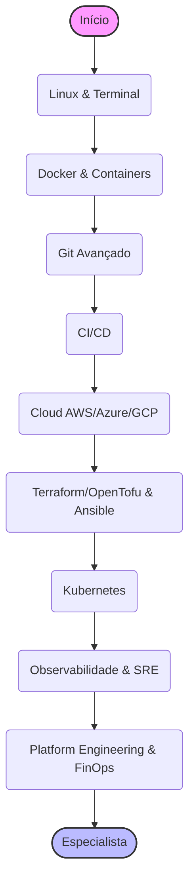

# ♾️ Trilha DevOps: A Ponte entre o Código e o Mundo

> **Edição 2026:** Foco em Platform Engineering, GitOps, Observabilidade com OpenTelemetry e segurança da cadeia de suprimentos.

```mermaid
flowchart TD
    Start([Início]) --> Linux(Linux & Terminal)
    Linux --> Container(Docker & Containers)
    Container --> Git(Git Avançado)
    Git --> CICD(CI/CD)
    CICD --> Cloud(Cloud AWS/Azure/GCP)
    Cloud --> IaC(Terraform/OpenTofu & Ansible)
    IaC --> K8s(Kubernetes)
    K8s --> Obs(Observabilidade & SRE)
    Obs --> Plat(Platform Engineering & FinOps)
    Plat --> Spec([Especialista])

    style Start fill:#f9f,stroke:#333,stroke-width:2px
    style Spec fill:#bbf,stroke:#333,stroke-width:2px
```

DevOps é cultura, mas alguém precisa operar o Kubernetes. Esta trilha leva você do terminal até a construção de plataformas internas, para que o código chegue à produção com segurança, rapidez e confiabilidade.

Esta trilha está dividida em níveis para guiar sua evolução profissional.

---

## 🐣 Nível Iniciante (Júnior)

O foco aqui é dominar a linha de comando e os fundamentos de infraestrutura.

### 🐧 Linux e Terminal

- **Shell Scripting:** Bash/Zsh. Automatize o que você faz mais de duas vezes. **Permissões:** `chmod`, `chown`, usuários e grupos.
- **Networking Básico:** SSH (chaves, não senhas), DNS, HTTP/S, TLS, firewalls (`nftables`/`ufw`).

### 🐳 Containers

- **Docker:** `Dockerfile` eficientes (multi-stage builds, usuário não-root, imagens mínimas). **Docker Compose:** Orquestrar múltiplos containers localmente.
- **Conceito:** Imutabilidade. Construiu a imagem, ela não muda; o que muda é a configuração injetada.

### 📜 Git Avançado

- **Branching:** Trunk Based Development como padrão; Git Flow só quando o produto exige várias versões em paralelo. **Hooks:** Checagens antes do commit (pre-commit).

---

## 🚀 Nível Intermediário (Pleno)

Aqui você trata infraestrutura como código e automatiza o ciclo de vida do software.

### 🔄 CI/CD

- **GitHub Actions / GitLab CI:** Pipelines que testam, buildam e fazem deploy a cada push. **Conceitos:** Lint, testes, SAST, cache de dependências, gestão de artefatos.
- **Segurança de pipeline:** Autenticação via OIDC (sem chaves de longa duração), versões de actions fixadas por hash e permissões mínimas no token.

### ☁️ Cloud Providers

Escolha uma principal, mas entenda os conceitos universais (compute, storage, rede).

- **AWS:** EC2, S3, RDS, Lambda, VPC. **Azure/GCP:** Equivalentes (VMs, Blob Storage, Cloud Functions).
- **IAM:** Princípio do menor privilégio e credenciais temporárias.

### 🏗️ Infrastructure as Code (IaC)

Nunca configure recursos manualmente (ClickOps).

- **Terraform / OpenTofu:** Provisionam infraestrutura de forma declarativa. O Terraform usa licença BSL; o **OpenTofu** é o fork open source mantido pela Linux Foundation e compatível na prática. Entenda state remoto, locking, módulos e workspaces.
- **Ansible:** Configuração de servidores (Configuration Management).
- **Crossplane:** Gerencia recursos de nuvem como objetos do Kubernetes (CNCF graduado). Útil quando a plataforma oferece infraestrutura por API.

### ☸️ Kubernetes

- **Conceitos:** Pods, Deployments, Services, ConfigMaps, Secrets, probes, requests/limits, HPA.
- **Versões:** O Kubernetes lança uma versão minor (1.3x) a cada ~4 meses e suporta só as três mais recentes. Planeje upgrades regulares e confira as notas de depreciação.
- **Tráfego de entrada:** Use a **Gateway API** (`Gateway`, `HTTPRoute`) em vez de `Ingress`. O projeto **ingress-nginx foi aposentado em março de 2026** e não recebe mais correções; quem ainda o usa deve migrar (Envoy Gateway, Cilium, NGINX Gateway Fabric, etc.).
- **Gerenciamento:** `kubectl`, Helm e Kustomize.

### ☁️ Serverless e Service Mesh

- **Serverless Containers:** AWS Fargate, Google Cloud Run ou Azure Container Apps rodam containers sem gerenciar nós.
- **Service Mesh:** Istio (inclusive o modo ambient, sem sidecar) ou Linkerd movem mTLS, métricas e retries para a malha. Adote só se você realmente precisa disso; muitas vezes a Gateway API e o Cilium bastam.

---

## 🧙‍♂️ Nível Avançado (Sênior / Especialista)

Onde você constrói plataformas para outros desenvolvedores e garante a estabilidade de sistemas em escala.

### 🔭 Observabilidade e eBPF

- **OpenTelemetry (OTel):** Padrão aberto e neutro de fornecedor para traces, métricas e logs (APIs, SDKs e Collector). Instrumente uma vez e escolha o backend depois (Grafana, Prometheus, Jaeger, Tempo etc.).
- **eBPF:** Programas executados com segurança no kernel Linux. **Cilium** (CNI, CNCF graduado) usa eBPF para rede, network policies e observabilidade (Hubble); **Falco** e **Tetragon** cobrem segurança em runtime.
- **AIOps (com cautela):** Assistentes de IA ajudam a resumir alertas e sugerir causas, mas ações automáticas em produção exigem guardrails, escopo restrito e aprovação humana.

### 🎯 SRE, SLIs e SLOs

- **SLI/SLO:** Defina indicadores (latência, disponibilidade, erros) e metas por serviço, por exemplo 99,9% de requisições bem-sucedidas em 30 dias.
- **Error Budget:** O orçamento de erro é a margem restante do SLO. Se acabou, prioriza-se confiabilidade antes de novas features.
- **Alertas:** Alerte por consumo de error budget (burn rate), não por cada pico de CPU. **Incidentes:** Runbooks, on-call sustentável e post-mortems sem culpa.

### 🐙 GitOps

- **Argo CD e Flux (CNCF graduados):** O estado desejado fica no Git (YAML/Helm/Kustomize) e o controlador reconcilia o cluster continuamente.
- **Drift Detection:** Se alguém altera um recurso manualmente, o controlador detecta a diferença e a corrige (self-heal) ou alerta. Deploy vira merge de Pull Request.
- **Segredos:** Nunca no Git em texto puro. Use External Secrets Operator, Sealed Secrets ou SOPS.

### 🏗️ Platform Engineering

Em vez de ser a equipe que "faz o deploy" para os outros, construa uma plataforma interna como produto.

- **Internal Developer Platforms (IDPs):** **Backstage** (CNCF incubating) ou **Port** oferecem catálogo de serviços, templates e documentação num só portal.
- **Golden Paths:** Templates que criam repositório, pipeline, observabilidade e políticas por padrão, reduzindo carga cognitiva. Meça adoção e satisfação dos devs.

### 🛡️ DevSecOps e Supply Chain

- **SBOM:** Gere a lista de componentes (`syft`, formatos SPDX ou CycloneDX).
- **Assinatura e proveniência:** **Sigstore/Cosign** assinam imagens e atestados; **SLSA** define níveis de maturidade de build e proveniência. Verifique assinaturas no cluster.
- **Policy as Code:** OPA/Gatekeeper, **Kyverno** ou ValidatingAdmissionPolicy (nativo do Kubernetes) bloqueiam containers como root ou sem limits.
- **Scanning:** Trivy ou Grype no build e no registry; trate CVEs por criticidade e exploitabilidade.

### 📈 Métricas DORA (Performance de Entrega)

As cinco métricas do [DORA](https://dora.dev/guides/dora-metrics/) medem velocidade e estabilidade juntas:

| Métrica                         | O que mede                              | Meta de elite (referência)   |
| ------------------------------- | --------------------------------------- | ---------------------------- |
| Lead Time for Changes           | Commit → produção                       | < 1 dia                      |
| Deployment Frequency            | Frequência de deploys                   | Sob demanda (várias por dia) |
| Change Failure Rate             | % de deploys que causam falha           | < 5%                         |
| Failed Deployment Recovery Time | Tempo para restaurar o serviço          | < 1 hora                     |
| Deployment Rework Rate          | % de deploys não planejados (correções) | Baixo e em queda             |

- **Como medir:** extraia dados do Git, do CI/CD e do gestor de incidentes (ex.: Four Keys, Backstage, Grafana).
- **Cuidado:** use como diagnóstico do time, nunca como ranking individual.

### 💰 FinOps e Green Software

- **FinOps:** Prática de responsabilizar engenharia, finanças e negócio pelo custo de nuvem. Ciclo: informar (visibilidade), otimizar e operar. Comece com tags/labels obrigatórias e alocação de custo por time e serviço.
- **Ferramentas:** **OpenCost** (CNCF) ou Kubecost para custo por namespace/serviço; relatórios nativos de AWS, Azure e GCP.
- **Otimização:** Right-sizing de requests/limits, **Karpenter** (ou autoscaler equivalente) para nós, Spot/preemptible em cargas tolerantes, Savings Plans/CUDs para a carga estável e desligar ambientes ociosos.
- **Unit economics:** Meça custo por cliente, requisição ou transação, não só a fatura total.
- **Green Software:** Menos desperdício é menos emissão. Veja os princípios da Green Software Foundation (eficiência de energia, de hardware e consciência de carbono).

### 📚 Livros e Cultura

- **["The Phoenix Project" (Gene Kim)](https://itrevolution.com/product/the-phoenix-project/):** Romance sobre por que o trabalho de TI é caótico e como o DevOps ajuda.
- **["The DevOps Handbook"](https://itrevolution.com/product/the-devops-handbook/):** O manual prático que complementa o Phoenix Project.
- **["Site Reliability Engineering" (Google)](https://sre.google/books/):** Livros gratuitos online sobre SRE, SLOs e gestão de incidentes.

### 🧠 Soft Skills

- **Cultura sem culpa:** Se um dev derrubou a produção, o pipeline permitiu. Busque a causa sistêmica.
- **Automação:** Elimine seu próprio trabalho manual e ensine os times a serem autônomos. **Gestão de incidentes:** Calma, comunicação clara e papéis definidos.

### 🏆 Desafios Práticos (Projetos)

- **Júnior:** Pipeline de CI/CD com GitHub Actions para uma aplicação Node.js: lint, testes e build da imagem Docker só se os testes passarem.
- **Pleno:** Infraestrutura de 3 camadas (frontend, backend, banco) na AWS (pode usar LocalStack) com Terraform ou OpenTofu, usando módulos e state remoto no S3.
- **Sênior:** GitOps completo com Argo CD num cluster Kubernetes: Gateway API, monitoramento (OpenTelemetry, Prometheus, Grafana), HPA, SLOs com alerta de burn rate, imagens assinadas com Cosign e políticas Kyverno que barram deploys sem limits.

---

## 📚 Materiais de Estudo Recomendados

Para formar o Desenvolvedor Completo em 2026 (do Júnior ao Especialista), reunimos os conteúdos mais atualizados e de altíssima qualidade do mercado:

### 🐣 Para Nível Júnior

- **[Linux Journey](https://linuxjourney.com/):** Fundamentos de Linux, permissões, serviços e terminal.
- **[GitHub Actions Documentation](https://docs.github.com/en/actions):** CI/CD direto da fonte. **[Docker Docs](https://docs.docker.com/):** Containers, Dockerfile e Compose.

### 🚀 Para Nível Pleno

- **[Kubernetes Tutorials](https://kubernetes.io/docs/tutorials/):** Pratique com minikube ou kind.
- **[Gateway API](https://gateway-api.sigs.k8s.io/):** Documentação oficial do substituto do Ingress.
- **[HashiCorp Developer (Terraform)](https://developer.hashicorp.com/terraform/tutorials):** Tutoriais oficiais de IaC.
- **[OpenTofu Docs](https://opentofu.org/docs/):** Alternativa open source ao Terraform.
- **[Prometheus Docs](https://prometheus.io/docs/introduction/overview/):** Base de métricas e alertas.

### 🏛️ Para Nível Sênior/Especialista

- **[OpenTelemetry Docs](https://opentelemetry.io/docs/):** Instrumentação e Collector.
- **[eBPF.io](https://ebpf.io/) e [Cilium Docs](https://docs.cilium.io/):** eBPF na prática para rede e segurança.
- **[Argo CD Docs](https://argo-cd.readthedocs.io/) e [Flux Docs](https://fluxcd.io/flux/):** GitOps.
- **[Backstage](https://backstage.io/):** Framework de portal de desenvolvedores. **[Crossplane](https://docs.crossplane.io/):** Infraestrutura via API do Kubernetes.
- **[Sigstore](https://docs.sigstore.dev/) e [SLSA](https://slsa.dev/):** Assinatura e proveniência de software.
- **[DORA](https://dora.dev/):** Pesquisa e guias de métricas de entrega.
- **[Google SRE Workbook](https://sre.google/workbook/table-of-contents/):** Implementação prática de SLOs e alertas.
- **[FinOps Foundation](https://www.finops.org/framework/):** Framework de FinOps.
- **[CNCF Landscape](https://landscape.cncf.io/):** Mapa dos projetos cloud native (graduados, incubating e sandbox).

---

## ↩️ Navegação

- [**Voltar para o Início**](../../index.md) [**Ver Conselhos de Carreira**](../../advices.md)
