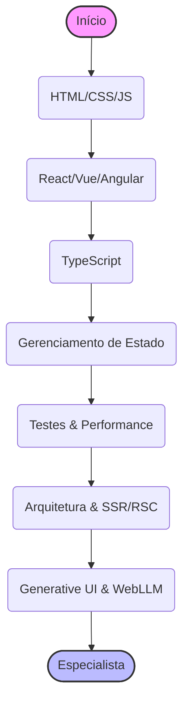

# 🎨 Trilha Frontend: Onde a Mágica Acontece

> **Edição 2026:** Focado em Generative UI, IA no Browser (WebGPU) e integração com Agentes.

Bem-vindo(a) ao mundo do Frontend! Aqui é onde o código se transforma em interfaces bonitas e interativas. Você será o arquiteto da experiência do usuário, a pessoa que faz a tecnologia parecer amigável.

Esta trilha está dividida em níveis para guiar sua evolução profissional.

---

## 🐣 Nível Iniciante (Júnior)

O foco aqui é dominar a tríade sagrada da web e começar a usar frameworks modernos.

### 🦴 HTML, CSS e JavaScript (A Base)
- **HTML:** Semântica (SEO) e Acessibilidade (a11y) - garantir que todos possam usar seu site.
- **CSS:** Flexbox, Grid e Responsividade (Mobile First). O básico para layout.
- **JavaScript:** Manipulação do DOM, `fetch` API para consumir dados e ES6+ (Arrow Functions, Destructuring).
- **Recursos:**
  - 📖 [MDN Web Docs](https://developer.mozilla.org/)

### 🛠️ Frameworks Modernos (Escolha Um)
- **React:** O padrão da indústria. Entenda Hooks (`useState`, `useEffect`) e Componentes Funcionais.
  - *Next.js:* Aprenda o básico de Server-Side Rendering (SSR) e roteamento.
- **Vue.js:** Curva de aprendizado suave e excelente documentação.
- **Angular:** Estrutura completa para grandes empresas (Google).

### 📦 Ferramentas Básicas
- **Git:** Como salvar e compartilhar seu código.
- **NPM/Yarn/PNPM:** Como instalar bibliotecas de terceiros.

---

## 🚀 Nível Intermediário (Pleno)

Aqui você garante qualidade, escalabilidade e performance. O "funciona" não é mais suficiente.

### 🛡️ TypeScript
- **Por que usar?** O JavaScript com "superpoderes" (tipagem estática). Evita 80% dos bugs comuns.
- **Conceitos:** Interfaces, Types, Generics e Utility Types.

### 🧠 Gerenciamento de Estado
Quando passar props de pai para filho fica insustentável.
- **Redux Toolkit:** O veterano robusto.
- **Zustand:** Minimalista e direto ao ponto.
- **React Query (TanStack Query):** Essencial para gerenciar estado assíncrono (API calls, cache, loading).

### 🧪 Testes no Frontend
- **Jest / Vitest:** Para lógica de negócios e funções puras.
- **React Testing Library:** Testar componentes como o usuário os vê (cliques, textos).
- **Cypress / Playwright:** Testes E2E (Ponta a Ponta) que simulam o navegador real.

### 🎨 Estilização Avançada
- **Tailwind CSS:** O padrão moderno de estilização utilitária.
- **Component Libraries:** Não reinvente a roda. Use **shadcn/ui** ou **Radix UI** para componentes acessíveis e bonitos.

### ♿ Acessibilidade Web (a11y)
A internet deve ser para todos.
- **Semântica HTML:** `button` é botão, `div` não é botão. O básico que muitos erram.
- **WAI-ARIA:** Quando o HTML não basta, use atributos ARIA (`aria-label`, `role`) para guiar leitores de tela.
- **Ferramentas de Auditoria:**
  - **Lighthouse / WAVE:** Para checkups rápidos.
  - **axe-core:** Para automação de testes de acessibilidade.
  - **Leitores de Tela (NVDA / VoiceOver):** Teste seu site de olhos fechados.

---

## 🧙‍♂️ Nível Avançado (Sênior / Especialista)

Onde a engenharia de software encontra a arte e a inteligência artificial.

### 🏗️ Arquitetura de Frontend
- **Micro-frontends:** Module Federation. Como dividir um sistema gigante em partes menores.
- **Server Components (RSC):** O novo paradigma do React e Next.js. Renderizar no servidor o que não precisa de interatividade.
- **Server Actions:** O padrão recomendado para executar mutações de dados e operações de IA (como chamar a OpenAI) de forma segura a partir do frontend, sem expor chaves de API.
- **Server-Driven UI (HTMX):** A alternativa radical às SPAs complexas. Retornar HTML do servidor em vez de JSON, ideal para aplicações "dashboard-like" e redução de complexidade.

### ⚡ Performance & Core Web Vitals
Performance é UX. Ninguém gosta de site lento.
- **LCP (Largest Contentful Paint):** Quanto tempo demora para o "conteúdo principal" aparecer? Meta: < 2.5s.
- **INP (Interaction to Next Paint):** O site trava quando clico? Substituiu o FID. Meta: < 200ms.
- **CLS (Cumulative Layout Shift):** As coisas mudam de lugar sozinhas? Evite layout instável.
- **Técnicas:** Code Splitting, Lazy Loading de imagens, otimização de fontes e uso correto de Cache-Control.

### 🤖 IA Engineering no Frontend (O Diferencial de 2026)
- **Vercel AI SDK:** A ponte entre seu frontend e os LLMs. Streaming de texto e chat.
- **Generative UI (Runtime):** A IA não deve retornar apenas texto. Ela deve gerar JSON que seu frontend renderiza como componentes ricos (`<StockChart />`, `<FlightTicket />`).
- **Generative UI (DevTime):** Ferramentas como **v0.dev** e **Lovable** que geram código de interface (React + Tailwind) pronto para uso, mudando o fluxo de trabalho de "codar do zero" para "curadoria e refino".
- **Streaming UI:** Renderizar a interface *token por token* para dar sensação de instantaneidade.
- **WebGPU & IA no Browser:** Rodar modelos (Llama 3, Whisper) diretamente na GPU do usuário usando **WebLLM** e **Transformers.js**. Privacidade total e zero custo de servidor.

### 🚀 Tópicos Especializados
- **WebAssembly (Wasm):** Rodar código Rust ou C++ no browser para performance nativa (edição de vídeo, jogos).
- **WebSockets:** Comunicação bidirecional em tempo real.
- **Segurança:** Proteção contra XSS, CSRF e configuração de Content Security Policy (CSP).

---

## ↩️ Navegação

*   [**Voltar para o Início**](../../index.md)
*   [**Ver Conselhos de Carreira**](../../advices.md)
