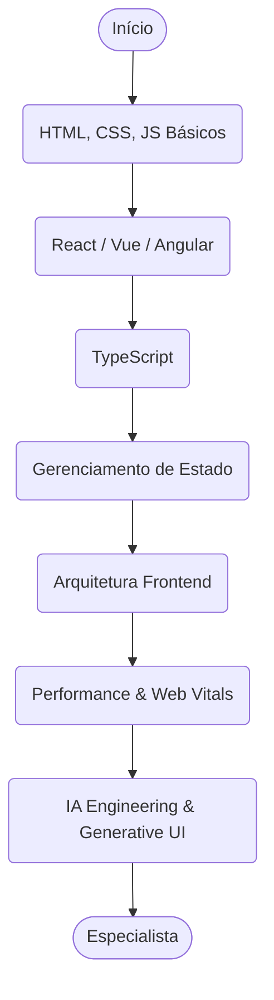

# 🎨 Trilha Frontend: Construindo Experiências de Usuário

> **Edição 2026:** Focado em Next.js 15+, Server Components, Vercel AI SDK e Local-First.

```mermaid
flowchart TD
    Start([Início]) --> HTML(HTML, CSS, JS Básicos)
    HTML --> Framework(React / Vue / Angular)
    Framework --> TypeScript(TypeScript)
    TypeScript --> State(Gerenciamento de Estado)
    State --> Arch(Arquitetura Frontend)
    Arch --> Perf(Performance & Web Vitals)
    Perf --> AI(IA Engineering & Generative UI)
    AI --> Spec([Especialista])
```

Torne-se um engenheiro focado em performance, componentes modernos e integração com IA. Em 2026, o Frontend vai muito além de "desenhar telas". É sobre orquestrar dados, garantir performance extrema e integrar Inteligência Artificial na interface.

## 🐣 Nível Iniciante (Júnior): A Base

O objetivo inicial é dominar as linguagens que o navegador entende nativamente antes de pular para os frameworks mágicos.

- **HTML & CSS Profundos:** Semântica (acessibilidade), Flexbox, CSS Grid. Entenda como o browser renderiza (DOM, CSSOM, Render Tree).
- **JavaScript Moderno (ES6+):** Arrow functions, Promises, Async/Await, manipulação do DOM. Entenda o Event Loop (Call Stack, Web APIs, Microtask Queue).
- **Frameworks:** React (Hooks: useState, useEffect, useCallback, useMemo), Vue.js (Composition API) ou Angular. Escolha um e foque na reatividade.
- **Ferramentas Básicas:** Git (versionamento), NPM/Yarn/PNPM (gerenciamento de pacotes), Vite (build tool).

## 🚀 Nível Intermediário (Pleno): O Otimizador

Neste nível, o código funciona, mas precisa ser escalável, tipado e testado.

- **TypeScript (Obrigatório):** Interfaces, Types, Generics e Utility Types. Tipagem estrita não é opção em 2026.
- **Gerenciamento de Estado Global:** Redux Toolkit, Zustand (para React) ou Pinia (para Vue). Saiba quando usar estado local vs global.
- **Sincronização de Dados (Server-State):** React Query (TanStack Query) ou SWR. Cache, revalidação automática e optimistic updates.
- **Testes Automatizados:** Jest/Vitest para testes unitários (lógica), React Testing Library (comportamento de componentes), Cypress/Playwright (E2E).
- **Estilização Avançada:** Tailwind CSS para produtividade, Component Libraries (shadcn/ui, Radix UI) construídas focadas em acessibilidade.
- **Acessibilidade Web (a11y):** WAI-ARIA, Lighthouse/WAVE, axe-core. Garantir navegação por teclado e compatibilidade com leitores de tela.

## 🧙‍♂️ Nível Avançado (Sênior / Especialista): O Arquiteto

O especialista desenha a arquitetura, pensa na latência e constrói infraestrutura para a equipe.

- **Arquitetura de Frontend:** Micro-frontends (Module Federation), Server-Driven UI (HTMX, onde a lógica de UI vem do backend).
- **React Server Components (RSC) e Meta-Frameworks:** Next.js 15+ (App Router), Nuxt. Domínio em SSR, SSG, ISR e Partial Prerendering (PPR).
- **Performance & Core Web Vitals:** Entenda e otimize LCP (< 2.5s), INP (< 200ms), CLS (< 0.1). Otimização agressiva de fontes, imagens (AVIF/WebP) e cache.
- **Tópicos Especializados:** WebAssembly (Wasm) rodando Rust no browser, Edge Computing (Cloudflare Workers) para diminuir latência, React Compiler.
- **Green Frontend & Sustentabilidade:** Redução de bundle JS, evitar re-renders desnecessários para economizar CPU e bateria dos dispositivos (Green Software).

### 🤖 IA Engineering no Frontend (O Diferencial de 2026)

Em 2026, a IA Generativa é cidadã de primeira classe no Frontend. O usuário não quer preencher formulários, ele quer conversar.

- **Vercel AI SDK:** A ponte definitiva entre frontend e LLMs. Domine Stateful Streaming, function/tool calling.
- **Generative UI (Runtime):** Geração de componentes React on-the-fly de acordo com o contexto do usuário (usando streamUI do Vercel AI SDK).
- **Generative UI (DevTime):** Uso de ferramentas Agentic como v0.dev, Lovable, Bolt.new ou Cursor para curadoria e refino arquitetural de UI.
- **Local First AI & WebNN:** Modelos SLM (Small Language Models como Phi-3, Llama 3 compactos) e modelos de áudio/visão (como Whisper) rodando diretamente na GPU/NPU do navegador do usuário via WebLLM, Transformers.js ou ONNX Runtime Web. Zero custo de inferência de nuvem, zero latência de rede e total privacidade de dados (Local-First Architecture).

## 🏆 Desafios Práticos

- **Júnior:** Landing Page responsiva com HTML, CSS e JavaScript puro (validação de campos de formulário, animações simples).
- **Pleno:** Dashboard de Clima consumindo uma API externa. Requisitos: TypeScript, React Query para fetch, estado global (Zustand), gráficos interativos e Dark/Light mode persistente.
- **Sênior:** E-commerce Full Stack com Next.js (App Router). Requisitos: Carrinho offline-first (sincronização via CRDTs ou TanStack Query), otimização rigorosa de Core Web Vitals (LCP/INP), e um assistente/chatbot de Generative UI nativo que ajuda o usuário a encontrar produtos recomendados baseados no histórico de navegação, utilizando WebNN/WebAssembly para inferência.

## 📚 Materiais de Estudo Recomendados

Para formar o Desenvolvedor Completo em 2026 (do Júnior ao Especialista), reunimos os conteúdos mais atualizados e de altíssima qualidade do mercado:

**Para o Júnior (Fundamentos e Bases):**

- **[MDN Web Docs](https://developer.mozilla.org/):** A bíblia do desenvolvimento web.
- **[The Odin Project](https://www.theodinproject.com/):** Currículo open-source focado em projetos para o desenvolvedor completo.
- **[JavaScript.info](https://javascript.info/) & [FreeCodeCamp](https://www.freecodecamp.org/):** Guias completos para JavaScript moderno e HTML/CSS.

**Para o Pleno (Arquitetura e TypeScript):**

- **[Total TypeScript](https://www.totaltypescript.com/):** Domine TypeScript avançado no ecossistema moderno.
- **[Frontend Masters](https://frontendmasters.com/):** Plataforma premium para aprofundar em React, Vue, performance e a11y.
- **[Testing JavaScript](https://testingjavascript.com/):** Teste com confiança e sem fragilidades usando Vitest, RTL e Playwright.
- **[Epic React](https://epicreact.dev/) / [React.dev](https://react.dev/):** Padrões avançados, hooks e concorrência no React 19+.

**Para o Sênior/Especialista (Performance, IA e Edge):**

- **[web.dev](https://web.dev/):** A referência absoluta para Core Web Vitals e alta performance.
- **[Vercel AI SDK Docs](https://sdk.vercel.ai/docs) & [ONNX Runtime Web](https://onnxruntime.ai/docs/tutorials/web/):** Aprenda a criar Generative UI conectadas a LLMs e Local-First AI com WebNN e Wasm.
- **[Local-First Web Development](https://localfirstweb.dev/):** Guia definitivo para criar aplicações offline-first premium de latência zero com CRDTs e Yjs.
- **[Josh W. Comeau's CSS for JS Devs](https://css-for-js.dev/):** Motor do CSS explicado, acabando com o medo de quebrar layouts.

## ↩️ Navegação

- [**Voltar para o Início**](../../index.md)
- [**Ver Conselhos de Carreira**](../../advices.md)
