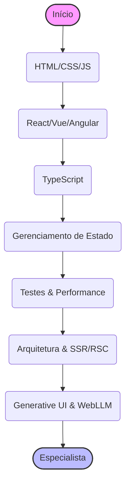

# 🎨 Trilha Frontend: Onde a Mágica Acontece

> **Edição 2026:** Focado em Generative UI, IA no Browser (WebGPU) e integração com Agentes.

```mermaid
flowchart TD
    Start([Início]) --> Base(HTML/CSS/JS)
    Base --> Framework(React/Vue/Angular)
    Framework --> TS(TypeScript)
    TS --> State(Gerenciamento de Estado)
    State --> Test(Testes & Performance)
    Test --> Arch(Arquitetura & SSR/RSC)
    Arch --> AI(Generative UI & WebLLM)
    AI --> Spec([Especialista])

    style Start fill:#f9f,stroke:#333,stroke-width:2px
    style Spec fill:#bbf,stroke:#333,stroke-width:2px
```

Bem-vindo(a) ao mundo do Frontend! Aqui é onde o código se transforma em interfaces bonitas e interativas. Você será o arquiteto da experiência do usuário, a pessoa que faz a tecnologia parecer amigável.

Esta trilha está dividida em níveis para guiar sua evolução profissional.

---

## 🐣 Nível Iniciante (Júnior)

O foco aqui é dominar a tríade sagrada da web e começar a usar frameworks modernos.

### 🦴 HTML, CSS e JavaScript (A Base)
- **HTML:** Semântica (SEO) e Acessibilidade (a11y) - garantir que todos possam usar seu site.
- **CSS:** Flexbox, Grid e Responsividade (Mobile First). O básico para layout.
- **JavaScript:** Manipulação do DOM, `fetch` API para consumir dados e ES6+ (Arrow Functions, Destructuring).
- **Recursos:**
  - 📖 [MDN Web Docs](https://developer.mozilla.org/)

### 🛠️ Frameworks Modernos (Escolha Um)
- **React:** O padrão da indústria. Entenda Hooks (`useState`, `useEffect`) e Componentes Funcionais.
  - *Next.js:* Aprenda o básico de Server-Side Rendering (SSR) e roteamento.
- **Vue.js:** Curva de aprendizado suave e excelente documentação.
- **Angular:** Estrutura completa para grandes empresas (Google).

### 📦 Ferramentas Básicas
- **Git:** Como salvar e compartilhar seu código.
- **NPM/Yarn/PNPM:** Como instalar bibliotecas de terceiros.

---

## 🚀 Nível Intermediário (Pleno)

Aqui você garante qualidade, escalabilidade e performance. O "funciona" não é mais suficiente.

### 🛡️ TypeScript
- **Por que usar?** O JavaScript com "superpoderes" (tipagem estática). Evita 80% dos bugs comuns.
- **Conceitos:** Interfaces, Types, Generics e Utility Types.

### 🧠 Gerenciamento de Estado
Quando passar props de pai para filho fica insustentável.
- **Redux Toolkit:** O veterano robusto.
- **Zustand:** Minimalista e direto ao ponto.
- **React Query (TanStack Query):** Essencial para gerenciar estado assíncrono (API calls, cache, loading).

### 🧪 Testes no Frontend
- **Jest / Vitest:** Para lógica de negócios e funções puras.
- **React Testing Library:** Testar componentes como o usuário os vê (cliques, textos).
- **Cypress / Playwright:** Testes E2E (Ponta a Ponta) que simulam o navegador real.

### 🎨 Estilização Avançada
- **Tailwind CSS:** O padrão moderno de estilização utilitária.
- **Component Libraries:** Não reinvente a roda. Use **shadcn/ui** ou **Radix UI** para componentes acessíveis e bonitos.

### ♿ Acessibilidade Web (a11y)
A internet deve ser para todos.
- **Semântica HTML:** `button` é botão, `div` não é botão. O básico que muitos erram.
- **WAI-ARIA:** Quando o HTML não basta, use atributos ARIA (`aria-label`, `role`) para guiar leitores de tela.
- **Ferramentas de Auditoria:**
  - **Lighthouse / WAVE:** Para checkups rápidos.
  - **axe-core:** Para automação de testes de acessibilidade.
  - **Leitores de Tela (NVDA / VoiceOver):** Teste seu site de olhos fechados.

---

## 🧙‍♂️ Nível Avançado (Sênior / Especialista)

Onde a engenharia de software encontra a arte e a inteligência artificial.

### 🏗️ Arquitetura de Frontend
- **Micro-frontends:** Module Federation. Como dividir um sistema gigante em partes menores.
- **Server Components (RSC) e Next.js 15+:** O paradigma moderno de renderização mista de páginas web.
  - **Partial Prerendering (PPR):** Combinar uma página estática super rápida com pedaços dinâmicos renderizados via stream, com suspenses.
- **Server Actions (Avançado):** Lógica que roda no servidor a partir do front end, útil para mutações em bancos de dados ou chamadas de API, garantindo segurança ao invés de expor endpoints.
- **Server-Driven UI (HTMX):** A alternativa radical às SPAs complexas. Retornar HTML do servidor em vez de JSON, ideal para aplicações "dashboard-like" e redução de complexidade.

### ⚡ Performance & Core Web Vitals
Performance é UX. Ninguém gosta de site lento.
- **LCP (Largest Contentful Paint):** Quanto tempo demora para o "conteúdo principal" aparecer? Meta: < 2.5s.
- **INP (Interaction to Next Paint):** O site trava quando clico? Substituiu o FID. Meta: < 200ms.
- **CLS (Cumulative Layout Shift):** As coisas mudam de lugar sozinhas? Evite layout instável.
- **Técnicas:** Code Splitting, Lazy Loading de imagens, otimização de fontes e uso correto de Cache-Control.

### 🤖 IA Engineering no Frontend (O Diferencial de 2026)
A revolução da IA também acontece no lado do cliente.
- **Vercel AI SDK:** A ponte definitiva entre seu frontend e os LLMs. Domine o streaming não apenas de texto, mas de estados complexos (Stateful Streaming) e chamadas de ferramentas.
- **Generative UI (Runtime):** A IA não deve retornar apenas Markdown. Usando ferramentas como Vercel AI SDK (`streamUI`), ela gera componentes React on-the-fly (`<StockChart />`, `<FlightTicket />`). A interface se adapta à intenção do usuário no tempo de execução.
- **Generative UI (DevTime):** Ferramentas como **v0.dev**, **Lovable** ou **Bolt.new** geram código de interface (React + Tailwind) pronto para uso. O fluxo de trabalho de um Sênior muda de "codar do zero" para "prompting arquitetural, curadoria e refino".
- **Streaming UI:** O usuário não pode esperar a API responder completamente. Renderizar a interface *token por token* e montar esqueletos dinâmicos é a regra para reter atenção.
- **WebGPU & IA no Browser (Local AI):** Rodar modelos (Llama 3, Phi-3, Whisper) diretamente na GPU do usuário final usando **WebLLM** e **Transformers.js**. Isso traz **Privacidade Total** e **Zero Custo de Servidor (Inference Cost = 0)**. O frontend virou uma plataforma de IA independente.

### 🚀 Tópicos Especializados e React Server Components (RSC)
- **WebAssembly (Wasm) e Edge Computing:** Escrever e compilar códigos nativos C++/Rust/Go rodando com performance de desktop no browser via Wasm. Compartilhar a mesma biblioteca criptográfica ou algoritmo pesado entre o seu servidor Rust e o navegador do cliente.
- **Server Components (RSC):** Entender a fronteira difusa entre servidor e cliente (ex: Next.js App Router, Nuxt). Componentes de servidor processam o que é pesado e só entregam a interface limpa via HTML pro cliente, com "Server Actions" substituindo endpoints de API separados para mutations.
- **Micro-Frontends e Module Federation (Avançado):** A forma correta de escalar times gigantes (escala Enterprise). Repositórios independentes publicam "pedaços" da aplicação que são injetados em tempo de execução no *shell* principal.
- **Segurança Avançada:** Content Security Policy (CSP) rigorosas (usando nonces para RSCs), proteção contra XSS (especialmente ao renderizar saídas de IA/Markdown) e estratégias avançadas de mitigação de CSRF.

### 🌿 Green Frontend & Sustentabilidade
A web consome energia. Você pode ajudar a reduzir isso.
- **Peso da Página:** Imagens otimizadas (AVIF/WebP) e bundle JS reduzido significam menos transferência de dados e menos energia.
- **Renderização Eficiente:** Evite re-renders desnecessários que gastam CPU do dispositivo do usuário.
- **Dark Mode:** Em telas OLED, pixels pretos estão desligados e economizam bateria.

### 🧠 Soft Skills & Diferencial Humano
- **Empatia com Design:** Não diga "isso é impossível". Diga "isso é custoso, podemos simplificar assim?". Entenda que o pixel perfect importa para a marca.
- **Advogado do Usuário:** Você é a última linha de defesa antes do usuário. Se o fluxo está confuso, levante a mão. Não implemente cegamente telas ruins.
- **Colaboração com Backend:** Entenda as limitações da API. Negocie payloads menores e estratégias de cache para melhorar a performance.

### 🏆 Desafios Práticos (Projetos)

- **Júnior:** Construa uma Landing Page responsiva para um produto fictício usando HTML, CSS (Flexbox/Grid) e JavaScript. Deve ter um formulário de contato funcional (pode usar Formspree) e validação de campos.
- **Pleno:** Crie uma Dashboard de Clima consumindo uma API pública (OpenWeatherMap). Requisitos: Gerenciamento de estado global (Zustand/Redux), gráficos com Recharts/Chart.js e modo Dark/Light.
- **Sênior:** Desenvolva um E-commerce completo com Next.js (App Router) e Server Actions. Requisitos: Otimização de imagens (LCP < 2.5s), carrinho de compras persistente, SEO técnico e integração com Vercel AI SDK para um chatbot de recomendação de produtos.

---

## ↩️ Navegação

*   [**Voltar para o Início**](../../index.md)
*   [**Ver Conselhos de Carreira**](../../advices.md)
