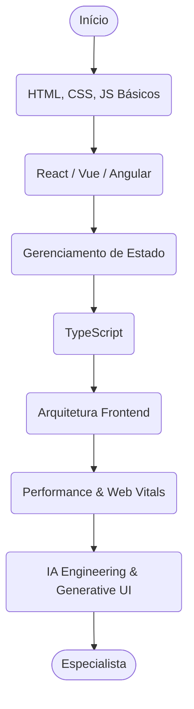

# 🎨 Trilha Frontend: Construindo Experiências de Usuário

> **Edição 2026:** Focado em Next.js 15+, Server Components, Vercel AI SDK e Local-First.

```mermaid
flowchart TD
    Start([Início]) --> HTML(HTML, CSS, JS Básicos)
    HTML --> Framework(React / Vue / Angular)
    Framework --> State(Gerenciamento de Estado)
    State --> TypeScript(TypeScript)
    TypeScript --> Arch(Arquitetura Frontend)
    Arch --> Perf(Performance & Web Vitals)
    Perf --> AI(IA Engineering & Generative UI)
    AI --> Spec([Especialista])
```

Torne-se um engenheiro focado em performance, componentes modernos e integração com IA.

## 🐣 Nível Iniciante (Júnior): A Base

- **HTML & CSS:** Semântica (acessibilidade), Flexbox, CSS Grid.
- **JavaScript Moderno (ES6+):** Arrow functions, Promises, Async/Await, manipulação do DOM.
- **Frameworks:** React (Hooks: useState, useEffect), Vue.js ou Angular.
- **Ferramentas Básicas:** Git e NPM/Yarn/PNPM.

## 🚀 Nível Intermediário (Pleno): O Otimizador

- **TypeScript:** Interfaces, Types, Generics e Utility Types.
- **Gerenciamento de Estado:** Redux Toolkit, Zustand ou React Query (TanStack Query).
- **Testes:** Jest/Vitest (lógica), React Testing Library (componentes), Cypress/Playwright (E2E).
- **Estilização Avançada:** Tailwind CSS, Component Libraries (shadcn/ui, Radix UI).
- **Acessibilidade Web (a11y):** WAI-ARIA, Lighthouse/WAVE, axe-core.

## 🧙‍♂️ Nível Avançado (Sênior / Especialista): O Arquiteto

- **Arquitetura de Frontend:** Micro-frontends (Module Federation), Server-Driven UI (HTMX).
- **React Server Components (RSC) e Next.js 15+:** Partial Prerendering (PPR), Server Actions.
- **Performance & Core Web Vitals:** LCP (< 2.5s), INP (< 200ms), CLS. Otimização de fontes/cache.
- **Tópicos Especializados:** WebAssembly (Wasm) e Edge Computing, React Compiler (React 19).
- **Green Frontend & Sustentabilidade:** Otimização de imagens (AVIF/WebP), redução de bundle JS.

### 🤖 IA Engineering no Frontend (O Diferencial de 2026)

- **Vercel AI SDK:** Ponte definitiva entre frontend e LLMs (Stateful Streaming, tool calling).
- **Generative UI (Runtime):** Geração de componentes React on-the-fly com Vercel AI SDK (streamUI).
- **Generative UI (DevTime):** Uso de v0.dev, Lovable ou Bolt.new para curadoria e refino arquitetural.
- **Local First AI & WebNN:** Modelos (Llama 3, Phi-3, Whisper) rodando no navegador via WebLLM e Transformers.js. Zero custo de inferência e total privacidade.

## 🏆 Desafios Práticos

- **Júnior:** Landing Page responsiva com HTML, CSS e JavaScript (validação de campos).
- **Pleno:** Dashboard de Clima com API externa, estado global (Zustand), gráficos e Dark/Light mode.
- **Sênior:** E-commerce com Next.js (App Router), otimização LCP, e chatbot AI para recomendação.

## 📚 Materiais de Estudo Recomendados

**Para o Júnior (Fundamentos e Bases):**

- **[MDN Web Docs](https://developer.mozilla.org/):** A bíblia do desenvolvimento web.
- **[FreeCodeCamp - Responsive Web Design](https://www.freecodecamp.org/):** Fixar HTML e CSS na prática.
- **[JavaScript.info](https://javascript.info/):** Guia completo para entender o JS moderno a fundo.

**Para o Pleno (Arquitetura e TypeScript):**

- **[Total TypeScript](https://www.totaltypescript.com/):** Curso definitivo para TypeScript avançado.
- **[Frontend Masters](https://frontendmasters.com/):** Cursos sobre performance, a11y e algoritmos.
- **[Epic React](https://epicreact.dev/) / [React.dev](https://react.dev/):** Domine padrões do React e concorrência.

**Para o Sênior/Especialista:**

- **[web.dev (Google Chrome Developers)](https://web.dev/):** Métricas vitais (Core Web Vitals).
- **[Vercel AI SDK Documentation](https://sdk.vercel.ai/docs):** Implementação de Generative UI e RAG via RSC.
- **[ONNX Runtime Web](https://onnxruntime.ai/docs/tutorials/web/):** Rodar modelos de IA locais no navegador (WebNN/WebAssembly).
- **[Patterns.dev](https://www.patterns.dev/):** Guia de padrões de design em JavaScript e React, focado em performance.
- **[Josh W. Comeau's CSS for JS Devs](https://css-for-js.dev/):** Ensina o motor do CSS por trás dos panos.

## ↩️ Navegação

- [**Voltar para o Início**](../../index.md)
- [**Ver Conselhos de Carreira**](../../advices.md)
