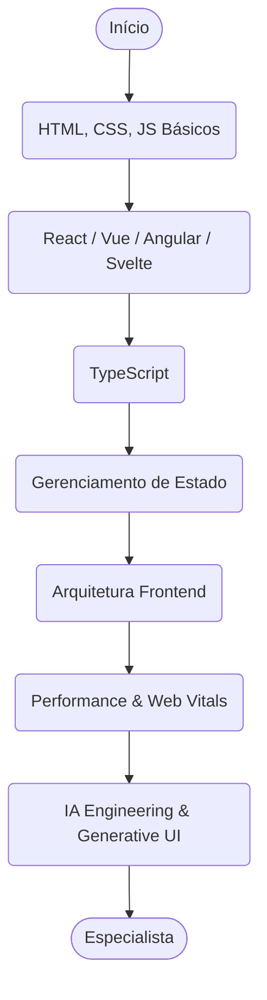

# 🎨 Trilha Frontend: Construindo Experiências de Usuário

> **Edição 2026:** React 19+ com Compiler, Next.js 16, TypeScript, Tailwind v4, acessibilidade, performance (INP), IA aplicada e Local-First.

```mermaid
flowchart TD
    Start([Início]) --> HTML(HTML, CSS, JS Básicos)
    HTML --> Framework(React / Vue / Angular / Svelte)
    Framework --> TypeScript(TypeScript)
    TypeScript --> State(Gerenciamento de Estado)
    State --> Arch(Arquitetura Frontend)
    Arch --> Perf(Performance & Web Vitals)
    Perf --> AI(IA Engineering & Generative UI)
    AI --> Spec([Especialista])
```

Esta trilha cobre o frontend de ponta a ponta: fundamentos, frameworks, qualidade (testes, a11y, segurança), performance e uso de IA na interface e no seu fluxo de trabalho.

## 🐣 Nível Iniciante (Júnior): A Base

Domine o que o navegador entende nativamente antes de depender de frameworks.

- **HTML & CSS:** HTML semântico (base da acessibilidade), Flexbox, CSS Grid, Container Queries, variáveis CSS e `:has()`. Entenda como o browser renderiza (DOM, CSSOM, Render Tree).
- **JavaScript Moderno (ES2015+):** Módulos ES, Promises, async/await, `fetch`, manipulação do DOM. Entenda o Event Loop (Call Stack, Web APIs, Microtask Queue).
- **Frameworks:** escolha um e aprofunde na reatividade.
  - **React 19+:** componentes, Hooks (`useState`, `useEffect`, `useActionState`, `use`), formulários com Actions.
  - **Vue 3.5+:** Composition API e `<script setup>`.
  - **Angular (20+):** Signals, componentes standalone e change detection zoneless.
  - **Svelte 5:** runes (`$state`, `$derived`, `$effect`).
- **Ferramentas Básicas:** Git, npm/pnpm, Vite 7+ (build tool), DevTools do navegador, ESLint e Prettier (ou Biome).
- **Acessibilidade desde o começo:** HTML semântico, texto alternativo, contraste, foco visível e navegação por teclado.

## 🚀 Nível Intermediário (Pleno): O Otimizador

O código funciona; agora precisa ser escalável, tipado, testado e acessível.

- **TypeScript (Obrigatório):** Interfaces, Types, Generics, Utility Types e `strict` ligado. O compilador nativo (TypeScript 7, escrito em Go) traz builds bem mais rápidos; acompanhe o blog oficial para migração.
- **Gerenciamento de Estado:** estado local primeiro. Para estado global use Zustand ou Redux Toolkit (React), Pinia (Vue) ou Signals (Angular). Saiba quando usar estado local, global ou na URL.
- **Server-State:** TanStack Query ou SWR. Cache, revalidação e optimistic updates.
- **Testes Automatizados:** Vitest (unitário), Testing Library (comportamento), Playwright (E2E, incluindo testes de a11y com axe), testes de componente e visual regression. Mock de API com MSW.
- **Estilização:** Tailwind CSS v4 (configuração em CSS), CSS Modules ou CSS nativo moderno. Component libraries acessíveis: shadcn/ui, Radix UI, React Aria.
- **Acessibilidade Web (a11y):** WCAG 2.2 AA, WAI-ARIA (use só quando o HTML nativo não resolve), gerenciamento de foco, axe-core, Lighthouse e testes com leitores de tela (NVDA, VoiceOver). Atenção ao European Accessibility Act, em vigor desde junho de 2025.
- **Segurança no Frontend:** XSS e Content Security Policy, CSRF, cookies `HttpOnly`/`SameSite`, sanitização de HTML, riscos de supply chain (auditoria de dependências, lockfile, `npm audit`) e cuidado com segredos em variáveis públicas.
- **Formulários e validação:** React Hook Form ou Actions nativas do React, validação com Zod ou Valibot compartilhada com o backend.

## 🧙‍♂️ Nível Avançado (Sênior / Especialista): O Arquiteto

O especialista desenha a arquitetura, mede a latência real e constrói a base para a equipe.

- **Arquitetura de Frontend:** monorepos (pnpm workspaces, Turborepo, Nx), design systems, micro-frontends (Module Federation) quando a organização justifica, Server-Driven UI (HTMX) como alternativa para apps orientados a servidor.
- **React Server Components e Meta-Frameworks:** Next.js 16 (App Router, Cache Components, Turbopack como bundler padrão), React Router v7, Nuxt, SvelteKit, Astro. Domine SSR, SSG, streaming e as estratégias de cache de cada um.
- **React Compiler:** estável desde o React 19.x; reduz a necessidade de `useMemo`/`useCallback` manuais. Entenda o que ele otimiza e como depurar.
- **Performance & Core Web Vitals:** otimize LCP (< 2,5 s), **INP** (< 200 ms, substituiu o FID) e CLS (< 0,1) no percentil 75 dos dados reais (RUM, CrUX). Quebre tarefas longas (`scheduler.yield`), use View Transitions, imagens AVIF/WebP, `fetchpriority`, preload de fontes e Speculation Rules para navegação instantânea.
- **Observabilidade:** Real User Monitoring, Sentry ou OpenTelemetry no navegador, Lighthouse CI e orçamentos de performance no pipeline.
- **WebAssembly, WebGPU e Edge:** Wasm (Rust) para trechos pesados, WebGPU para gráficos e inferência, Edge Runtimes (Cloudflare Workers, Vercel) para reduzir latência.
- **Segurança avançada:** Trusted Types, CSP com nonces, isolamento de origem (COOP/COEP), Subresource Integrity e proveniência de pacotes.
- **Green Frontend:** menos JavaScript enviado, imagens e vídeos otimizados, evitar re-renders e animações desnecessárias para poupar CPU e bateria.

### 🤖 IA Aplicada no Frontend

IA entra em dois lugares: na interface do produto e no seu fluxo de desenvolvimento.

- **Vercel AI SDK (v5+):** streaming de respostas, tool calling, saídas estruturadas e hooks de chat para React, Vue e Svelte.
- **Generative UI:** o modelo escolhe qual componente renderizar via tool calls (componentes tipados, não HTML livre). Valide sempre a saída do modelo com um schema.
- **Segurança em apps com LLM:** prompt injection, nunca expor chaves de API no cliente (use rota/servidor intermediário), limite de uso e tratamento de erro e latência na UI (estados de streaming, cancelamento, fallback).
- **Agentes de código e MCP:** Claude Code, Cursor, GitHub Copilot e Codex ajudam a escrever, refatorar e testar. O **Model Context Protocol (MCP)** conecta o agente a ferramentas reais (Playwright MCP, Figma, DevTools, documentação). Trate o código gerado como código de terceiros: revise, teste e rode lint/type-check antes de aceitar.
- **Protótipos com IA:** v0, Lovable e Bolt servem para explorar ideias rápido; leve o resultado para o seu design system e suas convenções.
- **IA no navegador (Local-First AI):** APIs embutidas do Chrome (Prompt API, Summarizer, Translator com Gemini Nano), WebLLM, Transformers.js e ONNX Runtime Web com WebGPU/WebNN rodam modelos pequenos (Gemma, Llama, Whisper) no dispositivo. Vantagens: privacidade e custo zero de inferência; limites: download do modelo, hardware heterogêneo e suporte desigual entre navegadores, então sempre tenha fallback.
- **Local-First:** dados no cliente (IndexedDB, SQLite/Wasm, OPFS) com sincronização via CRDTs (Yjs, Automerge) ou motores como Zero, ElectricSQL e PowerSync.

## 🏆 Desafios Práticos

- **Júnior:** Landing page responsiva e acessível com HTML, CSS e JavaScript puro (validação de formulário, navegação por teclado, nota 100 em acessibilidade no Lighthouse).
- **Pleno:** Dashboard de Clima consumindo uma API externa. Requisitos: TypeScript, TanStack Query, estado global (Zustand), gráficos interativos, Dark/Light mode persistente, testes com Vitest e Playwright.
- **Sênior:** E-commerce com Next.js (App Router). Requisitos: carrinho offline-first, INP < 200 ms medido com dados reais, CSP configurada, testes E2E em CI, e um assistente de compras com Generative UI (Vercel AI SDK, tool calling com schema validado) e fallback quando a IA falha.

## 📚 Materiais de Estudo Recomendados

### 🐣 Para Nível Júnior

- **[MDN Web Docs](https://developer.mozilla.org/):** referência principal de HTML, CSS e JavaScript.
- **[The Odin Project](https://www.theodinproject.com/):** currículo open-source baseado em projetos.
- **[JavaScript.info](https://javascript.info/) e [freeCodeCamp](https://www.freecodecamp.org/):** JavaScript moderno e HTML/CSS.
- **[web.dev Learn](https://web.dev/learn):** cursos gratuitos de CSS, HTML, acessibilidade e performance.

### 🚀 Para Nível Pleno

- **[TypeScript Handbook](https://www.typescriptlang.org/docs/) e [Total TypeScript](https://www.totaltypescript.com/):** do básico ao TypeScript avançado.
- **[React.dev](https://react.dev/):** documentação oficial (Hooks, Actions, Compiler).
- **[Vue.js](https://vuejs.org/guide/introduction.html), [Angular](https://angular.dev/), [Svelte](https://svelte.dev/docs):** guias oficiais.
- **[Tailwind CSS](https://tailwindcss.com/docs):** documentação da v4.
- **[Vitest](https://vitest.dev/), [Testing Library](https://testing-library.com/) e [Playwright](https://playwright.dev/):** testes unitários, de componente e E2E.
- **[Frontend Masters](https://frontendmasters.com/):** cursos aprofundados de React, Vue, performance e a11y.
- **[W3C WAI: Introdução à Acessibilidade](https://www.w3.org/WAI/fundamentals/accessibility-intro/) e [WCAG 2.2](https://www.w3.org/TR/WCAG22/):** padrões de acessibilidade.
- **[OWASP Cheat Sheet Series](https://cheatsheetseries.owasp.org/):** XSS, CSRF, CSP e outros temas de segurança web.

### 🏛️ Para Nível Sênior/Especialista

- **[web.dev: Core Web Vitals](https://web.dev/articles/vitals) e [Optimize INP](https://web.dev/articles/optimize-inp):** referência de performance.
- **[Next.js Docs](https://nextjs.org/docs):** App Router, Cache Components e Server Components.
- **[Vercel AI SDK Docs](https://ai-sdk.dev/docs):** streaming, tool calling e Generative UI.
- **[Model Context Protocol](https://modelcontextprotocol.io/):** especificação e guias do MCP.
- **[Claude Code Docs](https://docs.claude.com/en/docs/claude-code/overview):** agentes de código no terminal e IDE.
- **[Chrome Built-in AI](https://developer.chrome.com/docs/ai/built-in) e [ONNX Runtime Web](https://onnxruntime.ai/docs/tutorials/web/):** IA no navegador.
- **[Local-First Web](https://localfirstweb.dev/):** comunidade e recursos sobre apps local-first e CRDTs.
- **[CSS for JS Developers](https://css-for-js.dev/):** curso de Josh W. Comeau sobre CSS.

## ↩️ Navegação

- [**Voltar para o Início**](../../index.md)
- [**Ver Conselhos de Carreira**](../../advices.md)
