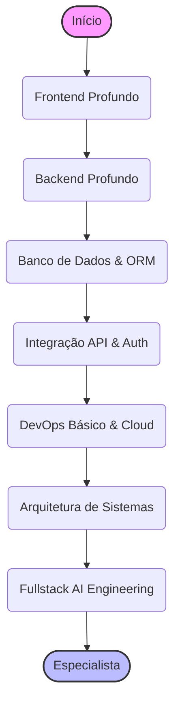

# 🥞 Trilha Full Stack: O Domínio Completo

> **Edição 2026:** Focado em Next.js/Nuxt, Server Components, Monorepos e Integração de IA.

Ser Full Stack é ter a visão do todo. É entender como o clique no botão (Frontend) viaja pela rede, processa a lógica no servidor (Backend), salva no banco de dados e volta com a resposta. Você é a ponte, o arquiteto e o construtor.

Esta trilha assume que você já tem uma base sólida em [Frontend](../frontend/frontend.md) ou [Backend](../backend/backend.md). O foco aqui é a **interseção**.

---

## 🐣 Nível Iniciante (Júnior)

O foco aqui é conseguir construir uma aplicação completa (CRUD) sozinho, do banco de dados à tela.

### 🌐 O Elo Perdido: Integração Client-Server
- **HTTP & REST:** Entenda profundamente Headers, Status Codes, Cookies vs LocalStorage.
- **CORS (Cross-Origin Resource Sharing):** O pesadelo de todo júnior. Entenda por que o browser bloqueia requisições e como configurar o backend corretamente.
- **Data Fetching:**
  - **Client-Side:** `useEffect` + `fetch` (React) ou `axios`.
  - **Server-Side:** Como buscar dados antes de renderizar a página (SSR).

### 🗄️ Banco de Dados para Fullstack
Você não precisa ser um DBA, mas precisa saber guardar dados.
- **ORMs Modernos:** Prisma (Node/TS), Drizzle, Django ORM (Python). Eles facilitam a conversa entre seu código e o SQL.
- **Modelagem Básica:** Relacionamentos 1:N e N:N. Chaves Estrangeiras.

### 🚀 Frameworks Fullstack (Meta-Frameworks)
A forma moderna de construir web.
- **Next.js (React):** O padrão da indústria. Aprenda App Router, Server Components e Server Actions.
- **Nuxt (Vue):** A experiência de desenvolvimento incrível do Vue com poderes de servidor.
- **Laravel (PHP) ou Rails (Ruby):** Os veteranos "baterias inclusas" que ainda dominam o mercado de freelas e MVPs rápidos.

---

## 🚀 Nível Intermediário (Pleno)

Aqui você escala, protege e organiza seu código.

### 🔐 Autenticação & Sessão
- **Auth de Verdade:** Não faça sua própria auth. Use **Auth.js (NextAuth)**, **Clerk** ou **Supabase Auth**.
- **JWT vs Session Cookies:** Entenda os trade-offs de segurança (XSS vs CSRF).
- **Role-Based Access Control (RBAC):** Proteger rotas de admin (`/admin`) no middleware e no frontend.

### 📦 Gerenciamento de Estado Global (Server + Client)
- **TanStack Query (React Query):** Sincronizar estado do servidor com o cliente. Cache, revalidação e loading states automáticos.
- **Zustand / Pinia:** Para estado puramente client-side (ex: carrinho de compras, modal aberto).

### 🏗️ Monorepos & Workspace
Gerenciar múltiplos projetos (Web, Admin, Mobile, API) no mesmo repositório.
- **Ferramentas:** Turborepo, Nx, pnpm workspaces.
- **Compartilhamento de Código:** Como ter uma pasta `packages/ui` ou `packages/utils` compartilhada entre frontend e backend.

### ☁️ Deploy & Infraestrutura (PaaS)
- **Vercel / Netlify:** Deploy de frontend e serverless functions com git push.
- **Railway / Render / Fly.io:** Para rodar containers Docker, bancos de dados e workers de fundo.
- **Bancos Gerenciados:** Neon (Serverless Postgres), PlanetScale (MySQL), Supabase (Postgres + Realtime).

---

## 🧙‍♂️ Nível Avançado (Sênior / Especialista)

Onde você desenha sistemas resilientes e integra Inteligência Artificial.

### 📐 Arquitetura de Sistemas (System Design)
- **BFF (Backend for Frontend):** Uma camada de API dedicada a formatar dados para uma UI específica.
- **Serverless vs Edge:** Rodar código perto do usuário (Cloudflare Workers) para latência mínima.
- **Filas e Jobs:** Tirar tarefas pesadas (envio de email, processamento de imagem) do ciclo de requisição HTTP. (Redis + BullMQ).

### 🤖 Fullstack AI Engineering
A integração profunda de modelos de IA no produto.
- **Vercel AI SDK:** O padrão para construir interfaces de chat e streaming de texto/componentes.
- **RAG na Prática:**
  - Ingerir documentos (PDF/MD) no build time ou runtime.
  - Armazenar em Vector DBs (Pinecone, pgvector).
  - Recuperar contexto relevante e injetar no prompt do LLM.
- **Function Calling:** Fazer o LLM acionar funções do seu backend (ex: "Adicionar item ao carrinho").

### 🌿 Green Fullstack
- **Static Generation (SSG):** Se o dado não muda, gere HTML estático. É mais rápido e gasta zero computação no request.
- **Incremental Static Regeneration (ISR):** Atualizar estáticos sob demanda.
- **Otimização de Imagens:** Uso de CDNs de imagem e formatos modernos (AVIF).

### 🧠 Soft Skills & Diferencial Humano
- **Visão de Produto:** Você entende as limitações técnicas e de design. Ajude a definir o MVP (Minimum Viable Product).
- **Estimativa de Tempo:** Como você conhece os dois lados, sabe onde os gargalos podem aparecer.
- **Trade-offs:** Saber escolher entre "fazer rápido" (tech debt) e "fazer escalável" dependendo da fase da empresa.

### 🏆 Desafios Práticos (Projetos)

- **Júnior:** Blog Pessoal com CMS. Use Next.js + Headless CMS (Sanity/Strapi) ou Markdown local.
- **Pleno:** Plataforma de Cursos (LMS). Requisitos: Auth (Login/Google), Pagamentos (Stripe), Upload de Vídeo (Mux/UploadThing) e Progresso do Aluno salvo no banco (Prisma + Postgres).
- **Sênior:** SaaS de Gerenciamento de Projetos com IA (Clone do Linear/Jira simplificado). Requisitos: Workspaces multi-tenant (subdomínios), Realtime (WebSockets/Supabase) para atualizações ao vivo, e um "Co-piloto" que resume as tarefas da semana usando OpenAI API.

---

## ↩️ Navegação

*   [**Voltar para o Início**](../../index.md)
*   [**Ver Conselhos de Carreira**](../../advices.md)
