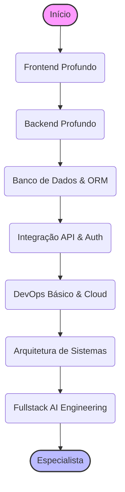

# 🥞 Trilha Full Stack: O Domínio Completo

> **Edição 2026:** Focado em Next.js/Nuxt, Server Components, Monorepos e Integração de IA.

```mermaid
flowchart TD
    Start([Início]) --> Front(Frontend Profundo)
    Front --> Back(Backend Profundo)
    Back --> DB(Banco de Dados & ORM)
    DB --> Integ(Integração API & Auth)
    Integ --> DevOps(DevOps Básico & Cloud)
    DevOps --> Arch(Arquitetura de Sistemas)
    Arch --> AI(Fullstack AI Engineering)
    AI --> Spec([Especialista])

    style Start fill:#f9f,stroke:#333,stroke-width:2px
    style Spec fill:#bbf,stroke:#333,stroke-width:2px
```

Ser Full Stack é ter a visão do todo. É entender como o clique no botão (Frontend) viaja pela rede, processa a lógica no servidor (Backend), salva no banco de dados e volta com a resposta. Você é a ponte, o arquiteto e o construtor.

Esta trilha assume que você já tem uma base sólida em [Frontend](../frontend/frontend.md) ou [Backend](../backend/backend.md). O foco aqui é a **interseção**.

---

## 🐣 Nível Iniciante (Júnior)

O foco aqui é conseguir construir uma aplicação completa (CRUD) sozinho, do banco de dados à tela.

### 🌐 O Elo Perdido: Integração Client-Server

- **HTTP & REST:** Entenda profundamente Headers, Status Codes, Cookies vs LocalStorage.
- **CORS (Cross-Origin Resource Sharing):** O pesadelo de todo júnior. Entenda por que o browser bloqueia requisições e como configurar o backend corretamente.
- **Data Fetching:**
  - **Client-Side:** `useEffect` + `fetch` (React) ou `axios`.
  - **Server-Side:** Como buscar dados antes de renderizar a página (SSR).

### 🗄️ Banco de Dados para Fullstack

Você não precisa ser um DBA, mas precisa saber guardar dados.

- **ORMs Modernos:** Prisma (Node/TS), Drizzle, Django ORM (Python). Eles facilitam a conversa entre seu código e o SQL.
- **Modelagem Básica:** Relacionamentos 1:N e N:N. Chaves Estrangeiras.

### 🚀 Frameworks Fullstack (Meta-Frameworks)

A forma moderna de construir web.

- **Next.js (React):** O padrão da indústria. Aprenda App Router, Server Components e Server Actions.
- **Nuxt (Vue):** A experiência de desenvolvimento incrível do Vue com poderes de servidor.
- **Laravel (PHP) ou Rails (Ruby):** Os veteranos "baterias inclusas" que ainda dominam o mercado de freelas e MVPs rápidos.

---

## 🚀 Nível Intermediário (Pleno)

Aqui você escala, protege e organiza seu código.

### 🔐 Autenticação & Sessão

- **Auth de Verdade:** Não faça sua própria auth. Use **Auth.js (NextAuth)**, **Clerk** ou **Supabase Auth**.
- **JWT vs Session Cookies:** Entenda os trade-offs de segurança (XSS vs CSRF).
- **Role-Based Access Control (RBAC):** Proteger rotas de admin (`/admin`) no middleware e no frontend.

### 📦 Gerenciamento de Estado Global (Server + Client)

- **TanStack Query (React Query):** Sincronizar estado do servidor com o cliente. Cache, revalidação e loading states automáticos.
- **Zustand / Pinia:** Para estado puramente client-side (ex: carrinho de compras, modal aberto).

### 🏗️ Monorepos & Workspace

Gerenciar múltiplos projetos (Web, Admin, Mobile, API) no mesmo repositório.

- **Ferramentas:** Turborepo, Nx, pnpm workspaces.
- **Compartilhamento de Código:** Como ter uma pasta `packages/ui` ou `packages/utils` compartilhada entre frontend e backend.

### ☁️ Deploy & Infraestrutura (PaaS)

- **Vercel / Netlify:** Deploy de frontend e serverless functions com git push.
- **Railway / Render / Fly.io:** Para rodar containers Docker, bancos de dados e workers de fundo.
- **Bancos Gerenciados:** Neon (Serverless Postgres), PlanetScale (MySQL), Supabase (Postgres + Realtime).

---

## 🧙‍♂️ Nível Avançado (Sênior / Especialista)

Onde você desenha sistemas resilientes e integra Inteligência Artificial.

### 📐 Arquitetura de Sistemas (System Design) Avançada

- **BFF (Backend for Frontend):** Você não expõe sua base de dados diretamente para a web/mobile. Um BFF é uma fina camada de API customizada para a UI de cada cliente (Ex: BFF Mobile, BFF Web). No ecossistema React/Next.js, os _Server Components_ e as _Server Actions_ são o substituto natural e moderno de um BFF externo.
- **Serverless, Edge Computing & Wasm:** Rodar funções muito baratas em Data Centers próximos do usuário (Cloudflare Workers, Deno Deploy) garantindo latência quase zero. Em 2026, Edge + WebAssembly (Wasm) traz binários leves de linguagens como Rust integrados nativamente ao JavaScript via V8 Isolates, oferecendo poder computacional massivo a custos irrisórios.
- **Mensageria e Filas (Message Brokers):** Sistemas distribuídos. Remover tarefas pesadas (envios em lote, processamento de relatórios gerados por IA, Webhooks) do fluxo do usuário e colocar em Redis (BullMQ), AWS SQS, ou Apache Kafka para resiliência.

### 🌍 Local-First Architecture e Sincronização

Em 2026, conexões instáveis não são desculpa para a interface travar. Local-First virou o paradigma de escolha para UX premium.

- **O Fim das Telas de Carregamento (Loading Spinners):** O usuário deve abrir a aplicação e ver os dados instantaneamente sem dependência direta de redes externas.
- **CRDTs (Conflict-free Replicated Data Types):** O pilar do Local-First. É uma estrutura matemática que permite que dois ou mais dispositivos offline (Client A e B) realizem edições num mesmo JSON ou texto. Quando ficam online, o CRDT mescla o estado perfeitamente de forma determinística, garantindo colaboração em tempo real estilo Google Docs.
- **Ecossistema:** Bancos de dados integrados como PowerSync, ElectricSQL, RxDB. Bibliotecas core de sincronização como **Yjs**, **Automerge** ou **Loro** rodam diretamente no cliente/Edge em Wasm, trocando de paradigma (a UI lê do banco local como fonte da verdade, e a sincronização com o servidor é automática).

### 🤖 Fullstack AI Engineering

A integração profunda de modelos de IA no produto.

- **Vercel AI SDK:** O padrão para construir interfaces de chat e streaming de texto/componentes.
- **RAG na Prática:**
  - Ingerir documentos (PDF/MD) no build time ou runtime.
  - Armazenar em Vector DBs (Pinecone, pgvector).
  - Recuperar contexto relevante e injetar no prompt do LLM.
- **Function Calling:** Fazer o LLM acionar funções do seu backend (ex: "Adicionar item ao carrinho").

### 🌿 Green Fullstack

- **Static Generation (SSG):** Se o dado não muda, gere HTML estático. É mais rápido e gasta zero computação no request.
- **Incremental Static Regeneration (ISR):** Atualizar estáticos sob demanda.
- **Otimização de Imagens:** Uso de CDNs de imagem e formatos modernos (AVIF).

### 🧠 Soft Skills & Diferencial Humano

- **Visão de Produto:** Você entende as limitações técnicas e de design. Ajude a definir o MVP (Minimum Viable Product).
- **Estimativa de Tempo:** Como você conhece os dois lados, sabe onde os gargalos podem aparecer.
- **Trade-offs:** Saber escolher entre "fazer rápido" (tech debt) e "fazer escalável" dependendo da fase da empresa.

### 🏆 Desafios Práticos (Projetos)

- **Júnior:** Blog Pessoal com CMS. Use Next.js + Headless CMS (Sanity/Strapi) ou Markdown local.
- **Pleno:** Plataforma de Cursos (LMS). Requisitos: Auth (Login/Google), Pagamentos (Stripe), Upload de Vídeo (Mux/UploadThing) e Progresso do Aluno salvo no banco (Prisma + Postgres).
- **Sênior:** SaaS de Gerenciamento de Projetos com IA (Clone do Linear/Jira simplificado). Requisitos: Workspaces multi-tenant (subdomínios), Realtime (WebSockets/Supabase) para atualizações ao vivo, e um "Co-piloto" que resume as tarefas da semana usando OpenAI API.

---

## 📚 Materiais de Estudo Recomendados

Para atingir a excelência em 2026, recomendamos os seguintes recursos práticos e teóricos:

**Para o Júnior (Fundamentos e Bases):**

- **[The Odin Project](https://www.theodinproject.com/):** O melhor currículo gratuito e guiado por projetos para full stack (Ruby on Rails ou Node.js).
- **[Full Stack Open (Universidade de Helsinque)](https://fullstackopen.com/):** Curso maravilhoso focado em React, Redux, Node.js, MongoDB, GraphQL e TypeScript.

**Para o Pleno (Next.js, Arquitetura e Monorepos):**

- **[Next.js Learn (Curso Oficial)](https://nextjs.org/learn):** A documentação da Vercel tem um curso passo a passo criando um dashboard full stack. Imperdível.
- **[Prisma / Drizzle Docs](https://www.prisma.io/docs):** Aprenda ORMs modernos lendo os guias iniciais e tutorias práticos em seus sites oficiais.
- **[Joy of React (Josh Comeau)](https://joyofreact.com/):** Uma profunda exploração das fundações do React, excelente para consolidar conceitos antes de tentar construir apps complexos.

**Para o Sênior/Especialista (Edge Computing, Local-First e IA):**

- **[Vercel AI SDK & Next.js AI Chatbot](https://github.com/vercel/ai-chatbot):** Estude o código-fonte desse repositório para entender como arquitetar e deployar o que há de mais moderno em GenUI com Server Actions.
- **[Local-First Web Development (Automerge / Yjs Docs)](https://localfirstweb.dev/):** Este manifesto explica a arquitetura necessária para as aplicações offline-first premium de 2026. Leia e acompanhe projetos como o PowerSync.
- **[Turborepo](https://turbo.build/) e [Nx](https://nx.dev/) Docs:** O padrão para criar monorepos eficientes, essenciais para dividir componentes entre projetos Admin, API e App Cliente.
- **[Serverless Framework](https://www.serverless.com/) / [SST (Serverless Stack)](https://sst.dev/):** Guias arquitetônicos excelentes de como desenhar pipelines nativos de Nuvem (AWS Lambda, DynamoDB) a partir de uma base de código unificada (TypeScript/Next.js).

---

## ↩️ Navegação

- [**Voltar para o Início**](../../index.md)
- [**Ver Conselhos de Carreira**](../../advices.md)
