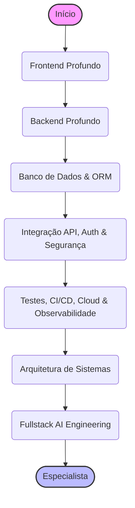

# 🥞 Trilha Full Stack: O Domínio Completo

> **Edição 2026:** Meta-frameworks (Next.js, Nuxt, TanStack Start), Server Components, TypeScript ponta a ponta, segurança, observabilidade e integração de IA.

```mermaid
flowchart TD
    Start([Início]) --> Front(Frontend Profundo)
    Front --> Back(Backend Profundo)
    Back --> DB(Banco de Dados & ORM)
    DB --> Integ(Integração API, Auth & Segurança)
    Integ --> DevOps(Testes, CI/CD, Cloud & Observabilidade)
    DevOps --> Arch(Arquitetura de Sistemas)
    Arch --> AI(Fullstack AI Engineering)
    AI --> Spec([Especialista])

    style Start fill:#f9f,stroke:#333,stroke-width:2px
    style Spec fill:#bbf,stroke:#333,stroke-width:2px
```

Ser Full Stack é ter a visão do todo. É entender como o clique no botão (Frontend) viaja pela rede, processa a lógica no servidor (Backend), salva no banco de dados e volta com a resposta. Você liga as duas pontas e decide onde cada responsabilidade vive.

Esta trilha assume que você já tem uma base sólida em [Frontend](../frontend/frontend.md) ou [Backend](../backend/backend.md). O foco aqui é a **interseção**.

---

## 🐣 Nível Iniciante (Júnior)

O foco aqui é conseguir construir uma aplicação completa (CRUD) sozinho, do banco de dados à tela.

### 🌐 O Elo Perdido: Integração Client-Server

- **HTTP & REST:** Headers, status codes, cookies vs LocalStorage, cache HTTP e contratos OpenAPI.
- **CORS (Cross-Origin Resource Sharing):** Entenda por que o browser bloqueia requisições e configure o backend com origens explícitas, sem `*` junto de credenciais.
- **Validação:** valide entradas no cliente e, sempre, no servidor (Zod, Valibot ou Pydantic).
- **Data Fetching:**
  - **Client-Side:** `fetch` com TanStack Query (React/Vue/Svelte). Evite `useEffect` para buscar dados.
  - **Server-Side:** Buscar dados no servidor antes de renderizar (Server Components, loaders, SSR).

### 🗄️ Banco de Dados para Fullstack

Você não precisa ser um DBA, mas precisa saber guardar dados.

- **Banco padrão:** PostgreSQL 18 resolve a maioria dos casos (inclusive busca vetorial com `pgvector`).
- **ORMs e query builders:** Drizzle e Prisma (Node/TS), Django ORM (Python). Aprenda a ler o SQL gerado e use migrations versionadas.
- **Modelagem Básica:** Relacionamentos 1:N e N:N, chaves estrangeiras e índices.

### Frameworks Fullstack (Meta-Frameworks)

A forma moderna de construir web.

- **Next.js (React):** o mais usado no mercado. Aprenda App Router, Server Components e Server Actions.
- **Nuxt (Vue)**, **SvelteKit**, **React Router v7** e **TanStack Start:** alternativas maduras, com loaders e rotas tipadas.
- **Laravel (PHP) ou Rails (Ruby):** frameworks "baterias inclusas", fortes para MVPs e produtos de negócio.
- **Runtime:** Node.js 24 LTS com TypeScript. Bun e Deno 2 são alternativas.

---

## 🚀 Nível Intermediário (Pleno)

Aqui você escala, protege e organiza seu código.

### 🔐 Autenticação & Sessão

- **Não implemente auth do zero:** use **Better Auth**, **Auth.js**, **Clerk**, **Supabase Auth** ou um provedor OIDC (Keycloak, Auth0). Armazenar senhas exige Argon2id.
- **JWT vs Session Cookies:** trade-offs (XSS vs CSRF). Prefira cookies `HttpOnly`, `Secure`, `SameSite`.
- **Autorização (RBAC/ABAC):** verifique permissão no servidor, em cada Server Action e endpoint. Esconder o botão ou bloquear no middleware não basta.
- **Segurança web e de API:** [OWASP Top 10](https://owasp.org/www-project-top-ten/) e [API Security Top 10](https://owasp.org/www-project-api-security/): XSS, CSRF, IDOR/BOLA, SSRF, rate limiting, CSP e segredos fora do repositório.

### 📦 Gerenciamento de Estado Global (Server + Client)

- **TanStack Query:** estado do servidor no cliente, com cache, revalidação e estados de loading.
- **Zustand / Pinia:** estado puramente client-side (ex: modal aberto, rascunho de formulário).
- **APIs tipadas ponta a ponta:** tRPC, Hono RPC ou OpenAPI com geração de clientes, para compartilhar tipos entre frontend e backend.

### 🏗️ Monorepos & Workspace

Gerenciar múltiplos projetos (Web, Admin, Mobile, API) no mesmo repositório.

- **Ferramentas:** pnpm workspaces com Turborepo ou Nx.
- **Compartilhamento de Código:** Como ter uma pasta `packages/ui` ou `packages/utils` compartilhada entre frontend e backend.

### ☁️ Deploy & Infraestrutura (PaaS)

- **Vercel / Netlify / Cloudflare:** deploy de frontend e funções com git push.
- **Railway / Render / Fly.io:** containers Docker, bancos e workers de fundo.
- **Bancos Gerenciados:** Neon, Supabase (Postgres + Realtime), PlanetScale (Postgres ou MySQL), Turso (SQLite).
- **Docker e CI/CD:** Dockerfile multi-stage e GitHub Actions rodando lint, testes e build a cada PR.
- **Cache e Filas:** Redis/Valkey para cache e rate limiting; BullMQ ou Inngest/Trigger.dev para jobs em background.

### 🧪 Testes

- **Unitários e componentes:** Vitest e Testing Library.
- **E2E:** Playwright.
- **Contrato:** valide o schema OpenAPI/tRPC no CI para que frontend e backend não quebrem um ao outro (Pact quando há times separados).
- **Integração:** Testcontainers com Postgres real.

---

## 🧙‍♂️ Nível Avançado (Sênior / Especialista)

Onde você desenha sistemas resilientes e integra Inteligência Artificial.

### 📐 Arquitetura de Sistemas (System Design) Avançada

- **BFF (Backend for Frontend):** não exponha o banco diretamente para web/mobile. Um BFF é uma camada de API fina, adaptada a cada cliente. No Next.js, Server Components e Server Actions cobrem boa parte desse papel; mantenha um BFF separado quando houver vários clientes (web e mobile).
- **Monolito modular primeiro:** separe em serviços só quando houver necessidade clara de escala ou de times independentes.
- **Serverless, Edge Computing & Wasm:** Rodar funções perto do usuário (Cloudflare Workers, Deno Deploy, Vercel) reduz latência, mas limita runtime, conexões de banco e tempo de execução. Use um pooler ou driver HTTP para Postgres. WebAssembly permite levar código de Rust ou Go para esses ambientes em tarefas pontuais.
- **Mensageria e Filas (Message Brokers):** tire tarefas pesadas (e-mails em lote, relatórios, chamadas a LLM, webhooks) do request e processe em Redis (BullMQ), AWS SQS, RabbitMQ, NATS ou Apache Kafka. Garanta idempotência, retries com backoff, dead-letter queue e o padrão Outbox.
- **Observabilidade:** OpenTelemetry (traces, métricas, logs) no frontend e no backend, com Sentry ou Grafana para erros e Core Web Vitals reais (RUM).
- **Custos:** monitore invocações serverless, egress, tamanho de build e tokens de LLM; defina orçamentos e alertas.

### 🌍 Local-First Architecture e Sincronização

Local-First é uma opção para apps colaborativos e que precisam funcionar offline. Não é necessário para todo produto.

- **Ideia central:** a UI lê e escreve num banco local, e a sincronização com o servidor acontece em segundo plano.
- **CRDTs (Conflict-free Replicated Data Types):** estruturas que permitem edições concorrentes offline e mesclam o resultado de forma determinística.
- **Ecossistema:** PowerSync, ElectricSQL, Zero, RxDB para sincronização com banco; **Yjs**, **Automerge** e **Loro** para documentos colaborativos.

### 🤖 Fullstack AI Engineering

A integração profunda de modelos de IA no produto.

- **Vercel AI SDK:** streaming de texto, saídas estruturadas e chat UI em React, Vue e Svelte, com vários provedores de modelo.
- **RAG na Prática:**
  - Ingerir documentos (PDF/MD) com chunking adequado.
  - Armazenar em `pgvector` (Postgres) ou Qdrant/Pinecone.
  - Busca híbrida, reranking e avaliação com perguntas de referência.
- **Tool calling:** o LLM aciona funções do seu backend (ex: "adicionar item ao carrinho"). Valide argumentos com Zod, aplique autorização do usuário e peça confirmação em ações sensíveis.
- **MCP (Model Context Protocol):** exponha capacidades do seu produto como MCP server e consuma servers existentes em agentes. Use OAuth e escopos mínimos.
- **Agentes:** comece com fluxos simples (workflows) antes de agentes autônomos. Frameworks: Vercel AI SDK, Mastra, LangGraph, OpenAI Agents SDK, Claude Agent SDK. O protocolo A2A cobre comunicação entre agentes de sistemas diferentes.
- **Segurança e custos:** trate saída do modelo como entrada não confiável (injeção de prompt, XSS), consulte o [OWASP Top 10 para LLMs](https://genai.owasp.org/llm-top-10/), limite tokens por usuário, use cache e modelos menores quando possível.
- **IA nas ferramentas:** assistentes de código (Claude Code, Copilot, Cursor) aceleram o trabalho, mas revise todo código gerado, principalmente auth e acesso a dados.

### 🌿 Green Fullstack

- **Static Generation (SSG):** se o dado não muda, gere HTML estático: mais rápido e sem computação por request.
- **ISR / revalidação por tag:** atualize páginas estáticas sob demanda.
- **Imagens:** CDN de imagens e formatos modernos (AVIF, WebP).
- **Menos JavaScript:** envie ao cliente só o necessário (Server Components, islands). Meça com Lighthouse e Core Web Vitals.

### 🧠 Soft Skills & Diferencial Humano

- **Visão de Produto:** entenda limites técnicos e de design e ajude a definir o MVP.
- **Estimativas:** conhecer os dois lados ajuda a antecipar gargalos.
- **Trade-offs:** escolher entre velocidade (dívida técnica consciente) e escalabilidade conforme a fase da empresa.

### 🏆 Desafios Práticos (Projetos)

- **Júnior:** Blog Pessoal com CMS. Use Next.js + Headless CMS (Sanity/Strapi) ou Markdown local.
- **Pleno:** Plataforma de Cursos (LMS). Requisitos: Auth (login/Google), pagamentos (Stripe, com webhooks idempotentes), upload de vídeo (Mux/UploadThing), progresso do aluno no banco (Drizzle ou Prisma + Postgres) e testes E2E com Playwright.
- **Sênior:** SaaS de Gerenciamento de Projetos com IA (Clone do Linear/Jira simplificado). Requisitos: Workspaces multi-tenant (subdomínios), Realtime (WebSockets/Supabase) para atualizações ao vivo, um job em fila para notificações, traces com OpenTelemetry e um "Co-piloto" (Vercel AI SDK) que resume as tarefas da semana, com limite de tokens por workspace e um MCP server que expõe as tarefas para outros agentes.

---

## 📚 Materiais de Estudo Recomendados

Seleção de materiais para o caminho do Júnior ao Especialista:

### 🐣 Para Nível Júnior

- **[MDN Web Docs](https://developer.mozilla.org/):** A documentação oficial mais completa e confiável sobre tecnologias web (HTML, CSS, JS).
- **[The Odin Project](https://www.theodinproject.com/):** currículo prático para iniciar do zero no ecossistema Full Stack (JS/Ruby).
- **[FreeCodeCamp](https://www.freecodecamp.org/):** Exercícios interativos e projetos para consolidar a base inicial de desenvolvimento.

### 🚀 Para Nível Pleno

- **[Full Stack Open (University of Helsinki)](https://fullstackopen.com/en/):** curso gratuito de React, Node.js, GraphQL, TypeScript e testes.
- **[Frontend Masters](https://frontendmasters.com/):** cursos em vídeo sobre React, Node, TypeScript e performance web.
- **[Node.js Design Patterns](https://www.nodejsdesignpatterns.com/):** livro sobre padrões e fluxos assíncronos em Node.js.

### 🏛️ Para Nível Sênior/Especialista

- **[Turborepo Docs](https://turborepo.com/docs) & [Nx Dev](https://nx.dev/):** estrutura e padrões de monorepo.
- **[AI SDK Docs](https://ai-sdk.dev/docs):** streaming, saídas estruturadas e tool calling.
- **[Local-First Web Development](https://localfirstweb.dev/):** comunidade e recursos sobre Local-First e CRDTs.
- **[Model Context Protocol](https://modelcontextprotocol.io/):** especificação e SDKs para criar e consumir MCP servers.
- **[OWASP Cheat Sheet Series](https://cheatsheetseries.owasp.org/):** guias práticos de segurança (auth, sessões, CSRF, XSS).
- **[Playwright Docs](https://playwright.dev/docs/intro):** testes E2E.
- **[OpenTelemetry Docs](https://opentelemetry.io/docs/):** observabilidade ponta a ponta.
- **[Web.dev - Core Web Vitals](https://web.dev/vitals/):** métricas de performance web e como melhorá-las.
- **[SST (Serverless Stack) Docs](https://sst.dev/):** infraestrutura como código em TypeScript para AWS e Cloudflare.

---

## ↩️ Navegação

- [**Voltar para o Início**](../../index.md)
- [**Ver Conselhos de Carreira**](../../advices.md)
