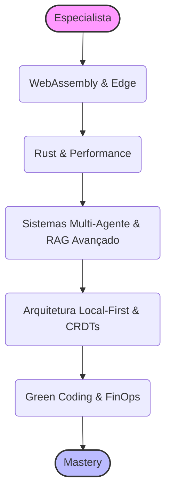

# 🌟 Padrões de Especialista 2026: O Nível Arquétipo

> **Edição 2026:** Uma visão profunda e holística sobre as arquiteturas, ferramentas e abordagens que separam um Sênior de um Arquiteto e Especialista Global.

Chegar ao nível de Especialista (ou Arquiteto Principal / Staff Engineer) em 2026 exige mais do que saber codificar. Exige compreender o cenário tecnológico em sua completude, antecipar gargalos arquiteturais e dominar paradigmas emergentes. Este documento consolida os maiores diferenciais técnicos e estratégicos para 2026.

---

## 🚀 1. WebAssembly (Wasm) e Edge Computing

O backend moderno não vive mais apenas em containers dentro de um datacenter centralizado. O Wasm democratizou a capacidade de rodar código compilado (Rust, Go, C++) no Edge (na borda, mais perto do usuário) e dentro do próprio navegador, de forma segura e quase nativa.

*   **Por que importa?** Tempos de inicialização de milissegundos (Cold Starts mínimos). Execução segura em sandboxes. Reuso de código pesado entre Frontend e Backend.
*   **O que dominar:** Cloudflare Workers, Wasmtime, Spin, e integração de módulos Wasm com Node.js e Deno.

## 🦀 2. Rust no Backend e Infraestrutura

A era de "memória infinita e instâncias gigantes" na nuvem está acabando por causa dos custos. Linguagens com gerenciamento automático (Garbage Collection), como Java e Node, estão sendo substituídas em serviços críticos (core) por Rust e Go.

*   **Por que importa?** Rust oferece segurança de memória sem Garbage Collector, resultando em previsibilidade de CPU e economia financeira massiva na AWS/GCP (FinOps).
*   **O que dominar:** Axum, Actix, Tauri (para Desktop) e reescrita de microsserviços pesados visando economia de computação (Green Software).

## 🤖 3. Arquitetura de Sistemas Multi-Agentes

LLMs sozinhos são apenas calculadoras de palavras. O valor real em 2026 vem de *Sistemas Compostos de IA*, onde múltiplos agentes autônomos colaboram entre si.

*   **Por que importa?** Um agente pode falhar ou ter alucinações. Um sistema com um agente planejador, um agente codificador, um agente revisor e um agente executivo (com acesso ao terminal) alcança uma taxa de sucesso imensamente maior.
*   **O que dominar:** LangGraph, AutoGen, CrewAI, DSPy (compilação e otimização de prompts ao invés de hardcoding), e MCP (Model Context Protocol).

## 📡 4. Arquitetura Local-First e CRDTs

Os usuários de 2026 não toleram mais telas de "carregando" (spinners). A aplicação deve funcionar instantaneamente e offline, sincronizando com a nuvem apenas em background.

*   **Por que importa?** Garante UX perfeita (latência zero percebida). Reduz a carga brutal nos servidores. Permite colaboração em tempo real estilo Google Docs.
*   **O que dominar:** Conflict-free Replicated Data Types (CRDTs), Yjs, Automerge, PWA avançado, IndexedDB, SQLite no navegador via Wasm.

## 🌿 5. Green Coding e FinOps Avançado

Em 2026, código ruim não apenas trava, mas custa milhares de dólares e emite toneladas de carbono.

*   **Por que importa?** "Desenvolvimento Sustentável" tornou-se uma métrica de engenharia (DevSecFinOps). O Especialista sabe exatamente quanto um loop O(n^2) custa no final do mês.
*   **O que dominar:** Profiling de memória avançado, redução de pacotes de rede (gRPC em vez de REST para serviços internos), cache agressivo (Edge Caching, ISR/SSG) e monitoramento de Cloud Carbon Footprint.

---

## 🏆 Desafio do Especialista

**O Projeto Final:**
Arquitetar (System Design) um "Sistema de Suporte ao Cliente Autônomo e Resiliente".
- Ele deve rodar primariamente no Edge (Cloudflare Workers via Wasm).
- Usar uma arquitetura RAG Avançada (GraphRAG) conectada ao banco de conhecimento corporativo.
- Integrar um sistema Multi-Agente (LangGraph/CrewAI) em que o "Agente Triagem" categoriza, e o "Agente Solução" acessa as APIs internas via *Function Calling* para emitir reembolsos ou gerar links.
- O Frontend do operador humano deve ser Local-First (usando Yjs/CRDT) para que o gerente possa revisar as ações do Agente mesmo se o Wi-Fi da empresa cair.

---
## ↩️ Navegação

*   [**Voltar para o Início**](../../index.md)
