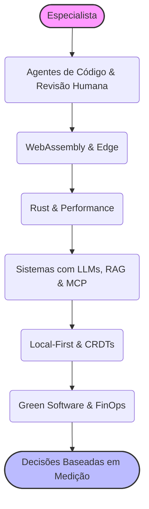

# 🌟 Padrões de Especialista 2026

> **Edição 2026 (atualizada em out/2026):** padrões que um Sênior/Staff precisa saber avaliar. Para cada um: quando usar, quando evitar e como medir.


```mermaid
flowchart TD
    Start([Especialista]) --> Agents(Agentes de Código & Revisão Humana)
    Agents --> Wasm(WebAssembly & Edge)
    Wasm --> Rust(Rust & Performance)
    Rust --> AI_Agents(Sistemas com LLMs, RAG & MCP)
    AI_Agents --> LocalFirst(Local-First & CRDTs)
    LocalFirst --> FinOps(Green Software & FinOps)
    FinOps --> Spec([Decisões Baseadas em Medição])

    style Start fill:#f9f,stroke:#333,stroke-width:2px
    style Spec fill:#bbf,stroke:#333,stroke-width:2px
```

Nível Sênior/Staff é menos sobre dominar muitas ferramentas e mais sobre decidir bem: entender trade-offs, medir antes de otimizar e documentar o raciocínio (ADRs, RFCs). Nenhum padrão abaixo é obrigatório; cada um resolve um problema específico.

---

## 🤖 1. Engenharia com Agentes de Código

Agentes de código (Claude Code, GitHub Copilot coding agent, Codex CLI, Cursor, entre outros) já fazem parte do fluxo de muitos times. Como Sênior, você define as regras de uso.

- **Quando usar:** tarefas bem delimitadas, migrações repetitivas, testes, correção de bugs reproduzíveis.
- **Cuidados:** exija testes e CI verdes; PR pequeno; revisão humana obrigatória (inclusive para código gerado por agente); permissões mínimas e sandbox; segredos fora do contexto; atenção a prompt injection vindo de issues e páginas externas.
- **Contexto do projeto:** mantenha `AGENTS.md` com comandos, convenções e arquitetura. Trate-o como documentação viva.
- **MCP (Model Context Protocol):** padrão aberto para expor ferramentas e dados a agentes. Audite servidores como qualquer dependência e restrinja o que cada um pode fazer (somente leitura quando possível).
- **Métricas:** acompanhe taxa de retrabalho, tempo de revisão, defeitos em produção e custo por tarefa, e não apenas "linhas geradas".
- 📖 [Model Context Protocol](https://modelcontextprotocol.io/)
- 📖 [AGENTS.md](https://agents.md/)
- 📖 [OWASP GenAI Security Project](https://genai.owasp.org/)

## 🚀 2. WebAssembly (Wasm) e Edge Computing

Wasm roda código compilado (Rust, Go, C++) no navegador e em runtimes no servidor ou na borda, com isolamento (sandbox) e inicialização rápida.

- **Quando usar:** trechos de CPU intensiva (parsing, imagem, criptografia), reuso de código entre cliente e servidor, plugins seguros e funções no Edge.
- **Quando evitar:** lógica comum de CRUD e I/O. O custo de ida e volta JS ↔ Wasm pode anular o ganho.
- **O que conhecer:** Cloudflare Workers, Wasmtime, Spin, WASI, e integração de módulos Wasm com Node.js e Deno.

### 🧩 Exemplo prático: Rust + Node.js com Wasm

1. Instale o alvo: `rustup target add wasm32-unknown-unknown` e `cargo install wasm-pack`.
2. Crie a lib: `cargo new --lib calc` e adicione `wasm-bindgen` ao `Cargo.toml` (`crate-type = ["cdylib"]`).
3. Exporte a função:

   ```rust
   use wasm_bindgen::prelude::*;

   #[wasm_bindgen]
   pub fn fib(n: u32) -> u32 {
       if n < 2 { n } else { fib(n - 1) + fib(n - 2) }
   }
   ```

4. Compile para Node: `wasm-pack build --target nodejs`.
5. Use no Node: `const { fib } = require("./pkg/calc"); console.log(fib(30));`
6. Meça contra a versão em JS puro e registre o ganho (e o custo de ida e volta JS ↔ Wasm).

- 📖 [Rust para WebAssembly (MDN)](https://developer.mozilla.org/en-US/docs/WebAssembly/Guides/Rust_to_Wasm) e [wasm-bindgen](https://wasm-bindgen.github.io/wasm-bindgen/) — o `wasm-pack` foi arquivado em 2025; para builds novos, use `cargo build --target wasm32-unknown-unknown` + `wasm-bindgen-cli`.

## 🦀 3. Rust e Go em Serviços Críticos

Rust oferece segurança de memória sem coletor de lixo; Go oferece simplicidade e concorrência produtiva. Ambos reduzem uso de CPU e memória em serviços de alta carga.

- **Quando usar:** serviços sensíveis a latência ou custo, ferramentas de linha de comando, componentes de infraestrutura, módulos Wasm.
- **Quando evitar:** reescrever sem medição ou quando o gargalo é banco de dados e rede. Considere também o custo de formação do time.
- **O que conhecer:** Axum, Tokio, Tauri (desktop) e, em Go, a biblioteca padrão e `pprof`.
- 📖 [The Rust Programming Language](https://doc.rust-lang.org/book/)

## 🧠 4. Sistemas com LLMs, RAG e Agentes

Muitos produtos combinam modelos, busca e ferramentas. A parte difícil é a confiabilidade, não a chamada de API.

- **Comece simples:** uma chamada bem desenhada, com saída estruturada, costuma bastar. Adote agentes ou múltiplos agentes só quando o fluxo exigir decisões em várias etapas.
- **RAG:** boa indexação, busca híbrida (vetorial + palavra-chave), reranking e citação de fontes. GraphRAG pode ajudar em dados muito relacionais, com custo maior de construção.
- **Avaliação (evals):** conjunto de casos de teste, métricas e regressão a cada mudança de modelo ou prompt.
- **Operação:** custo por requisição, latência, cache, limites de taxa, observabilidade e plano de fallback.
- **Segurança:** prompt injection, vazamento de dados, permissões das ferramentas e aprovação humana em ações sensíveis (reembolsos, exclusões).
- **O que conhecer:** LangGraph, DSPy, SDKs de agentes dos provedores e MCP.
- 📖 [LangChain Academy](https://academy.langchain.com/)
- 📖 [DSPy](https://dspy.ai/)

## 📡 5. Local-First e CRDTs

Aplicações local-first guardam dados no dispositivo e sincronizam em segundo plano. Funcionam offline e respondem sem esperar a rede.

- **Quando usar:** edição colaborativa, apps de campo, ferramentas de produtividade com uso offline.
- **Quando evitar:** dados com regras de consistência estritas (saldos, estoque), em que o servidor precisa ser a única fonte de verdade.
- **O que conhecer:** CRDTs, Yjs, Automerge, IndexedDB, SQLite no navegador via Wasm e motores de sincronização.
- 📖 [Local-First Web Development](https://localfirstweb.dev/)

## 🌿 6. Green Software e FinOps

Eficiência reduz custo e emissões ao mesmo tempo.

- **Como aplicar:** meça uso de CPU, memória, rede e custo por requisição; otimize os maiores gargalos; use cache e compressão; dimensione instâncias corretamente; desligue ambientes ociosos; inclua o custo de inferência de IA.
- **O que conhecer:** profiling (pprof, perf, flamegraphs), OpenTelemetry, Cloud Carbon Footprint e práticas de FinOps.
- 📖 [Green Software Foundation](https://greensoftware.foundation/)
- 📖 [FinOps Foundation](https://www.finops.org/)

---

## 🏆 Desafio do Especialista

**Projeto final:** projete (System Design) um sistema de suporte ao cliente com assistência de IA.

- Escreva um ADR justificando cada escolha, incluindo o que você decidiu **não** usar.
- Rode o fluxo principal no Edge (por exemplo, Cloudflare Workers), usando Wasm apenas onde a medição justificar.
- Use RAG sobre a base de conhecimento, com citação de fontes e conjunto de evals.
- Um agente de triagem classifica os chamados; um segundo componente consulta APIs internas por ferramentas (MCP ou function calling) com permissões mínimas.
- Ações sensíveis, como reembolsos, exigem aprovação humana.
- A interface do operador deve funcionar offline para consulta e rascunho (local-first), sincronizando depois.
- Defina métricas de custo, latência e qualidade, e um plano de fallback.

---

## ↩️ Navegação

- [**Voltar para a Trilha Comum**](./common.md)
- [**Voltar para o Início**](../../index.md)

## 📚 Materiais de Estudo Recomendados

Para formar o Desenvolvedor Completo em 2026 (do Júnior ao Especialista), reunimos os conteúdos mais atualizados e de altíssima qualidade do mercado:

### 🐣 Para Nível Júnior

- **[MDN: Conceitos de WebAssembly](https://developer.mozilla.org/en-US/docs/WebAssembly/Concepts):** como o Wasm funciona.
- **[Model Context Protocol](https://modelcontextprotocol.io/):** introdução ao padrão que conecta agentes a ferramentas.

### 🚀 Para Nível Pleno

- **[The Rust Programming Language](https://doc.rust-lang.org/book/):** o livro oficial e gratuito.
- **[Local-First Web Development](https://localfirstweb.dev/):** guia prático de aplicações local-first.
- **[FinOps Foundation](https://www.finops.org/):** boas práticas de gestão de custos na nuvem.

### 🏛️ Para Nível Sênior/Especialista

- **[LangChain Academy](https://academy.langchain.com/):** orquestração de agentes com LangGraph.
- **[Cloudflare Workers Docs](https://developers.cloudflare.com/workers/):** computação no Edge e Wasm.
- **[Green Software Foundation](https://greensoftware.foundation/):** princípios e ferramentas para software de menor impacto.
