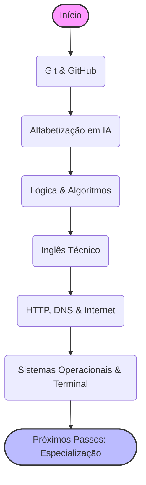

# 🗺️ Trilha Comum: A Base para Toda Grande Jornada DEV

> **Edição 2026:** Inclui Alfabetização em IA e novos paradigmas de trabalho com Agentes.

Todo grande herói de uma saga de fantasia precisa de um mapa, uma espada e um conjunto de habilidades básicas, certo? No universo do desenvolvimento, esta trilha é o seu kit de sobrevivência. São os feitiços e habilidades que todo(a) dev, não importa a especialização, precisa dominar.

---

## 🐣 Nível 1: A Fundação (Obrigatório)

Antes de tentar voar, você precisa aprender a andar. Estes são os pilares que sustentam todo o resto.

### 📦 Git & GitHub: Salvando seu Progresso

- **O que é?** Pense no Git como um sistema de "save points" para o seu código. Ele permite que você salve versões do seu projeto, volte no tempo se algo der errado e trabalhe em equipe sem que um sobrescreva o trabalho do outro. O GitHub é como uma grande biblioteca online para seus projetos Git, um lugar para guardá-los e compartilhá-los com o mundo. É o seu portfólio, sua base de operações.
- **Por que aprender?** "Com grandes poderes vêm grandes responsabilidades". Sem Git, você corre o risco de perder trabalho, criar conflitos de versão e ter uma dor de cabeça digna de um vilão da Marvel.
- **Recursos:**
  - 📖 [Documentação Oficial do Git](https://git-scm.com/doc)
  - 📺 [Git e GitHub para Iniciantes (Vídeo)](https://www.youtube.com/watch?v=UMhskLXJuq4)

### 🧠 Lógica de Programação e Algoritmos

- **O que são?** Algoritmos são como receitas de bolo: um passo a passo para resolver um problema. Estruturas de Dados são as "prateleiras" e "potes" onde você organiza seus ingredientes (dados) da forma mais eficiente.
- **Por que aprender?** Um bom cozinheiro sabe organizar sua cozinha para pegar os ingredientes rapidamente. Um(a) bom(a) dev sabe como estruturar seus dados para que o programa rode rápido e sem travar. É a diferença entre um feitiço que funciona instantaneamente e um que demora uma eternidade.
- **Recursos:**
  - 📖 [Visualgo: Visualizando Algoritmos e Estruturas de Dados](https://visualgo.net/en)
  - 📺 [Curso de Algoritmos e Lógica de Programação (Vídeo)](https://www.youtube.com/watch?v=8mei6uVttho)

### 🌍 Inglês para Devs: A Língua Universal

- **Por que aprender?** A documentação, os fóruns (Stack Overflow, GitHub Issues), os vídeos e as ferramentas de IA mais avançadas são, majoritariamente, em inglês. Saber inglês abre as portas do conhecimento global. Não precisa ser fluente para começar, mas a "leitura técnica" é essencial.
- **Dicas:**
  - Mude o idioma do seu celular e computador para inglês.
  - Tente ler a documentação original antes de procurar a tradução.
  - Consuma conteúdo de IA em inglês (newsletters, vídeos), pois a tradução de termos técnicos costuma ser confusa.

---

## 🛠️ Nível 2: Ferramentas do Dia a Dia

Agora que você tem a base teórica, vamos para as ferramentas que você usará todo santo dia.

### 🤖 Alfabetização em IA: O Novo Superpoder

A Inteligência Artificial não vai substituir os desenvolvedores, mas os desenvolvedores que usam IA vão substituir os que não usam.

- **Coding Assistants (Copilotos):**
  - **GitHub Copilot / Cursor / Windsurf:** Aprenda a usar essas ferramentas para gerar boilerplate, explicar código legado e escrever testes.
  - **Context Awareness:** Entenda que a IA precisa de contexto. Não peça apenas "crie uma função". Peça "crie uma função que faça X, dado que o banco de dados é Y e estamos usando a biblioteca Z".
- **Prompt Engineering para Devs:**
  - **Few-Shot Prompting:** Dê exemplos para a IA. "Gere testes unitários seguindo este padrão: [exemplo]".
  - **Chain of Thought:** Peça para a IA "pensar passo a passo" antes de dar a solução final.
  - **Structured Outputs:** Peça respostas em JSON para integrar com seus scripts.
- **Agentes e Ferramentas:** Entenda a diferença entre um chatbot (que só fala) e um Agente (que pode executar comandos no terminal, acessar a web e modificar arquivos).

### 🐧 Linux, Terminal e Sistemas Operacionais

- **Terminal:** A "tela preta" dos hackers. É uma forma poderosa de interagir com o computador. Aprenda comandos básicos (`cd`, `ls`, `grep`, `curl`).
- **Sistemas Operacionais:** Entenda o básico de Processos, Threads e Gerenciamento de Memória.
- **Recursos:**
  - 📖 [Linux Journey](https://linuxjourney.com/)

### 🌐 HTTP, DNS e Internet

- **Como a Web Funciona:** Entenda o ciclo Request/Response.
- **DNS:** O sistema de nomes da internet.
- **APIs REST:** Os garçons da web. Entenda os verbos (GET, POST, PUT, DELETE) e Status Codes (200, 404, 500).

### 🐳 Docker (Básico)

- **O que é?** Imagine empacotar sua aplicação em uma caixa que roda igual em qualquer lugar.
- **Por que aprender?** Para acabar com o "na minha máquina funciona".
- **Recursos:**
  - 📖 [Documentação Oficial do Docker](https://docs.docker.com/)

---

## 🚀 Nível 3: O Profissional Completo (Soft Skills & Gestão)

Código é a parte fácil. Lidar com pessoas, prazos e sua própria mente é o verdadeiro desafio.

### 🧠 Soft Skills na Era da IA

Com a IA escrevendo código, suas habilidades humanas valem ouro.

- **Pensamento Crítico:** A IA alucina. Você é o revisor final. Nunca aceite código gerado sem entender e testar.
- **Comunicação Clara:** Explicar problemas técnicos para pessoas não-técnicas (Product Managers, Designers) é essencial.
- **Comunicação Assíncrona:** Escrever bem (no Slack, nos Pull Requests, na documentação) é mais importante que falar bem em reuniões.
- **Inteligência Emocional:** Empatia pelo usuário final e pelos colegas de time. A IA não tem sentimentos; você tem.

### 📚 Aprender a Aprender (Meta-Learning)

- **Técnica Pomodoro:** Foco total por 25 minutos, descanso de 5.
- **Repetição Espaçada (Anki):** Para memorizar conceitos de longo prazo.
- **Deep Work:** Blocos de tempo sem interrupções para resolver problemas complexos.

### ❤️ Saúde Mental

- **Burnout:** Reconheça os sinais. Cansaço crônico, cinismo, falta de eficácia.
- **Descanso Ativo:** Sair das telas. Caminhar, dormir bem, ter hobbies offline.

---

### 📚 Onde Estudar de Graça (Recursos Gerais)

- **[FreeCodeCamp](https://www.freecodecamp.org/):** O melhor lugar para começar do zero. Cursos interativos e projetos práticos.
- **[Roadmap.sh](https://roadmap.sh/):** Guias visuais detalhados para qualquer carreira tech.
- **[CS50 (Harvard)](https://pll.harvard.edu/course/cs50-introduction-computer-science):** O melhor curso de introdução à ciência da computação do mundo.
- **[Microsoft: Generative AI for Beginners](https://github.com/microsoft/generative-ai-for-beginners):** Curso completo e gratuito no GitHub.

---
## 🚦 Próximos Passos

Agora que você tem a base, escolha sua especialização:

*   [**Backend**](../backend/backend.md)
*   [**Frontend**](../frontend/frontend.md)
*   [**Full Stack**](../fullstack/fullstack.md)
*   [**Mobile**](../mobile/mobile.md)
*   [**DevOps**](../devops/devops.md)
*   [**Engenharia de Dados**](../data/data-engineering.md)
*   [**Cybersecurity**](../security/cybersecurity.md)
*   [**Inteligência Artificial**](../ai/artificial-intelligence.md)
