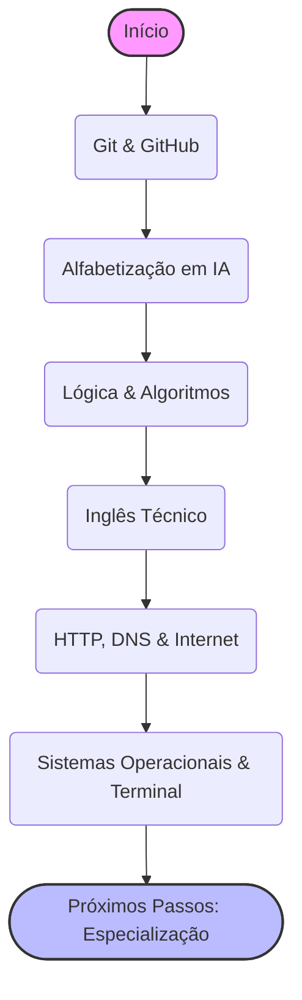

# 🗺️ Trilha Comum: A Base para Toda Grande Jornada DEV

> **Edição 2026:** Inclui Alfabetização em IA e novos paradigmas de trabalho com Agentes.

**O Desafio do Desenvolvedor Completo 2026:** O conhecimento esperado abrange desde a lógica estruturada do nível Júnior até a orquestração avançada e pensamento arquitetural de um Especialista. Não se trata apenas de escrever código, mas de garantir alta qualidade, sustentabilidade (Green Coding) e estar plenamente engajado com ferramentas modernas e ciclos de feedback otimizados.

```mermaid
flowchart TD
    Start([Início]) --> Git(Git & GitHub)
    Git --> AI(Alfabetização em IA)
    AI --> Logic(Lógica & Algoritmos)
    Logic --> English(Inglês Técnico)
    English --> HTTP(HTTP, DNS & Internet)
    HTTP --> OS(Sistemas Operacionais & Terminal)
    OS --> Next([Próximos Passos: Especialização])

    style Start fill:#f9f,stroke:#333,stroke-width:2px
    style Next fill:#bbf,stroke:#333,stroke-width:2px
```

Todo grande herói de uma saga de fantasia precisa de um mapa, uma espada e um conjunto de habilidades básicas, certo? No universo do desenvolvimento, esta trilha é o seu kit de sobrevivência. São os feitiços e habilidades que todo(a) dev, não importa a especialização, precisa dominar.

---

## 🐣 Nível 1: A Fundação (Obrigatório)

Antes de tentar voar, você precisa aprender a andar. Estes são os pilares que sustentam todo o resto.

### 📦 Git & GitHub: Salvando seu Progresso

- **O que é?** Pense no Git como um sistema de "save points" para o seu código. Ele permite que você salve versões do seu projeto, volte no tempo se algo der errado e trabalhe em equipe sem que um sobrescreva o trabalho do outro. O GitHub é como uma grande biblioteca online para seus projetos Git, um lugar para guardá-los e compartilhá-los com o mundo. É o seu portfólio, sua base de operações.
- **Por que aprender?** "Com grandes poderes vêm grandes responsabilidades". Sem Git, você corre o risco de perder trabalho, criar conflitos de versão e ter uma dor de cabeça digna de um vilão da Marvel.
- **Recursos:**
  - 📖 [Documentação Oficial do Git](https://git-scm.com/doc)
  - 📺 [Git e GitHub para Iniciantes (Vídeo)](https://www.youtube.com/watch?v=UMhskLXJuq4)

### 🧠 Lógica de Programação e Algoritmos

- **O que são?** Algoritmos são como receitas de bolo: um passo a passo para resolver um problema. Estruturas de Dados são as "prateleiras" e "potes" onde você organiza seus ingredientes (dados) da forma mais eficiente.
- **Por que aprender?** Um bom cozinheiro sabe organizar sua cozinha para pegar os ingredientes rapidamente. Um(a) bom(a) dev sabe como estruturar seus dados para que o programa rode rápido e sem travar. É a diferença entre um feitiço que funciona instantaneamente e um que demora uma eternidade.
- **Recursos:**
  - 📖 [Visualgo: Visualizando Algoritmos e Estruturas de Dados](https://visualgo.net/en)
  - 📺 [Curso de Algoritmos e Lógica de Programação (Vídeo)](https://www.youtube.com/watch?v=8mei6uVttho)

### 🌍 Inglês para Devs: A Língua Universal

- **Por que aprender?** A documentação, os fóruns (Stack Overflow, GitHub Issues), os vídeos e as ferramentas de IA mais avançadas são, majoritariamente, em inglês. Saber inglês abre as portas do conhecimento global. Não precisa ser fluente para começar, mas a "leitura técnica" é essencial.
- **Dicas:**
  - Mude o idioma do seu celular e computador para inglês.
  - Tente ler a documentação original antes de procurar a tradução.
  - Consuma conteúdo de IA em inglês (newsletters, vídeos), pois a tradução de termos técnicos costuma ser confusa.

---

## 🛠️ Nível 2: Ferramentas do Dia a Dia

Agora que você tem a base teórica, vamos para as ferramentas que você usará todo santo dia.

### 🤖 Alfabetização em IA: O Novo Superpoder

A Inteligência Artificial não vai substituir os desenvolvedores, mas os desenvolvedores que usam IA vão substituir os que não usam.

- **Coding Assistants (Copilotos):**
  - **GitHub Copilot / Cursor / Windsurf:** Aprenda a usar essas ferramentas para gerar boilerplate, explicar código legado e escrever testes.
  - **Context Awareness:** Entenda que a IA precisa de contexto. Não peça apenas "crie uma função". Peça "crie uma função que faça X, dado que o banco de dados é Y e estamos usando a biblioteca Z".
- **Prompt Engineering para Devs:**
  - **Zero-Shot vs Few-Shot:** Não espere que a IA adivinhe a arquitetura do seu projeto. Dê exemplos de código existentes. "Gere testes unitários para a função X seguindo exatamente o padrão do arquivo `test_Y.ts`: [cole o código aqui]".
  - **Chain of Thought (CoT):** Obrigue o modelo a raciocinar antes de codar. "Pense passo a passo em como resolver esse bug antes de escrever a correção. Liste as possíveis causas raízes."
  - **Structured Outputs:** O poder de transformar texto livre em dados estruturados. Peça respostas em JSON estrito (usando Zod/Pydantic) para automatizar pipelines de CI/CD ou scripts locais.
- **Agentes e Ferramentas (Tool Calling):** Entenda a diferença entre um chatbot estático (que alucina) e um Agente Autônomo (que pode usar a ferramenta `grep` no seu repositório, ler a documentação da API em tempo real e corrigir o próprio erro no terminal).
- **Agentic Coding Workflows (O Padrão Ouro de 2026):**
  - **Uso de LLMs como pares:** Ferramentas como Aider, SWE-agent, Cline ou Cursor não são "autocompletes gigantes". Você atua como o **Tech Lead**; a IA é o Desenvolvedor Júnior. Você aprova a PR, ela escreve o boilerplate.
  - **Test-Driven Agentic Workflow (TDAW):** Em vez de pedir para a IA escrever a feature, você escreve um teste que falha e pede para o Agente: "Modifique o código até esse teste passar". Isso evita regressões invisíveis.
  - **Contexto é Rei:** Dominar como passar o contexto correto (regras de linter, `.cursorrules`, arquivos README de arquitetura) para que a IA gere código que parece ter sido escrito por você.

### 🐧 Linux, Terminal e Sistemas Operacionais

- **Terminal:** A "tela preta" dos hackers. É uma forma poderosa de interagir com o computador. Aprenda comandos básicos (`cd`, `ls`, `grep`, `curl`).
- **Sistemas Operacionais:** Entenda o básico de Processos, Threads e Gerenciamento de Memória.
- **Recursos:**
  - 📖 [Linux Journey](https://linuxjourney.com/)

### 🌐 HTTP, DNS e Internet

- **Como a Web Funciona:** Entenda o ciclo Request/Response.
- **DNS:** O sistema de nomes da internet.
- **APIs REST:** Os garçons da web. Entenda os verbos (GET, POST, PUT, DELETE) e Status Codes (200, 404, 500).

### 🐳 Docker (Básico)

- **O que é?** Imagine empacotar sua aplicação em uma caixa que roda igual em qualquer lugar.
- **Por que aprender?** Para acabar com o "na minha máquina funciona".
- **Recursos:**
  - 📖 [Documentação Oficial do Docker](https://docs.docker.com/)

---

## 🚀 Nível 3: O Profissional Completo (Soft Skills & Gestão)

Código é a parte fácil. Lidar com pessoas, prazos e sua própria mente é o verdadeiro desafio.

### 🧠 Soft Skills na Era da IA

Com a IA escrevendo código, suas habilidades humanas valem ouro.

- **Pensamento Crítico:** A IA alucina. Você é o revisor final. Nunca aceite código gerado sem entender e testar.
- **Comunicação Clara:** Explicar problemas técnicos para pessoas não-técnicas (Product Managers, Designers) é essencial.
- **Comunicação Assíncrona:** Escrever bem (no Slack, nos Pull Requests, na documentação) é mais importante que falar bem em reuniões.
- **Inteligência Emocional:** Empatia pelo usuário final e pelos colegas de time. A IA não tem sentimentos; você tem.

### 📚 Aprender a Aprender (Meta-Learning)

- **Técnica Pomodoro:** Foco total por 25 minutos, descanso de 5.
- **Repetição Espaçada (Anki):** Para memorizar conceitos de longo prazo.
- **Deep Work:** Blocos de tempo sem interrupções para resolver problemas complexos.

### ❤️ Saúde Mental

- **Burnout:** Reconheça os sinais. Cansaço crônico, cinismo, falta de eficácia.
- **Descanso Ativo:** Sair das telas. Caminhar, dormir bem, ter hobbies offline.

---

## 📚 Materiais de Estudo Recomendados

Para formar o Desenvolvedor Completo em 2026 (do Júnior ao Especialista), reunimos os conteúdos mais atualizados e de altíssima qualidade do mercado:

### 🐣 Para Nível Júnior (Começando a Jornada)

- **[FreeCodeCamp](https://www.freecodecamp.org/) & [The Odin Project](https://www.theodinproject.com/):** Prática essencial interativa e currículo open-source focado em projetos para base Full Stack.
- **[CS50 (Harvard)](https://pll.harvard.edu/course/cs50-introduction-computer-science):** O melhor curso universitário de introdução à ciência da computação.
- **[Microsoft: Generative AI for Beginners](https://github.com/microsoft/generative-ai-for-beginners):** Essencial para dar os primeiros passos na era da IA.

### 🚀 Para Nível Pleno (Aprofundamento e Prática Contínua)

- **[Frontend Masters](https://frontendmasters.com/) & [Roadmap.sh](https://roadmap.sh/):** O mais alto nível de ensino web (TypeScript) e excelentes guias visuais interativos de carreira.
- **[DeepLearning.AI](https://www.deeplearning.ai/):** A referência máxima de aprendizado focado em Inteligência Artificial, LangChain e ML.
- **[Anthropic Prompt Engineering Tutorial](https://github.com/anthropics/courses):** Aprenda a estruturar prompts avançados e heurísticas Few-Shot para modelos complexos em 2026.

### 🏛️ Para Nível Sênior/Especialista (Arquitetura e Escala)

- **[Full Cycle](https://fullcycle.com.br/) & [ByteByteGo](https://www.youtube.com/@ByteByteGo):** Masterclass de aprofundamento arquitetural moderno (Go, Microsserviços, Mensageria, System Design).
- **[Local-First Web Dev](https://localfirstweb.dev/) & [AWS Skill Builder](https://explore.skillbuilder.aws/):** Padrões resilientes offline-first, WebAssembly e arquitetura cloud nativa avançada corporativa.
- **[LangChain Academy](https://academy.langchain.com/) & [Hugging Face](https://huggingface.co/learn):** Orquestração massiva multi-agente, fine-tuning e deployment contínuo de modelos abertos.

### 🏆 Desafios Práticos (Projetos)

- **Nível 1 (Fundação):** Crie uma conta no GitHub, aprenda comandos básicos do Git (add, commit, push, pull) e publique um repositório com um README descrevendo você. Escreva um algoritmo simples em pseudo-código para resolver um problema lógico do seu dia a dia.
- **Nível 2 (Ferramentas):** Utilize uma IA (como ChatGPT ou Copilot) como parceiro de aprendizado para entender como funciona o protocolo HTTP. Tente criar um container Docker simples (ex: rodando uma imagem do Nginx) usando o terminal do Linux.
- **Nível 3 (Profissional Completo):** Leia um artigo técnico em inglês, aplique a técnica Pomodoro para focar por 2 horas nos estudos, e escreva um pequeno resumo no GitHub explicando o que aprendeu. Reflita sobre sua comunicação em interações passadas.

---

## 📚 Aprofunde seus Estudos

Para maximizar seu aprendizado e entender exatamente o que focar em cada etapa da sua carreira, confira nosso guia detalhado:

- [**Guia de Estudos 2026: Do Júnior ao Especialista**](./study-guide.md)

---

## 🚦 Próximos Passos

Agora que você tem a base, escolha sua especialização:

- [**Backend**](../backend/backend.md)
- [**Frontend**](../frontend/frontend.md)
- [**Full Stack**](../fullstack/fullstack.md)
- [**Mobile**](../mobile/mobile.md)
- [**DevOps**](../devops/devops.md)
- [**Engenharia de Dados**](../data/data-engineering.md)
- [**Cybersecurity**](../security/cybersecurity.md)
- [**Inteligência Artificial**](../ai/artificial-intelligence.md)
- [**QA & Testing (Qualidade de Software)**](../qa/qa-testing.md)
