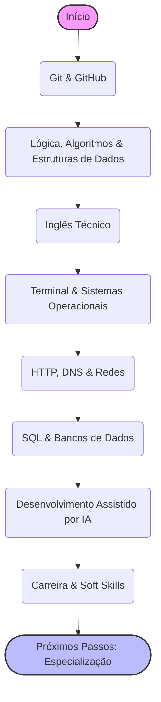

# 🗺️ Trilha Comum: A Base para Toda Jornada DEV

> **Edição 2026 (atualizada em out/2026):** fundamentos, Git/GitHub moderno, desenvolvimento assistido por IA com revisão humana, carreira e soft skills.

Esta trilha vale para qualquer especialização. A IA acelera quem já entende o que está pedindo; sem fundamentos, você não consegue julgar o que ela entrega. Por isso a ordem é: base sólida, ferramentas, e só então o uso intenso de agentes.

```mermaid
flowchart TD
    Start([Início]) --> Git(Git & GitHub)
    Git --> Logic(Lógica, Algoritmos & Estruturas de Dados)
    Logic --> English(Inglês Técnico)
    English --> OS(Terminal & Sistemas Operacionais)
    OS --> Net(HTTP, DNS & Redes)
    Net --> SQL(SQL & Bancos de Dados)
    SQL --> AI(Desenvolvimento Assistido por IA)
    AI --> Career(Carreira & Soft Skills)
    Career --> Next([Próximos Passos: Especialização])

    style Start fill:#f9f,stroke:#333,stroke-width:2px
    style Next fill:#bbf,stroke:#333,stroke-width:2px
```

---

## 🐣 Nível 1: A Fundação (Obrigatório)

### 📦 Git & GitHub

- **O que é?** Git versiona seu código: salva histórico, permite voltar no tempo e trabalhar em paralelo. GitHub hospeda repositórios e organiza a colaboração (Issues, Pull Requests, Actions).
- **O que dominar:**
  - Fluxo diário: `clone`, `switch -c`, `add`, `commit`, `push`, `pull --rebase`, `merge`, `rebase`, `stash`, `restore`, `reflog` (para desfazer erros).
  - Commits pequenos e com mensagem clara (ex.: [Conventional Commits](https://www.conventionalcommits.org/pt-br/)).
  - Pull Requests: descrição objetiva, diff pequeno, revisão de código, resolução de conflitos.
  - Branch protection e rulesets, `CODEOWNERS` e revisão obrigatória antes do merge.
  - GitHub Actions para testes e lint a cada PR; `git worktree` para trabalhar em várias branches (ou várias sessões de agente) em paralelo.
  - Segurança básica: chaves SSH ou assinatura de commits, nunca versionar segredos, ativar secret scanning e Dependabot.
- **Recursos:**
  - 📖 [Pro Git (livro gratuito)](https://git-scm.com/book/pt-br/v2)
  - 📖 [Documentação do Git](https://git-scm.com/doc)
  - 📖 [Documentação do GitHub](https://docs.github.com/pt)
  - 🎮 [GitHub Skills (cursos interativos)](https://skills.github.com/)

### 🧠 Lógica, Algoritmos e Estruturas de Dados

- **O que estudar:** complexidade (Big O), arrays, listas, pilhas, filas, hash maps, árvores, grafos, ordenação, busca binária, recursão e programação dinâmica básica.
- **Por que ainda importa com IA?** Você precisa perceber quando o código gerado é O(n²) onde poderia ser O(n log n), e entrevistas técnicas continuam cobrando isso.
- **Como praticar:** resolva poucos problemas por semana, mas explique a solução em voz alta e analise a complexidade. Não use IA para dar a resposta; use-a para pedir dicas e revisar depois.
- **Recursos:**
  - 📖 [Visualgo: algoritmos animados](https://visualgo.net/en)
  - 🎓 [CS50x (Harvard)](https://cs50.harvard.edu/x/)
  - 🧩 [LeetCode](https://leetcode.com/) e [Exercism](https://exercism.org/)

### 🌍 Inglês Técnico

- Documentação, issues, RFCs e papers saem primeiro em inglês. Foque em leitura técnica e em escrever PRs e commits claros.
- **Dicas:** leia a documentação original antes da tradução; mantenha ferramentas em inglês; anote termos novos no Anki.

---

## 🛠️ Nível 2: Ferramentas do Dia a Dia

### 🐧 Terminal e Sistemas Operacionais

- **Terminal:** navegação, pipes, `grep`, `find`, `curl`, `jq`, `ssh`, scripts Bash e variáveis de ambiente.
- **Sistemas Operacionais:** processos, threads, memória, sistema de arquivos, permissões e sinais. **Recursos:**
  - 📖 [Linux Journey](https://linuxjourney.com/)
  - 🎓 [The Missing Semester (MIT)](https://missing.csail.mit.edu/)

### 🌐 HTTP, DNS e Redes

- **Modelo básico:** TCP/IP, portas, DNS, TLS/HTTPS, cookies, CORS, cache HTTP.
- **HTTP:** ciclo request/response, verbos, status codes (2xx, 3xx, 4xx, 5xx), headers, HTTP/2 e HTTP/3 (QUIC).
- **APIs:** REST bem desenhado (recursos, idempotência, paginação, versionamento), JSON, noções de gRPC e GraphQL, autenticação com OAuth 2.0/OIDC e JWT.
- **Prática:** use `curl -v` e a aba Network do navegador para ver o que realmente trafega; use `dig` para DNS. **Recursos:**
  - 📖 [MDN: HTTP](https://developer.mozilla.org/pt-BR/docs/Web/HTTP)
  - 📖 [High Performance Browser Networking](https://hpbn.co/)
  - 📖 [Beej's Guide to Network Programming](https://beej.us/guide/bgnet/)

### 🗄️ SQL e Bancos de Dados

- **SQL é base de todo dev:** `SELECT`, `JOIN`, `GROUP BY`, subqueries, CTEs, funções de janela, `INSERT/UPDATE/DELETE`.
- **Modelagem:** normalização, chaves primárias e estrangeiras, índices, transações (ACID) e níveis de isolamento.
- **Desempenho:** leia `EXPLAIN ANALYZE`, entenda índices B-tree e o problema N+1.
- **Escolha pragmática:** PostgreSQL resolve a maioria dos casos (inclusive JSON e busca vetorial com pgvector). Use NoSQL quando o padrão de acesso justificar. **Recursos:**
  - 📖 [SQLBolt](https://sqlbolt.com/)
  - 📖 [Tutorial oficial do PostgreSQL](https://www.postgresql.org/docs/current/tutorial.html)
  - 📖 [Use The Index, Luke](https://use-the-index-luke.com/)

### 🐳 Docker (Básico)

- Imagens, containers, volumes, redes, `Dockerfile` e Docker Compose. Objetivo: ambiente reproduzível, sem "na minha máquina funciona".
- Boas práticas: imagens pequenas, multi-stage build, usuário não-root, sem segredos na imagem.
- 📖 [Documentação do Docker](https://docs.docker.com/)

---

## 🤖 Nível 3: Desenvolvimento Assistido por IA

Assistentes e agentes de código fazem parte do fluxo normal de trabalho em 2026. Eles aceleram tarefas repetitivas, mas **você continua responsável pelo código que entra em produção**.

### Ferramentas

- **Assistentes no editor:** GitHub Copilot, Cursor, entre outros. Bons para autocomplete, explicar código e refatorações pequenas.
- **Agentes de código:** executam tarefas em várias etapas (ler o repositório, editar arquivos, rodar testes e comandos). Exemplos: Claude Code, GitHub Copilot coding agent, Codex CLI, Cursor Agent, Cline e Aider. Eles funcionam no terminal, na IDE ou na nuvem, abrindo PRs.
- **MCP (Model Context Protocol):** padrão aberto para conectar agentes a ferramentas e dados (GitHub, bancos, documentação, navegador, tickets). Conheça o conceito de servidores MCP, e trate cada um como uma dependência: confira a origem, limite permissões e não exponha segredos.

### Fluxo recomendado

1. **Defina o escopo:** tarefa pequena, critério de aceite claro e arquivos relevantes.
2. **Dê contexto:** arquivos de instruções do projeto (`AGENTS.md`, `CLAUDE.md`, regras do Cursor/Copilot) com comandos de build/test, convenções e arquitetura.
3. **Planeje antes:** peça um plano e revise antes de deixar o agente editar.
4. **Teste primeiro:** escreva ou peça um teste que falha e deixe o agente iterar até passar (TDD com agente). Testes são a melhor rede de segurança.
5. **Revise o diff como se fosse de outra pessoa:** entenda cada mudança, procure dependências inventadas, tratamento de erro ausente, falhas de segurança e escopo excedido.
6. **Rode CI e revisão humana:** nenhum código gerado por IA entra sem PR, testes verdes e pelo menos uma revisão humana.
7. **Registre o que aprendeu:** atualize as instruções do projeto quando o agente errar de forma recorrente.

### Práticas essenciais

- **Prompts úteis:** objetivo, contexto, restrições, exemplo de formato esperado e como verificar. Para saídas estruturadas, use JSON Schema (Zod/Pydantic).
- **Segurança:** nunca cole segredos ou dados de clientes em ferramentas não aprovadas; rode agentes com permissões mínimas, de preferência em sandbox ou container; cuidado com prompt injection em issues, páginas web e dependências lidas pelo agente.
- **Licenças e política da empresa:** verifique o que sua organização permite.
- **Limites:** IA erra com confiança. Verifique APIs na documentação oficial e desconfie de código que "parece certo".
- **Não terceirize o aprendizado:** como Júnior, tente primeiro, depois peça revisão à IA; senão você não desenvolve julgamento.
- 📖 [Model Context Protocol](https://modelcontextprotocol.io/)
- 📖 [Documentação do GitHub Copilot](https://docs.github.com/pt/copilot)
- 📖 [Claude Code (documentação)](https://docs.claude.com/en/docs/claude-code/overview)
- 📖 [AGENTS.md (formato aberto de instruções)](https://agents.md/)
- 📖 [OWASP GenAI Security Project](https://genai.owasp.org/)

---

## 🚀 Nível 4: O Profissional Completo (Carreira & Soft Skills)

### 🤝 Soft Skills

- **Pensamento crítico:** questione o que a IA e os colegas dizem; peça evidência e teste.
- **Comunicação clara:** explique problemas técnicos para pessoas não técnicas; escreva PRs, ADRs e documentação objetivos.
- **Comunicação assíncrona:** textos bem escritos reduzem reuniões. **Receber e dar feedback:** code review é diálogo, não julgamento pessoal. Comente o código, não a pessoa.
- **Colaboração e ownership:** peça ajuda depois de tentar por um tempo razoável, assuma a entrega de ponta a ponta e avise cedo sobre riscos.
- **Estimativas e prioridades:** divida o trabalho, diga o que não cabe no prazo e alinhe expectativas.
- 📖 [Google Engineering Practices: Code Review](https://google.github.io/eng-practices/review/)

### 💼 Carreira

- **Portfólio:** poucos projetos bem acabados, com README, testes, CI e deploy, valem mais que muitos repositórios soltos. Mostre também PRs em projetos open source.
- **Currículo e LinkedIn:** descreva resultados (o que melhorou, em quanto), não só tecnologias.
- **Entrevistas:** treine algoritmos básicos, SQL, explicar projetos seus e, para Pleno/Sênior, System Design. Pratique também a conversa comportamental (método STAR).
- **Crescimento:** do Júnior ao Sênior, o escopo cresce de tarefas para sistemas e pessoas. Busque feedback regular e mentoria.
- 📖 [Staff Engineer (staffeng.com)](https://staffeng.com/)
- 📖 [The Pragmatic Programmer](https://pragprog.com/titles/tpp20/the-pragmatic-programmer-20th-anniversary-edition/)

### 📚 Aprender a Aprender

- **Prática deliberada:** construa projetos, não apenas assista aulas. **Repetição espaçada:** [Anki](https://apps.ankiweb.net/) para conceitos de longo prazo.
- **Foco:** blocos sem interrupção (Pomodoro ou Deep Work), conforme sua rotina. **Ensine:** escreva notas públicas, responda dúvidas, mentore alguém.

### ❤️ Saúde Mental

- **Burnout:** cansaço crônico, cinismo e queda de eficácia são sinais para agir cedo; converse com gestão e busque apoio profissional se necessário.
- **Rotina sustentável:** sono, pausas, atividade física e hobbies fora das telas.

---

## 🏆 Desafios Práticos

- **Nível 1 (Fundação):** publique um repositório no GitHub com README, abra um PR em outro repositório seu, resolva um conflito de merge de propósito e implemente busca binária com testes e análise de complexidade.
- **Nível 2 (Ferramentas):** crie uma API simples com 2 endpoints e PostgreSQL, tudo em Docker Compose; adicione um índice e compare o `EXPLAIN ANALYZE` antes e depois; inspecione as chamadas com `curl -v`.
- **Nível 3 (IA):** adicione uma funcionalidade pequena à API usando um agente de código: escreva o teste primeiro, revise o diff linha a linha, rode a CI e descreva no PR o que o agente fez e o que você corrigiu.
- **Nível 4 (Carreira):** escreva um post ou ADR curto explicando uma decisão técnica do seu projeto e peça feedback a uma pessoa da comunidade.

---

## 📚 Materiais de Estudo Recomendados

Para formar o Desenvolvedor Completo em 2026 (do Júnior ao Especialista), reunimos os conteúdos mais atualizados e de altíssima qualidade do mercado:

### 🐣 Para Nível Júnior

- **[freeCodeCamp](https://www.freecodecamp.org/) e [The Odin Project](https://www.theodinproject.com/):** prática guiada e currículo baseado em projetos.
- **[CS50x (Harvard)](https://cs50.harvard.edu/x/):** introdução à ciência da computação, gratuita.
- **[Microsoft: Generative AI for Beginners](https://github.com/microsoft/generative-ai-for-beginners):** primeiros passos com IA generativa.

### 🚀 Para Nível Pleno

- **[Frontend Masters](https://frontendmasters.com/) e [Roadmap.sh](https://roadmap.sh/):** cursos aprofundados e guias visuais de carreira.
- **[DeepLearning.AI](https://www.deeplearning.ai/):** cursos curtos sobre IA aplicada.
- **[Anthropic Courses](https://github.com/anthropics/courses):** prompts e uso de ferramentas com modelos de linguagem.

### 🏛️ Para Nível Sênior/Especialista

- **[Full Cycle](https://fullcycle.com.br/) e [ByteByteGo](https://www.youtube.com/@ByteByteGo):** arquitetura, mensageria e System Design.
- **[System Design Primer](https://github.com/donnemartin/system-design-primer):** base para entrevistas e decisões de arquitetura.
- **[Hugging Face Learn](https://huggingface.co/learn):** modelos abertos, fine-tuning e agentes.

---

## 📚 Aprofunde seus Estudos

- [**Guia de Estudos 2026: Do Júnior ao Especialista**](./study-guide.md) [**Padrões de Especialista 2026**](./2026-specialist-patterns.md)

---

## 🚦 Próximos Passos

Agora que você tem a base, escolha sua especialização:

- [**Backend**](../backend/backend.md) [**Frontend**](../frontend/frontend.md)
- [**Full Stack**](../fullstack/fullstack.md) [**Mobile**](../mobile/mobile.md)
- [**DevOps**](../devops/devops.md) [**Engenharia de Dados**](../data/data-engineering.md)
- [**Cybersecurity**](../security/cybersecurity.md) [**Inteligência Artificial**](../ai/artificial-intelligence.md)
- [**QA & Testing (Qualidade de Software)**](../qa/qa-testing.md)
