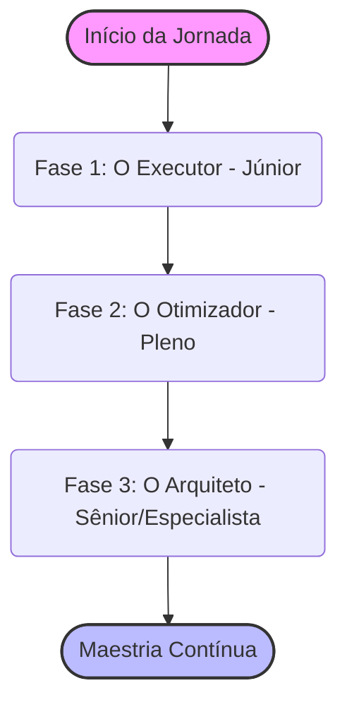

# 📚 Guia de Estudos 2026: Do Júnior ao Especialista

> **Edição 2026:** Um guia prático de como organizar seus estudos para atingir o nível de excelência exigido pelo mercado moderno, focando em IA, arquitetura avançada e sustentabilidade.

O mercado de tecnologia em 2026 não tolera mais desenvolvedores que apenas "escrevem código". Com a ascensão dos agentes autônomos de IA e ferramentas como Copilot e Cursor, a habilidade de *pensar* e *arquitetar* tornou-se mais valiosa do que a habilidade de *digitar*.

Este guia foi desenhado para maximizar seu tempo e garantir que você estude **o que realmente importa**.

---

## 🌱 Fase 1: O Executor (Nível Júnior)

O objetivo desta fase não é criar a arquitetura perfeita, mas sim **fazer funcionar de forma previsível e entender os fundamentos**. Você deve dominar a base antes de tentar escalar.

### 🎯 Foco Principal:
- **Lógica e Estruturas de Dados:** Compreender Big O Notation básico. Saber quando usar um Array vs um Map (Dicionário).
- **A Linguagem (Sua Ferramenta de Trabalho):** Escolha UMA linguagem (ex: JavaScript/TypeScript, Python, Go) e entenda como ela funciona por baixo dos panos (Event Loop, Garbage Collection).
- **Git & Versionamento:** Commits atômicos, branch management e como resolver conflitos sem pânico.
- **Alfabetização em IA (Obrigatório):** Aprender a escrever prompts estruturados (*Zero-Shot*, *Few-Shot*) para que a IA gere código boilerplate, testes simples ou explique mensagens de erro.

### 📅 Rotina Sugerida (1 a 2 horas/dia):
1. **Teoria (30%):** Assista a uma aula de CS50 ou leia documentações oficiais (MDN, docs de frameworks).
2. **Prática Focada (50%):** Resolva problemas no LeetCode (foco em Easy/Medium) ou implemente pequenos scripts.
3. **Revisão com IA (20%):** Peça para o ChatGPT/Claude revisar seu código: *"Este código funciona, mas existe uma forma mais idiomática ou eficiente de escrevê-lo nesta linguagem?"*

---

## 🚀 Fase 2: O Otimizador (Nível Pleno)

Você já consegue entregar features. Agora, o desafio é entregar features **rápidas, seguras, testáveis e sustentáveis**.

### 🎯 Foco Principal:
- **Testes Automatizados & TDD:** Você não testa apenas para achar bugs, mas para documentar o comportamento esperado. O Padrão de 2026 é o **Test-Driven Agentic Workflow (TDAW)**: você escreve o teste falho e pede para o Agente de IA implementar a lógica até o teste passar.
- **Banco de Dados (Avançado):** Sair do CRUD básico. Entender Índices, Transações (ACID), N+1 Queries e quando usar SQL vs NoSQL.
- **CI/CD & Docker:** Sua máquina não importa. O código tem que rodar de forma idêntica em produção. Domine o básico de GitHub Actions e containerização.
- **System Design (Básico):** Como dois microsserviços conversam? (REST vs gRPC vs Mensageria/RabbitMQ).

### 📅 Rotina Sugerida (2 a 3 horas/dia):
1. **Refatoração (30%):** Pegue um projeto antigo seu e aplique princípios SOLID ou Clean Architecture.
2. **Infraestrutura Prática (40%):** Crie pipelines de deploy. Suba um banco de dados real no Docker, integre no seu pipeline (Testcontainers).
3. **Estudo de Casos reais (30%):** Leia blogs de engenharia de grandes empresas (Uber, Netflix, Discord) para entender os problemas que eles enfrentam ao escalar.

---

## 🏛️ Fase 3: O Arquiteto (Nível Sênior / Especialista)

Aqui, o código é a parte mais fácil do seu dia. Seu trabalho é **tomar decisões que afetam o negócio, os custos da empresa e a equipe como um todo**.

### 🎯 Foco Principal:
- **Sistemas Multi-Agente & RAG Avançado:** Integrar LLMs não é apenas chamar uma API. É criar sistemas onde múltiplos agentes validam as respostas uns dos outros (GraphRAG, LangGraph).
- **Green Coding & FinOps:** Escolher entre Node.js e Rust/Go não é mais apenas preferência, é uma decisão financeira. Entender o custo de CPU/Memória na nuvem e otimizar para reduzir a pegada de carbono.
- **Local-First & Edge Computing:** Arquitetar aplicações que funcionam perfeitamente offline (via CRDTs/Yjs) e rodam no Edge (Cloudflare Workers, Wasm) para latência zero global.
- **Mentoria e Liderança Técnica:** Desenvolver Soft Skills. Um Sênior que não consegue explicar decisões complexas de forma simples para um Product Manager ou mentorar um Júnior não é Sênior de verdade.

### 📅 Rotina Sugerida (Foco em Profundidade):
1. **Provas de Conceito (PoC) (40%):** Teste tecnologias emergentes (ex: WebAssembly, novos modelos locais com Ollama) antes de colocá-las em produção.
2. **Arquitetura (40%):** Estude padrões complexos (Event-Sourcing, CQRS, Data Mesh) e pratique desenhos de arquitetura de sistemas distribuídos.
3. **Mentoria & Comunicação (20%):** Escreva RFCs (Request for Comments) detalhando suas propostas arquiteturais, dê palestras internas na sua empresa ou crie conteúdo técnico.

---

## 📚 Conteúdos de Alta Qualidade (Júnior ao Especialista)

Para garantir que você tenha a melhor base teórica e prática em 2026, selecionamos os melhores materiais divididos por nível:

### 🐣 Para Nível Júnior (A Base)
- **Cursos:** [CS50 (Harvard)](https://pll.harvard.edu/course/cs50-introduction-computer-science) (Ciência da Computação Base), [FreeCodeCamp](https://www.freecodecamp.org/) (Prática de Código), [The Odin Project](https://www.theodinproject.com/) (Full Stack).
- **Livros:** "Código Limpo" (Robert C. Martin) - *Foque nos primeiros capítulos*, "Entendendo Algoritmos" (Aditya Y. Bhargava).
- **IA Literacy:** [Microsoft: Generative AI for Beginners](https://github.com/microsoft/generative-ai-for-beginners).

### 🚀 Para Nível Pleno (Otimização e Arquitetura)
- **Cursos:** [Frontend Masters](https://frontendmasters.com/) (Especialmente os cursos de Performance e TypeScript avançado), [DeepLearning.AI](https://www.deeplearning.ai/) (Cursos curtos sobre LangChain e RAG).
- **Livros:** "Projetando Sistemas Intensivos em Dados" (Martin Kleppmann), "Arquitetura Limpa" (Robert C. Martin).
- **Plataformas de Prática:** [LeetCode](https://leetcode.com/) (Foco em Medium), [SystemDesignPrimer](https://github.com/donnemartin/system-design-primer).

### 🏛️ Para Nível Sênior/Especialista (Maestria e Liderança)
- **Cursos:** Assinaturas corporativas focadas em arquitetura como [O'Reilly](https://www.oreilly.com/) e [Pluralsight](https://www.pluralsight.com/). Cursos especializados em Edge Computing e Wasm.
- **Canais / Blogs:** [ByteByteGo (YouTube)](https://www.youtube.com/@ByteByteGo) (System Design de Alto Nível), Blogs de Engenharia da Uber, Netflix, e Cloudflare.
- **Livros:** "Staff Engineer: Leadership beyond the management track" (Will Larson), "Building Microservices" (Sam Newman).

---

## 🧠 Dica de Ouro para 2026: Aprenda a Aprender

Com novas ferramentas de IA saindo a cada semana, decorar sintaxe tornou-se inútil. Desenvolva as seguintes meta-habilidades:

1. **Leitura Dinâmica de Documentação:** Vá direto para a seção de "Getting Started" e depois para "Architecture/Concepts".
2. **Pensamento Crítico:** Não aceite o primeiro código gerado pela IA. Entenda *por que* ela escolheu aquela abordagem.
3. **Inglês Técnico:** A vanguarda da tecnologia é documentada primeiro em inglês. Não dependa de traduções que demoram meses para sair.

---
## ↩️ Navegação

*   [**Voltar para a Trilha Comum**](./common.md)
*   [**Voltar para o Início**](../../index.md)
