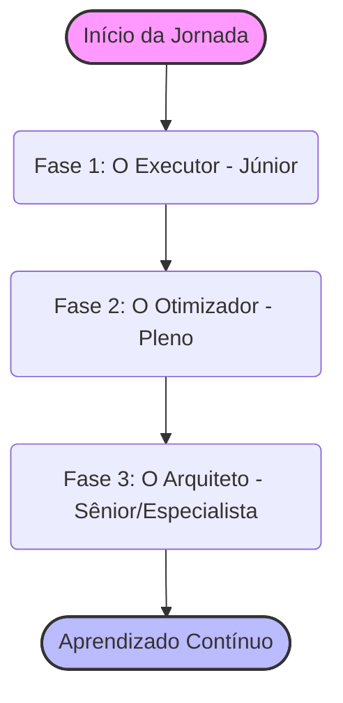

# 📚 Guia de Estudos 2026: Do Júnior ao Especialista

> **Edição 2026 (atualizada em out/2026):** como organizar seus estudos com fundamentos sólidos, uso responsável de IA e foco em carreira.

## 🌟 O Desenvolvedor Completo em 2026

Escrever código que compila não basta. Em qualquer trilha, três eixos aparecem do Júnior ao Especialista:

- **Fundamentos:** algoritmos e estruturas de dados, redes (HTTP, DNS, TLS), SQL, sistemas operacionais e Git. Mudam pouco e sustentam todo o resto.
- **Desenvolvimento assistido por IA:** usar assistentes e agentes de código (Copilot, Cursor, Claude Code, Codex CLI etc.) e conectá-los a ferramentas via MCP, **sempre com testes, CI e revisão humana**. A IA acelera; a responsabilidade é sua.
- **Engenharia e carreira:** arquitetura, custo (FinOps), eficiência de recursos (Green Software), comunicação, feedback e mentoria.

```mermaid
flowchart TD
    Start([Início da Jornada]) --> JR(Fase 1: O Executor - Júnior)
    JR --> Mid(Fase 2: O Otimizador - Pleno)
    Mid --> Sr(Fase 3: O Arquiteto - Sênior/Especialista)
    Sr --> Mastery([Aprendizado Contínuo])

    style Start fill:#f9f,stroke:#333,stroke-width:2px
    style Mastery fill:#bbf,stroke:#333,stroke-width:2px
```

Com agentes escrevendo parte do código, o valor do desenvolvedor se desloca para entender o problema, decidir, verificar e comunicar. Este guia ajuda a investir tempo no que mais rende.

---

## 🌱 Fase 1: O Executor (Júnior)

Objetivo: entregar tarefas pequenas de forma previsível e entender os fundamentos.

### 🎯 Foco principal

- **Lógica e estruturas de dados:** Big O básico; quando usar array, map, set, pilha, fila e árvore.
- **Uma linguagem a fundo:** JavaScript/TypeScript, Python ou Go. Entenda tipos, erros, assincronismo e gerenciamento de memória.
- **Git e GitHub:** commits pequenos, branches, Pull Requests, resolução de conflitos, `rebase` e `reflog`.
- **SQL básico:** `JOIN`, `GROUP BY`, índices, modelagem simples.
- **Redes e HTTP:** request/response, status codes, DNS, uso do DevTools e do `curl`.
- **IA com disciplina:** use assistentes para explicar erros e revisar seu código depois de tentar sozinho; não aceite o que não entende.

### 📅 Rotina sugerida (1 a 2 horas/dia)

1. **Teoria (30%):** aulas do CS50 ou documentação oficial (MDN, docs da linguagem).
2. **Prática (50%):** exercícios (Exercism, LeetCode nível fácil/médio) e mini-projetos com deploy.
3. **Revisão (20%):** peça a IA ou a um colega para revisar o código: "existe forma mais idiomática ou segura de escrever isto?". Compare com sua solução.

---

## 🚀 Fase 2: O Otimizador (Pleno)

Objetivo: entregar funcionalidades testáveis, seguras e fáceis de manter.

### 🎯 Foco principal

- **Testes automatizados:** unitários, integração e end-to-end. Com agentes de código, escrever o teste antes e deixar o agente iterar até passar é um fluxo eficiente e seguro.
- **Agentes de código no dia a dia:** arquivos de instruções (`AGENTS.md`), planos revisados antes da implementação, diffs pequenos, MCP com permissões mínimas, sandbox e revisão humana obrigatória no PR.
- **Bancos de dados:** transações (ACID), isolamento, índices, `EXPLAIN ANALYZE`, N+1, migrações e quando usar NoSQL.
- **CI/CD e containers:** GitHub Actions, Docker, ambientes reproduzíveis, Testcontainers.
- **Redes e APIs:** REST, gRPC, filas/mensageria, timeouts, retries, idempotência, OAuth 2.0/OIDC.
- **Observabilidade básica:** logs estruturados, métricas e traces (OpenTelemetry).
- **Segurança:** OWASP Top 10, gestão de segredos, dependências.
- **Soft skills:** revisar código com respeito, dar e receber feedback, estimar e comunicar riscos.

### 📅 Rotina sugerida (2 a 3 horas/dia)

1. **Refatoração (30%):** melhore um projeto antigo com testes, SOLID e arquitetura limpa onde fizer sentido.
2. **Infraestrutura prática (40%):** pipeline de CI/CD, banco real em container, deploy automatizado.
3. **Estudo de casos (30%):** blogs de engenharia (Uber, Netflix, Discord, Cloudflare) e post-mortems públicos.

---

## 🏛️ Fase 3: O Arquiteto (Sênior / Especialista)

Objetivo: tomar decisões que afetam produto, custo e equipe, e multiplicar o time.

### 🎯 Foco principal

- **System Design:** consistência, disponibilidade, filas, caches, particionamento, modelagem de falhas; registre decisões em ADRs.
- **IA nos produtos e nos times:** integrar LLMs com RAG, avaliação (evals), custo e latência; definir políticas de uso de agentes de código, revisão e segurança (prompt injection, vazamento de dados, permissões de MCP).
- **Custo e eficiência:** FinOps e Green Software. Meça antes de otimizar; escolha a linguagem (Rust, Go, Java, Node) pelo perfil de carga, não por moda.
- **Local-first e Edge:** use quando o requisito pedir (offline, latência, colaboração); avalie a complexidade de sincronização (CRDTs) antes de adotar.
- **Liderança técnica:** RFCs, mentoria, comunicação com produto e negócio, priorização e gestão de dívida técnica.

### 📅 Rotina sugerida (foco em profundidade)

1. **Provas de conceito (40%):** teste tecnologias novas com critérios e métricas definidos antes de adotá-las.
2. **Arquitetura (40%):** estude padrões (Event Sourcing, CQRS, particionamento) e pratique desenhos de sistemas distribuídos.
3. **Mentoria e comunicação (20%):** escreva RFCs, dê palestras internas, revise PRs de outras pessoas.

---

## 💼 Carreira ao Longo das Fases

- **Júnior:** portfólio pequeno e bem acabado, primeiras contribuições open source, networking com comunidades.
- **Pleno:** autonomia em funcionalidades de ponta a ponta, entrevistas com System Design básico, visibilidade interna (documentação, apresentações).
- **Sênior/Especialista:** influência além do próprio código, mentoria, decisões documentadas. Escolha entre trilha de gestão ou de engenharia (Staff+).
- **Sempre:** peça feedback regular, registre conquistas com resultados mensuráveis e cuide da saúde mental.

---

## 📚 Materiais de Estudo Recomendados

Para formar o Desenvolvedor Completo em 2026 (do Júnior ao Especialista), reunimos os conteúdos mais atualizados e de altíssima qualidade do mercado:

### 🐣 Para Nível Júnior

- **Cursos e prática:** [CS50x (Harvard)](https://cs50.harvard.edu/x/), [freeCodeCamp](https://www.freecodecamp.org/) e [The Odin Project](https://www.theodinproject.com/).
- **Fundamentos:** [Visualgo](https://visualgo.net/), [SQLBolt](https://sqlbolt.com/), [Pro Git](https://git-scm.com/book/pt-br/v2), [MDN: HTTP](https://developer.mozilla.org/pt-BR/docs/Web/HTTP) e [The Missing Semester](https://missing.csail.mit.edu/).
- **IA e qualidade:** [Generative AI for Beginners](https://github.com/microsoft/generative-ai-for-beginners), [Playwright](https://playwright.dev/) e [Vitest](https://vitest.dev/).

### 🚀 Para Nível Pleno

- **Linguagens e web:** [Frontend Masters](https://frontendmasters.com/) e [Go.dev/learn](https://go.dev/learn/).
- **IA aplicada:** [Anthropic Courses](https://github.com/anthropics/courses), [DeepLearning.AI](https://www.deeplearning.ai/) e [Model Context Protocol](https://modelcontextprotocol.io/).
- **Infra e dados:** [Docker Docs](https://docs.docker.com/), [Use The Index, Luke](https://use-the-index-luke.com/), [System Design Primer](https://github.com/donnemartin/system-design-primer) e o livro "Designing Data-Intensive Applications" (Martin Kleppmann).

### 🏛️ Para Nível Sênior/Especialista

- **Arquitetura:** [Full Cycle](https://fullcycle.com.br/), [ByteByteGo](https://www.youtube.com/@ByteByteGo) e [AWS Skill Builder](https://explore.skillbuilder.aws/).
- **IA Engineering:** [LangChain Academy](https://academy.langchain.com/), [Hugging Face Learn](https://huggingface.co/learn) e [OWASP GenAI Security Project](https://genai.owasp.org/).
- **Eficiência e liderança:** [WebAssembly (MDN)](https://developer.mozilla.org/en-US/docs/WebAssembly), [Green Software Foundation](https://greensoftware.foundation/), [FinOps Foundation](https://www.finops.org/) e [Staff Engineer](https://staffeng.com/).

---

## 🧠 Dica de Ouro: Aprenda a Aprender

Ferramentas mudam rápido; fundamentos não. Desenvolva meta-habilidades:

1. **Leitura de documentação:** comece em "Getting Started", depois "Concepts/Architecture".
2. **Pensamento crítico:** entenda por que a IA escolheu aquela abordagem e valide em fonte oficial.
3. **Inglês técnico:** documentação e discussões saem primeiro em inglês.
4. **Projetos reais:** consolide cada tema com um projeto pequeno publicado.

---

## ↩️ Navegação

- [**Voltar para a Trilha Comum**](./common.md)
- [**Voltar para o Início**](../../index.md)
