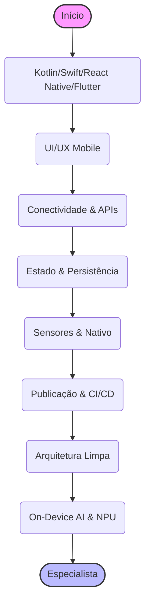

# 📱 Trilha Mobile: O Mundo na Palma da Mão

> **Edição 2026:** Com foco em On-Device AI, NPU Acceleration e Hybrid AI.

"Tem um app pra isso." A trilha mobile te coloca no centro dessa revolução. Você não vai apenas construir um software, vai construir um companheiro digital.

Esta trilha está dividida em níveis para guiar sua evolução profissional.

---

## 🐣 Nível Iniciante (Júnior)

Comece entendendo como os apps funcionam e publique seu primeiro "Hello World".

### 🎯 Escolha sua Jornada (Nativo vs. Híbrido)
- **Nativo (Especialista):**
  - **Android (Kotlin):** O padrão moderno do Google.
  - **iOS (Swift):** A linguagem elegante da Apple.
- **Híbrido & Multiplataforma:**
  - **React Native:** Use seus conhecimentos de web (JavaScript/React).
  - **Flutter:** Desenhe em qualquer pixel com Dart. Alta performance.
  - **Kotlin Multiplatform (KMP):** Compartilhe a lógica de negócios (e até UI com Compose Multiplatform) mantendo a performance 100% nativa.

### 🧩 Fundamentos de UI/UX Mobile
- **Layouts:** Flexbox (React Native), Rows/Columns (Flutter) ou AutoLayout (iOS). Como criar telas responsivas.
- **Navegação:** Stack, TabBar, Drawer. Como o usuário vai de A para B.
- **Ciclo de Vida:** Entenda quando a tela é criada, pausada (background) e destruída.

### 🌐 Conectividade Básica
- Consumo de APIs REST (GET, POST).
- Tratamento de estados de carregamento (Loading) e erro (Error handling).

---

## 🚀 Nível Intermediário (Pleno)

Construa apps robustos, que funcionam offline e encantam o usuário.

### 🧠 Gerenciamento de Estado
- **React Native:** Context API, Redux Toolkit, Zustand.
- **Flutter:** Provider, Riverpod, BLoC (Business Logic Component).
- **Nativo:** ViewModel, LiveData/StateFlow (Android), Combine (iOS).

### 🗄️ Persistência de Dados (Offline-First)
- **Bancos Locais:** SQLite, Room, Realm ou WatermelonDB.
- **Estratégia Offline:** O app deve funcionar sem internet e sincronizar quando a conexão voltar.

### 📲 Recursos do Dispositivo
- **Sensores:** Câmera, GPS, Acelerômetro.
- **Notificações Push:** Engajamento com Firebase Cloud Messaging (FCM).
- **Biometria:** Login com FaceID ou TouchID.

### 🚢 Publicação e CI/CD
- **Lojas:** Google Play Console e Apple App Store Connect.
- **Fastlane:** Automatize a geração de prints, assinaturas digitais e o upload para a loja.

---

## 🧙‍♂️ Nível Avançado (Sênior / Especialista)

Otimização extrema, arquitetura limpa e Inteligência Artificial no dispositivo.

### 🏗️ Arquitetura Mobile Avançada
- **Clean Architecture:** Separação de responsabilidades (Domain, Data, Presentation).
- **MVVM / MVI:** Padrões unidirecionais para interfaces reativas e testáveis.
- **Modularização:** Dividir o app em múltiplos pacotes/módulos para acelerar o build e escalar times grandes.

### ⚡ Performance e Segurança
- **Profiling:** Ferramentas para detectar memory leaks e gargalos de renderização (60fps é a lei).
- **Segurança:** Obfuscação (ProGuard/R8), Certificate Pinning e uso seguro do Keychain/Keystore.

### 📱 IA no Mobile (On-Device AI - A Nova Era)
- **Small Language Models (SLMs):** Rodar Phi-3, Gemma ou Llama 3 8B direto no celular.
- **Frameworks de IA:**
  - **ExecuTorch & TFLite:** Para rodar modelos PyTorch e TensorFlow no edge.
  - **MediaPipe:** Soluções prontas do Google para Visão Computacional e ML on-device.
  - **CoreML:** O framework nativo da Apple para máxima performance no iOS.
- **NPU Acceleration:** Delegar o processamento de IA para o chip neural (Apple Neural Engine / Android NPU) para economizar bateria.
- **Privacidade (Local RAG):** Usar dados pessoais do dispositivo para dar contexto à IA, sem nunca enviar os dados para a nuvem.

### 🗣️ Interfaces Naturais
- **Voice UI:** Integração com Whisper local para comandos de voz rápidos.
- **Multimodalidade:** Usar a câmera para analisar objetos e textos em tempo real.

---

## ↩️ Navegação

*   [**Voltar para o Início**](../../index.md)
*   [**Ver Conselhos de Carreira**](../../advices.md)
