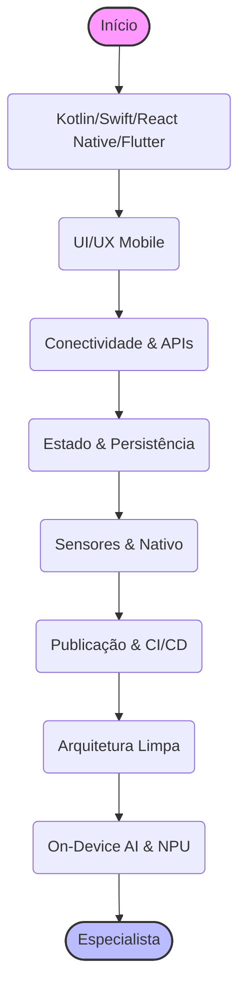

# 📱 Trilha Mobile: O Mundo na Palma da Mão

> **Edição 2026:** Com foco em On-Device AI, NPU Acceleration e Hybrid AI.

```mermaid
flowchart TD
    Start([Início]) --> Lang(Kotlin/Swift/React Native/Flutter)
    Lang --> UI(UI/UX Mobile)
    UI --> API(Conectividade & APIs)
    API --> State(Estado & Persistência)
    State --> Sensors(Sensores & Nativo)
    Sensors --> Store(Publicação & CI/CD)
    Store --> Arch(Arquitetura Limpa)
    Arch --> AI(On-Device AI & NPU)
    AI --> Spec([Especialista])

    style Start fill:#f9f,stroke:#333,stroke-width:2px
    style Spec fill:#bbf,stroke:#333,stroke-width:2px
```

"Tem um app pra isso." A trilha mobile te coloca no centro dessa revolução. Você não vai apenas construir um software, vai construir um companheiro digital.

Esta trilha está dividida em níveis para guiar sua evolução profissional.

---

## 🐣 Nível Iniciante (Júnior)

Comece entendendo como os apps funcionam e publique seu primeiro "Hello World".

### 🎯 Escolha sua Jornada (Nativo vs. Híbrido)
- **Nativo (Especialista):**
  - **Android (Kotlin):** O padrão moderno do Google.
  - **iOS (Swift):** A linguagem elegante da Apple.
- **Híbrido & Multiplataforma:**
  - **React Native:** Use seus conhecimentos de web (JavaScript/React).
  - **Flutter:** Desenhe em qualquer pixel com Dart. Alta performance.
  - **Kotlin Multiplatform (KMP):** Compartilhe a lógica de negócios (e até UI com Compose Multiplatform) mantendo a performance 100% nativa.

### 🧩 Fundamentos de UI/UX Mobile
- **Layouts:** Flexbox (React Native), Rows/Columns (Flutter) ou AutoLayout (iOS). Como criar telas responsivas.
- **Navegação:** Stack, TabBar, Drawer. Como o usuário vai de A para B.
- **Ciclo de Vida:** Entenda quando a tela é criada, pausada (background) e destruída.

### 🌐 Conectividade Básica
- Consumo de APIs REST (GET, POST).
- Tratamento de estados de carregamento (Loading) e erro (Error handling).

---

## 🚀 Nível Intermediário (Pleno)

Construa apps robustos, que funcionam offline e encantam o usuário.

### 🧠 Gerenciamento de Estado
- **React Native:** Context API, Redux Toolkit, Zustand.
- **Flutter:** Provider, Riverpod, BLoC (Business Logic Component).
- **Nativo:** ViewModel, LiveData/StateFlow (Android), Combine (iOS).

### 🗄️ Persistência de Dados (Offline-First)
- **Bancos Locais:** SQLite, Room, Realm ou WatermelonDB.
- **Estratégia Offline:** O app deve funcionar sem internet e sincronizar quando a conexão voltar.

### 📲 Recursos do Dispositivo
- **Sensores:** Câmera, GPS, Acelerômetro.
- **Notificações Push:** Engajamento com Firebase Cloud Messaging (FCM).
- **Biometria:** Login com FaceID ou TouchID.

### 🚢 Publicação e CI/CD
- **Lojas:** Google Play Console e Apple App Store Connect.
- **Fastlane:** Automatize a geração de prints, assinaturas digitais e o upload para a loja.

---

## 🧙‍♂️ Nível Avançado (Sênior / Especialista)

Otimização extrema, arquitetura limpa e Inteligência Artificial no dispositivo.

### 🏗️ Arquitetura Mobile Avançada
- **Compose Multiplatform (Avançado):** Levar a UI declarativa do Kotlin para além do Android e iOS, compilando telas nativas para Desktop (Mac/Windows) e WebAssembly a partir do mesmo código.
- **Clean Architecture:** Separação de responsabilidades (Domain, Data, Presentation).
- **MVVM / MVI:** Padrões unidirecionais para interfaces reativas e testáveis.
- **Modularização:** Dividir o app em múltiplos pacotes/módulos para acelerar o build e escalar times grandes.

### ⚡ Performance e Segurança
- **Profiling:** Ferramentas para detectar memory leaks e gargalos de renderização (60fps é a lei).
- **Segurança:** Obfuscação (ProGuard/R8), Certificate Pinning e uso seguro do Keychain/Keystore.

### 📱 IA no Mobile (On-Device AI - A Nova Era)
- **Small Language Models (SLMs):** Rodar Phi-3, Gemma ou Llama 3 8B direto no celular.
- **Frameworks de IA:**
  - **ExecuTorch & TFLite:** Para rodar modelos PyTorch e TensorFlow no edge.
  - **MediaPipe:** Soluções prontas do Google para Visão Computacional e ML on-device.
  - **CoreML:** O framework nativo da Apple para máxima performance no iOS.
- **NPU Acceleration:** Delegar o processamento de IA para o chip neural (Apple Neural Engine / Android NPU) para economizar bateria.
- **Privacidade (Local RAG):** Usar dados pessoais do dispositivo para dar contexto à IA, sem nunca enviar os dados para a nuvem.

### 📡 Arquitetura Local-First (O Novo Padrão de 2026)
Em 2026, a frustração com latência de rede é intolerável. Apps nativos devem funcionar perfeitamente offline, sincronizando em background.
- **O Banco de Dados como API:** Em vez de fazer chamadas REST para carregar a tela, a UI lê de um banco local reativo (SQLite via Room/CoreData ou Realm).
- **Sincronização Bidirecional e CRDTs:** Ferramentas como PowerSync, ElectricSQL ou Dexie Cloud usam Conflict-free Replicated Data Types para fazer merge de dados locais e remotos automaticamente, permitindo colaboração tipo Google Docs no celular.

### 🗣️ Interfaces Naturais
- **Voice UI:** Integração com Whisper local para comandos de voz rápidos.
- **Multimodalidade:** Usar a câmera para analisar objetos e textos em tempo real.

### 🎓 Recursos Oficiais (A Verdade Direta da Fonte)
Em mobile, as coisas mudam todo ano nas conferências oficiais. Acompanhe:
- **[Android Developers (YouTube)](https://www.youtube.com/user/androiddevelopers):** O canal oficial. Assista aos vídeos da *Google I/O* todo ano.
- **[Apple Developer (WWDC)](https://developer.apple.com/wwdc/):** Instale o app "Developer" da Apple. Assista às sessões da *WWDC* para saber o que há de novo no Swift e SwiftUI.

### 🌿 Green Mobile Development
Apps mal otimizados matam a bateria e geram lixo eletrônico (troca de aparelhos).
- **Eficiência Energética:** Evite wake-locks desnecessários e polling contínuo de rede.
- **Tamanho do App:** Apps menores são baixados mais rápido (menos dados) e ocupam menos espaço.
- **Retrocompatibilidade:** Suportar aparelhos antigos evita que eles virem lixo precocemente.

### 🧠 Soft Skills & Diferencial Humano
- **Contexto de Uso:** O usuário usa seu app na fila do banco, no ônibus, com sol na tela. Desenvolva pensando nessas condições (contraste, áreas de toque grandes, modo offline).
- **Respeito aos Recursos:** Não drene a bateria do usuário com processos em background desnecessários. Isso gera desinstalação imediata.
- **Paciência com as Lojas:** A Apple e o Google vão rejeitar seu app por motivos aleatórios. Respire fundo, leia a guideline e tente de novo.

### 🏆 Desafios Práticos (Projetos)

- **Júnior:** Crie um App de Lista de Compras. Requisitos: Layout responsivo, adicionar/remover itens e salvar os dados localmente (AsyncStorage/SharedPrefs) para não perder ao fechar o app.
- **Pleno:** Desenvolva um App de Filmes consumindo a API do TMDB. Requisitos: Navegação entre telas (Home -> Detalhes), Busca, Favoritos (Banco local: Room/Realm/WatermelonDB) e Tratamento de erros (ex: sem internet).
- **Sênior:** Crie um "Diário Inteligente" com IA On-Device. Requisitos: O usuário digita ou fala (Speech-to-Text) como foi o dia, e o app usa um modelo local (MediaPipe/TFLite) para classificar o sentimento (Feliz/Triste) e armazenar de forma criptografada.

---

## ↩️ Navegação

*   [**Voltar para o Início**](../../index.md)
*   [**Ver Conselhos de Carreira**](../../advices.md)
