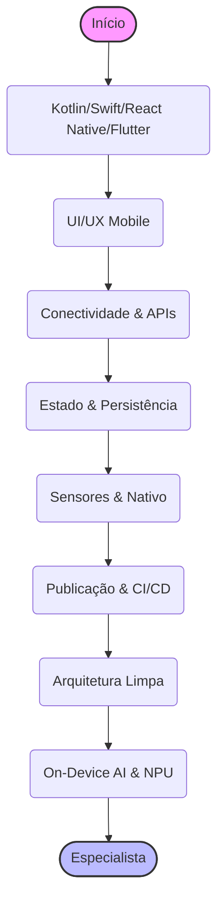

# 📱 Trilha Mobile: O Mundo na Palma da Mão

> **Edição 2026:** Swift 6, Kotlin 2.x/KMP, Compose Multiplatform no iOS, React Native (New Architecture) com Expo, Flutter, On-Device AI e agentes de código.

```mermaid
flowchart TD
    Start([Início]) --> Lang(Kotlin/Swift/React Native/Flutter)
    Lang --> UI(UI/UX Mobile)
    UI --> API(Conectividade & APIs)
    API --> State(Estado & Persistência)
    State --> Sensors(Sensores & Nativo)
    Sensors --> Store(Publicação & CI/CD)
    Store --> Arch(Arquitetura Limpa)
    Arch --> AI(On-Device AI & NPU)
    AI --> Spec([Especialista])

    style Start fill:#f9f,stroke:#333,stroke-width:2px
    style Spec fill:#bbf,stroke:#333,stroke-width:2px
```

Esta trilha cobre desenvolvimento mobile nativo e multiplataforma, do primeiro app publicado até arquitetura, segurança, testes e IA no dispositivo. Está dividida em níveis para guiar sua evolução.

---

## 🐣 Nível Iniciante (Júnior)

Comece entendendo como os apps funcionam e publique seu primeiro "Hello World".

### 🎯 Escolha sua Jornada (Nativo vs. Híbrido)

- **Nativo (Especialista):**
  - **Android (Kotlin):** Kotlin 2.x com Jetpack Compose é o padrão do Google.
  - **iOS (Swift):** Swift 6 (concorrência com checagem de data races) e SwiftUI.
- **Híbrido & Multiplataforma:**
  - **React Native + Expo:** use seus conhecimentos de web (TypeScript/React). A New Architecture (Fabric e TurboModules) é o padrão; comece pelo Expo SDK mais recente, com Expo Router e EAS.
  - **Flutter:** UI própria em Dart, renderizada com o motor Impeller.
  - **Kotlin Multiplatform (KMP):** compartilhe a lógica de negócios e, se quiser, a UI com Compose Multiplatform (estável também no iOS) mantendo acesso às APIs nativas.

### 🧩 Fundamentos de UI/UX Mobile

- **Layouts:** Flexbox (React Native), Rows/Columns (Flutter) ou AutoLayout (iOS). Como criar telas responsivas.
- **Navegação:** Stack, TabBar, Drawer. Como o usuário vai de A para B. **Ciclo de Vida:** Entenda quando a tela é criada, pausada (background) e destruída.
- **Acessibilidade:** TalkBack e VoiceOver, labels semânticos, Dynamic Type/tamanho de fonte, contraste e áreas de toque mínimas.
- **Design nativo:** siga Material 3 (Expressive) no Android e as Human Interface Guidelines no iOS.

### 🌐 Conectividade Básica

- Consumo de APIs REST (GET, POST) com tipagem (Retrofit/Ktor, URLSession, fetch/TanStack Query, Dio).
- Tratamento de estados de carregamento (Loading) e erro (Error handling).

---

## 🚀 Nível Intermediário (Pleno)

Construa apps robustos, que funcionam offline e encantam o usuário.

### 🧠 Gerenciamento de Estado

- **React Native:** Context API, Redux Toolkit, Zustand, TanStack Query. **Flutter:** Provider, Riverpod, BLoC (Business Logic Component).
- **Nativo:** ViewModel e StateFlow (Android); Observation (`@Observable`) e async/await (iOS).

### 🗄️ Persistência de Dados (Offline-First)

- **Bancos Locais:** SQLite, Room (com suporte a KMP), SwiftData/Core Data, Drift (Flutter), expo-sqlite ou WatermelonDB.
- **Estratégia Offline:** O app deve funcionar sem internet e sincronizar quando a conexão voltar.

### 📲 Recursos do Dispositivo

- **Sensores:** Câmera, GPS, Acelerômetro. **Notificações Push:** Engajamento com Firebase Cloud Messaging (FCM).
- **Biometria:** Face ID/Touch ID e BiometricPrompt, com Keychain/Keystore e passkeys para login sem senha.
- **Permissões:** peça só o necessário, no momento do uso, e explique o motivo.

### 🚢 Publicação e CI/CD

- **Lojas:** Google Play Console e Apple App Store Connect. Fique atento aos requisitos anuais de target API/SDK mínimo e às políticas de privacidade (Privacy Manifest na Apple, Data Safety no Google Play).
- **CI/CD:** Fastlane, GitHub Actions, Xcode Cloud e EAS Build/Update (Expo) para builds, assinatura e distribuição (TestFlight, Play Internal Testing).
- **Testes:** unitários (JUnit, XCTest/Swift Testing, Jest), UI (Espresso/Compose Test, XCUITest), E2E (Maestro, Detox) e monitoramento de crashes (Crashlytics ou Sentry).

---

## 🧙‍♂️ Nível Avançado (Sênior / Especialista)

Otimização extrema, arquitetura limpa e Inteligência Artificial no dispositivo.

### 🏗️ Arquitetura Mobile Avançada

- **Compose Multiplatform:** UI declarativa em Kotlin compartilhada entre Android, iOS (estável), Desktop e Web (Wasm, em evolução). Avalie por projeto quanto compartilhar de UI e quanto manter nativo.
- **Clean Architecture:** Separação de responsabilidades (Domain, Data, Presentation).
- **MVVM / MVI:** Padrões unidirecionais para interfaces reativas e testáveis, com injeção de dependências (Hilt/Koin, Riverpod).
- **Modularização:** Dividir o app em múltiplos pacotes/módulos para acelerar o build e escalar times grandes.

### ⚡ Performance e Segurança

- **Profiling:** Ferramentas para detectar memory leaks e gargalos de renderização (meta de 60 fps, ou 120 fps em telas de alta taxa).
- **Segurança:** seguindo o OWASP MASVS: ofuscação (R8), Certificate Pinning, Keychain/Keystore, Play Integrity e App Attest, e proteção de segredos (nunca embarque chaves de API no app).

### 📱 IA no Mobile (On-Device AI & NPU Acceleration)

Parte da inferência pode rodar no aparelho, com ganhos em privacidade, latência e funcionamento offline. Combine com IA em nuvem (abordagem híbrida) quando o modelo local não bastar.

- **Small Language Models (SLMs) e Quantização:** Use _quantization_ (4-bit/8-bit) para caber modelos como Gemma 3n, Llama 3.2 ou Qwen na RAM limitada do celular, medindo a perda de qualidade na sua tarefa.
- **Frameworks de IA Nativos:**
  - **ExecuTorch:** Runtime oficial do PyTorch para dispositivos (sucessor do PyTorch Mobile). Executa modelos otimizados em iOS/Android com baixo uso de memória e bateria.
  - **Passo a passo com ExecuTorch:** (1) exporte o modelo com `torch.export`; (2) quantize (8-bit/4-bit) e escolha o backend (XNNPACK na CPU, Core ML/ANE no iOS, QNN/Vulkan no Android); (3) gere o arquivo `.pte` com `to_edge()` e `to_executorch()`; (4) embarque o `.pte` e execute pelo runtime (Kotlin/Java no Android, Swift/Obj-C no iOS); (5) meça latência, memória e bateria em aparelhos reais de entrada.
  - **Apple Core ML e Foundation Models:** Core ML usa o Apple Neural Engine (ANE) em Swift; o framework Foundation Models (iOS 26+) dá acesso ao modelo on-device da Apple para geração de texto e saídas estruturadas.
  - **LiteRT (ex-TensorFlow Lite) e MediaPipe:** inferência de visão, áudio e texto no Android, iOS e Flutter, com delegates de GPU/NPU.
  - **Gemini Nano (ML Kit GenAI e AICore):** em aparelhos compatíveis, o Android expõe o Gemini Nano como serviço do sistema, via APIs do ML Kit GenAI (resumo, reescrita, descrição de imagens) e a Prompt API. A disponibilidade depende do aparelho; planeje fallback.
- **Aceleração via Hardware (NPU):** Use delegates e backends nativos (Core ML/ANE, NNAPI/LiteRT, QNN) para mover a carga da CPU para GPU/NPU, que executa operações matriciais com menos energia. Teste em vários aparelhos, pois o suporte varia por chip.
- **RAG com Privacidade Local (Local RAG):** Conecte SLMs aos dados do usuário (notas, fotos, SQLite do app) usando embeddings e busca vetorial locais, sem enviar os dados para a internet. Isso ajuda na conformidade com LGPD e GDPR.

### 🧑‍💻 Agentes de Código e MCP no Mobile

- **Agentes de código:** Claude Code, Android Studio (Gemini), Xcode (assistentes de código integrados) e Cursor aceleram refatorações, migrações (ex.: Swift 6, Compose) e testes.
- **MCP (Model Context Protocol):** conecta o agente a ferramentas como simulador, logs e documentação (ex.: Expo MCP, Xcode e Android Studio como servidores).
- **Boas práticas:** revise o diff, rode testes e lint, e nunca dê ao agente acesso a certificados de assinatura ou chaves de produção.

### 📡 Arquitetura Local-First (Sincronização Avançada)

Apps móveis precisam funcionar em metrô, elevador e zonas sem sinal; uma API REST sozinha não garante isso.

- **Reatividade e "UI de Latência Zero":** Toda escrita vai primeiro para o banco local (`Room` no Android, `SwiftData`/`Core Data` no iOS) e a UI reage imediatamente (Compose/SwiftUI), sem esperar a rede.
- **CRDTs e Resolução de Conflitos em Background:** Se a mesma tarefa é editada offline em dois dispositivos, há conflito. Soluções como Ditto, Automerge ou Yjs usam **CRDTs** para mesclar sem intervenção; PowerSync e ElectricSQL sincronizam bancos locais com o backend com regras de resolução definidas por você. Observação: o Atlas Device Sync/Realm da MongoDB foi descontinuado, então não o escolha para projetos novos.

### 🗣️ Interfaces Naturais

- **Voice UI:** reconhecimento de fala nativo (SpeechAnalyzer no iOS, SpeechRecognizer no Android) ou Whisper local para comandos de voz.
- **Multimodalidade:** Usar a câmera para analisar objetos e textos em tempo real.

### 🎓 Recursos Oficiais

Plataformas mobile mudam todo ano. Acompanhe as fontes oficiais:

- **[Android Developers (YouTube)](https://www.youtube.com/user/androiddevelopers):** O canal oficial. Assista às sessões da _Google I/O_ todo ano.
- **[Apple Developer (WWDC)](https://developer.apple.com/wwdc/):** Assista às sessões da _WWDC_ para saber o que há de novo no Swift e SwiftUI.

### 🌿 Green Mobile Development

Apps pouco otimizados gastam bateria e incentivam a troca de aparelhos.

- **Eficiência Energética:** Evite wake-locks desnecessários e polling contínuo de rede.
- **Tamanho do App:** Apps menores são baixados mais rápido (menos dados) e ocupam menos espaço.
- **Retrocompatibilidade:** Suportar aparelhos antigos evita que eles virem lixo precocemente.

### 🧠 Soft Skills & Diferencial Humano

- **Contexto de Uso:** O usuário usa seu app na fila do banco, no ônibus, com sol na tela. Desenvolva pensando nessas condições (contraste, áreas de toque grandes, modo offline).
- **Respeito aos Recursos:** Não drene a bateria do usuário com processos em background desnecessários. Isso leva à desinstalação.
- **Paciência com as Lojas:** Seu app pode ser rejeitado nas lojas. Leia a guideline citada na rejeição, corrija e reenvie.

### 🏆 Desafios Práticos (Projetos)

- **Júnior:** Crie um App de Lista de Compras. Requisitos: Layout responsivo, adicionar/remover itens e salvar os dados localmente (AsyncStorage/SharedPrefs) para não perder ao fechar o app.
- **Pleno:** Desenvolva um App de Filmes consumindo a API do TMDB. Requisitos: Navegação entre telas (Home -> Detalhes), Busca, Favoritos (Banco local: Room/Realm/WatermelonDB) e Tratamento de erros (ex: sem internet).
- **Sênior:** Crie um "Diário Inteligente" com IA On-Device. Requisitos: O usuário digita ou fala (Speech-to-Text) como foi o dia, e o app usa um modelo local (LiteRT/MediaPipe, Core ML ou ExecuTorch) para classificar o sentimento (Feliz/Triste) e armazenar de forma criptografada.

---

## 📚 Materiais de Estudo Recomendados

Para formar o Desenvolvedor Completo em 2026 (do Júnior ao Especialista), reunimos os conteúdos mais atualizados e de altíssima qualidade do mercado:

### 🐣 Para Nível Júnior

- **Cursos Oficiais Android e iOS:** [Swift e SwiftUI (Apple)](https://developer.apple.com/swift/) e [Android Basics com Compose (Google)](https://developer.android.com/courses) são bons pontos de partida.
- **[Flutter.dev (Documentação Oficial)](https://flutter.dev/):** Guia oficial com codelabs práticos.
- **[React Native - Core Components](https://reactnative.dev/docs/components-and-apis) e [Expo Docs](https://docs.expo.dev/):** documentação oficial para quem vem do React.

### 🚀 Para Nível Pleno

- **[Philipp Lackner (YouTube)](https://www.youtube.com/@PhilippLackner):** Excelente para aprender Kotlin moderno, Jetpack Compose e as melhores práticas do Android.
- **[Vanderbilt University - Coursera (Android App Development)](https://www.coursera.org/specializations/android-app-development):** Base estruturada de Android.
- **[Andrea Bizzotto (Flutter)](https://codewithandrea.com/):** Material avançado sobre arquitetura no Flutter (Riverpod, Clean Architecture).

### 🏛️ Para Nível Sênior/Especialista

- **[ExecuTorch Docs (PyTorch)](https://pytorch.org/executorch):** Prepare modelos LLM/SLM e execute-os em dispositivos móveis.
- **[Hugging Face Models](https://huggingface.co/models):** encontre modelos pequenos e quantizados para uso on-device.
- **[LiteRT (Google AI Edge)](https://ai.google.dev/edge/litert) e [Core ML](https://developer.apple.com/machine-learning/core-ml/):** documentação oficial de inferência no Android e iOS.
- **[Apple Foundation Models](https://developer.apple.com/documentation/foundationmodels):** modelo on-device da Apple.
- **[Model Context Protocol](https://modelcontextprotocol.io/):** especificação do MCP para agentes de código.
- **[OWASP MASVS](https://mas.owasp.org/MASVS/):** padrão de segurança para apps móveis.
- **[Kotlin Multiplatform (KMP) by JetBrains](https://kotlinlang.org/docs/multiplatform.html):** Documentação oficial sobre compartilhar lógica de negócio e UI entre Android e iOS, incluindo Compose Multiplatform.
- **[Ditto](https://www.ditto.live/) / [PowerSync](https://www.powersync.com/) Docs:** Projete e sincronize bancos Local-First.
- **[Android AICore & Gemini Nano](https://developer.android.com/ai/aicore):** Documentação oficial do Gemini Nano e das APIs de IA on-device no Android.

---

## ↩️ Navegação

- [**Voltar para o Início**](../../index.md) [**Ver Conselhos de Carreira**](../../advices.md)
