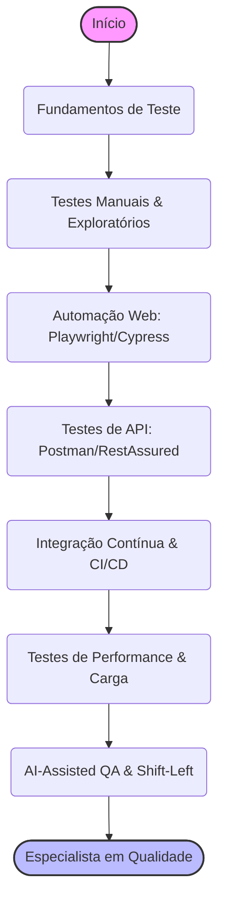

# 🕵️‍♀️ Trilha QA & Software Testing: Garantia de Qualidade

> **Edição 2026:** Foco em Automação (Playwright/Cypress), Shift-Left Testing e AI-Assisted Testing.

O Engenheiro de Quality Assurance (QA) não é apenas o "caçador de bugs". Em 2026, você é o guardião da confiança do usuário. Seu papel é prever falhas antes que o código chegue em produção e automatizar a verificação contínua do sistema.

Esta trilha está dividida em níveis para guiar sua evolução profissional.

---

## 🐣 Nível Iniciante (Júnior)

O foco aqui é entender o ciclo de vida do bug, como reportá-lo de forma eficiente e iniciar na automação básica.

### 📚 Fundamentos de Teste (A Teoria Necessária)
- **Pirâmide de Testes:** Unidade (rápido, barato) > Integração > E2E (lento, caro).
- **Tipos de Testes:** Funcionais, Não Funcionais (Usabilidade, Performance), Regressão, Smoke Tests.
- **BDD e TDD:** Entenda o Desenvolvimento Orientado a Comportamento (Gherkin: `Dado`, `Quando`, `Então`).
- **Recursos:**
  - 📖 [Syllabus CTFL (ISTQB)](https://bstqb.org.br/) - A base teórica global para QA.

### 🕵️ Testes Manuais e Exploratórios
- **Reporte de Bugs:** Um bom bug report tem: Título claro, Passos para reproduzir, Resultado Esperado vs. Resultado Atual e Anexos (Screenshots/Logs).
- **Testes Heurísticos e Exploratórios:** Aprenda a "quebrar" o sistema pensando fora da caixa, além do que está no roteiro.

### 🌐 Ferramentas de API (O Básico)
- **Postman / Insomnia:** Como enviar requisições (GET, POST), ler o JSON de resposta e validar Status Codes (200, 400, 500).

---

## 🚀 Nível Intermediário (Pleno)

Deixar de ser um testador manual para se tornar um Engenheiro de Automação.

### 🤖 Automação E2E (End-to-End) para Web
Em 2026, o Selenium perdeu muito espaço para ferramentas mais rápidas e modernas.
- **Playwright (Microsoft):** O padrão absoluto da indústria atual. Suporte nativo a múltiplos browsers, interceptação de rede (Mocking) e execução paralela veloz.
- **Cypress:** Excelente experiência de desenvolvedor (DX) e comunidade gigante para testes puramente em JavaScript/TypeScript.
- **Padrão Page Object Model (POM):** Como organizar seu código de teste para não virar espaguete quando a aplicação crescer.

### 🔌 Automação de APIs
- **Ferramentas Code-Based:** Supertest (Node.js), RestAssured (Java), PyTest (Python).
- **Validação de Contratos:** Garantir que o backend não mudou a estrutura do JSON silenciosamente (ex: Pact).

### 🗃️ Bancos de Dados para QA
- **SQL Básico:** Você precisa saber verificar no banco se o "Cadastro Realizado com Sucesso" realmente salvou os dados (`SELECT`, `JOIN`), além de manipular a massa de dados para os testes (`INSERT`, `UPDATE`, `DELETE`).

### ⚙️ CI/CD (Integração Contínua)
Seu teste não serve de nada rodando só na sua máquina.
- **GitHub Actions / GitLab CI:** Como fazer seus testes rodarem automaticamente toda vez que um desenvolvedor abre um Pull Request (PR).

---

## 🧙‍♂️ Nível Avançado (Sênior / Especialista)

Onde você projeta a estratégia global de qualidade (Quality Engineering), garantindo performance, segurança e utilizando IA ao seu favor.

### ⚡ Testes de Performance e Carga
- **k6 (Grafana):** Escrever testes de carga em JavaScript que rodam no terminal usando Go por baixo dos panos. É o substituto moderno do JMeter.
- **Gatilhos de Alerta:** "Se 95% das requisições demorarem mais de 500ms com 1000 usuários simultâneos, o teste falha."

### 🛡️ Shift-Left Testing & DevSecOps
"Shift-Left" significa mover os testes para a esquerda (o mais cedo possível no ciclo de desenvolvimento).
- **Revisão de Arquitetura:** O QA Sênior atua na fase de requisitos, dizendo "Essa arquitetura vai gerar gargalos no banco" antes de qualquer linha de código ser escrita.
- **Acessibilidade (a11y):** Automação de testes de leitores de tela e contraste usando `axe-core`.
- **Segurança Básica (DAST):** Integrar scans de segurança no pipeline (ex: OWASP ZAP) para evitar vulnerabilidades triviais como XSS e SQLi.

### 🧠 IA-Assisted QA (A Revolução de 2026)
O QA não será substituído pela IA, mas o QA que usa IA substituirá o que não usa.
- **Geração de Casos de Teste com LLMs:** Usar GPT-4o ou Claude para ler uma história de usuário (Jira) e gerar 20 cenários de borda (Edge Cases) em segundos.
- **Auto-Healing Tests:** Ferramentas modernas (ex: Healenium, Testim.io, Mabl) que percebem quando um `id` ou `class` de um botão mudou no frontend e corrigem o seletor do teste dinamicamente, sem intervenção humana (evitando o inferno dos testes frágeis/flaky).
- **Copilotos de Código:** Usar Cursor ou GitHub Copilot para acelerar drasticamente a escrita de scripts Playwright usando TypeScript.
- **Análise Preditiva de Falhas:** IAs que analisam o histórico de commits e apontam: "Atenção, módulos modificados por este desenvolvedor nesta área costumam introduzir bugs críticos. Aumente a cobertura aqui."

### 🏆 Desafios Práticos (Projetos)

- **Júnior:** Crie um documento de plano de testes e reporte 5 bugs fictícios estruturados (com passos e resultados) para um site público (ex: um e-commerce demo).
- **Pleno:** Automatize o fluxo de "Adicionar item ao carrinho e fazer Checkout" usando **Playwright + TypeScript**. Integre esse teste para rodar no GitHub Actions.
- **Sênior:** Projete um framework unificado onde um único script Playwright gera a massa de dados via API REST, intercepta o backend (Mock) para forçar um erro 500 na interface, e tira uma captura de tela automática da tela de erro do usuário. Adicione testes de carga com o Grafana k6 batendo nessa mesma API.

---

## 📚 Materiais de Estudo Recomendados

Para atingir a excelência em 2026, recomendamos os seguintes recursos práticos e teóricos:

**Para o Júnior (Fundamentos e Teste Manual):**
- **[Syllabus CTFL (ISTQB)](https://bstqb.org.br/):** O currículo oficial de certificação internacional, fornecendo a teoria base em testes de qualidade que vai diferenciar a base do júnior.
- **[FreeCodeCamp - Software Testing Course](https://www.freecodecamp.org/):** Excelente curso prático gratuito com vídeos sobre o ciclo de vida do software e tipos de teste para um testador iniciante.

**Para o Pleno (Automação Web E2E, APIs):**
- **[Documentação Oficial do Playwright](https://playwright.dev/):** A melhor documentação entre as ferramentas de QA atuais. Leia o "Getting Started" e os guias fundamentais (Locators e Assertions).
- **[Cypress Real World App (Repo GitHub)](https://github.com/cypress-io/cypress-realworld-app):** A Cypress forneceu este repositório de um App clone inteiro com os melhores exemplos práticos de como automatizar pagamentos e criar testes escaláveis.
- **[Ministry of Testing (MoT)](https://www.ministryoftesting.com/):** Uma comunidade mundial riquíssima que aborda os desafios práticos do engenheiro QA além do código.

**Para o Sênior/Especialista (Testes de Performance, IA e Shift-Left):**
- **[Grafana k6 Docs](https://k6.io/docs/):** A ferramenta moderna baseada em JavaScript/Go para aplicar carga, picos massivos e verificar "Testes de Stress" contra APIs da arquitetura Backend.
- **[Test Automation University (Applitools)](https://testautomationu.applitools.com/):** Uma infinidade de cursos gratuitos, avançados (em Java/Python/JavaScript), sobre testes visuais impulsionados por IA (Visual AI).
- **[The Pragmatic Engineer (Newsletter/Blog)](https://blog.pragmaticengineer.com/):** Ótimo para um QA Sênior entender as estratégias massivas que empresas (Uber, Stripe) tomam sobre "Engineering Productivity" em vez de apenas achar bugs.

---

## ↩️ Navegação

*   [**Voltar para o Início**](../../index.md)
*   [**Ver Conselhos de Carreira**](../../advices.md)
