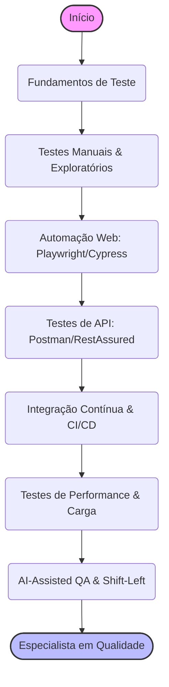

# 🕵️‍♀️ Trilha QA & Software Testing: Garantia de Qualidade

> **Edição 2026:** Automação (Playwright/Cypress), Shift-Left, contract testing, acessibilidade e testes com apoio de IA.

```mermaid
flowchart TD
    Start([Início]) --> Fundamentals(Fundamentos de Teste)
    Fundamentals --> Manual(Testes Manuais & Exploratórios)
    Manual --> Web(Automação Web: Playwright/Cypress)
    Web --> API(Testes de API: Postman/RestAssured)
    API --> CICD(Integração Contínua & CI/CD)
    CICD --> Perf(Testes de Performance & Carga)
    Perf --> AI(AI-Assisted QA & Shift-Left)
    AI --> Spec([Especialista em Qualidade])

    style Start fill:#f9f,stroke:#333,stroke-width:2px
    style Spec fill:#bbf,stroke:#333,stroke-width:2px
```

QA vai além de caçar bugs. O papel é reduzir risco: definir estratégia de testes, prevenir falhas cedo e manter a verificação automatizada e confiável no pipeline.

Esta trilha está dividida em níveis para guiar sua evolução profissional.

---

## 🐣 Nível Iniciante (Júnior)

O foco aqui é entender o ciclo de vida do bug, como reportá-lo de forma eficiente e iniciar na automação básica.

### 📚 Fundamentos de Teste (A Teoria Necessária)

- **Pirâmide de Testes:** Unidade (rápido, barato) > Integração > E2E (lento, caro). Variações como o "troféu de testes" priorizam integração; escolha pelo risco do produto.
- **Tipos de Testes:** Funcionais, Não Funcionais (Usabilidade, Performance), Regressão, Smoke Tests.
- **BDD e TDD:** Entenda o Desenvolvimento Orientado a Comportamento (Gherkin: `Dado`, `Quando`, `Então`).
- **Recursos:**
  - 📖 [BSTQB (ISTQB no Brasil)](https://bstqb.org.br/) - Syllabus CTFL v4.0, base teórica para a certificação.

### 🕵️ Testes Manuais e Exploratórios

- **Reporte de Bugs:** Um bom bug report tem: Título claro, Passos para reproduzir, Resultado Esperado vs. Resultado Atual e Anexos (Screenshots/Logs).
- **Testes Heurísticos e Exploratórios:** Aprenda a "quebrar" o sistema pensando fora da caixa, além do que está no roteiro.

### 🌐 Ferramentas de API (O Básico)

- **Postman / Bruno / Insomnia:** Enviar requisições (GET, POST), ler o JSON de resposta e validar status codes (200, 400, 500). Entenda OpenAPI como contrato da API.
- **Git e linha de comando:** Base para trabalhar com código de teste em equipe.

---

## 🚀 Nível Intermediário (Pleno)

Deixar de ser um testador manual para se tornar um Engenheiro de Automação.

### 🤖 Automação E2E (End-to-End) para Web

Playwright é hoje a escolha mais comum em projetos novos; Selenium segue forte em bases legadas e ambientes Java corporativos.

- **Playwright (Microsoft):** Chromium, Firefox e WebKit com uma API só, auto-waiting, interceptação de rede, trace viewer, execução paralela, fixtures e sharding no CI. Em TypeScript, Python, Java ou .NET.
- **Cypress:** Boa experiência de desenvolvedor, com Cypress Cloud e component testing. Mais restrito a JavaScript/TypeScript.
- **Selenium 4 / WebDriver BiDi:** Para legado e grids existentes.
- **Locators resilientes:** Prefira `getByRole` e `getByLabel` a seletores CSS/XPath frágeis.
- **Page Object Model e fixtures:** Organize o código de teste para não virar espaguete.
- **Testes flaky:** Identifique a causa (espera, dados, ambiente) antes de aumentar retries.
- **Testes de componente e unidade:** Vitest (ou Jest) com Testing Library; Playwright/Cypress Component Testing para componentes reais no browser.
- **Mobile:** Appium, Maestro e Detox para apps.

### 🔌 Automação de APIs

- **Ferramentas Code-Based:** Supertest (Node.js), RestAssured (Java), pytest com httpx/requests (Python), ou o `request` do Playwright.
- **Contract Testing:** Pact (consumer-driven) para microsserviços, e validação do OpenAPI com Schemathesis ou Dredd. Evita quebras silenciosas entre times.
- **GraphQL e eventos:** Teste schemas, e contratos de mensagens (Kafka, filas) com Pact ou schema registry.
- **Testcontainers:** Suba banco, fila e dependências reais em containers nos testes de integração.

### 🗃️ Bancos de Dados para QA

- **SQL Básico:** Você precisa saber verificar no banco se o "Cadastro Realizado com Sucesso" realmente salvou os dados (`SELECT`, `JOIN`), além de manipular a massa de dados para os testes (`INSERT`, `UPDATE`, `DELETE`).

### ⚙️ CI/CD (Integração Contínua)

Seu teste não serve de nada rodando só na sua máquina.

- **GitHub Actions / GitLab CI:** Rodar testes a cada Pull Request, com cache, paralelismo e publicação de relatórios e traces.
- **Ambientes efêmeros e dados de teste:** Preview environments, seeds determinísticos e limpeza entre execuções.
- **Quality gates:** Bloqueie merge por testes falhando, não por percentual de cobertura isolado. Cobertura mostra o que não foi testado, não a qualidade dos testes.

---

## 🧙‍♂️ Nível Avançado (Sênior / Especialista)

Onde você projeta a estratégia global de qualidade (Quality Engineering), garantindo performance, segurança e utilizando IA ao seu favor.

### ⚡ Testes de Performance e Carga

- **k6 (Grafana):** Testes de carga em JavaScript/TypeScript, executados por um motor em Go. Alternativas: Gatling e JMeter (comum em legado), Locust (Python).
- **Thresholds:** Defina SLOs no teste. Ex.: "p95 abaixo de 500 ms com 1000 usuários virtuais; senão, o teste falha".
- **Observabilidade:** Correlacione resultados com métricas e traces (OpenTelemetry, Grafana) para achar o gargalo.
- **Resiliência:** Introdução a chaos engineering (Chaos Mesh, Litmus) e testes em produção com feature flags e canary.

### 🛡️ Shift-Left Testing & DevSecOps

"Shift-Left" significa mover os testes para a esquerda (o mais cedo possível no ciclo de desenvolvimento).

- **Revisão de Arquitetura:** O QA Sênior atua na fase de requisitos, dizendo "Essa arquitetura vai gerar gargalos no banco" antes de qualquer linha de código ser escrita.
- **Acessibilidade (a11y):** WCAG 2.2 nível AA como meta. Automatize com `axe-core` (@axe-core/playwright) e Lighthouse, sabendo que ferramentas automáticas cobrem só parte dos problemas; complete com testes manuais com teclado e leitores de tela (NVDA, VoiceOver). Atenção ao European Accessibility Act, em vigor desde junho/2025.
- **Testes visuais:** Snapshots do Playwright, Chromatic ou Percy para regressão visual.
- **Segurança Básica (DAST):** Integrar scans (ex.: ZAP) no pipeline para achar problemas triviais como XSS e SQLi.
- **Mutation testing:** Stryker ou PIT para medir se os testes realmente detectam defeitos.
- **Métricas:** DORA (lead time, taxa de falha de mudança), taxa de testes flaky e tempo de feedback do CI.

### 🧠 Testes com Apoio de IA

IA acelera tarefas repetitivas, mas não substitui julgamento de risco. Todo código ou caso gerado precisa de revisão e execução.

- **Geração de casos de teste:** Use LLMs (Claude, GPT, Gemini) para sugerir cenários de borda a partir de histórias de usuário e critérios de aceitação. Valide com o time e o negócio.
- **Agentes de código escrevendo testes:** Claude Code, GitHub Copilot e Cursor geram testes Playwright e unitários. Dê contexto (convenções, fixtures, `AGENTS.md`) e confira se o teste falha quando o comportamento está errado.
- **Playwright com agentes:** O Playwright MCP permite que um agente navegue e inspecione a página via árvore de acessibilidade, e os Playwright Test Agents (planner, generator, healer) ajudam a planejar, gerar e reparar testes. Trate a saída como rascunho.
- **Self-healing:** Ferramentas como Healenium, Testim e Mabl ajustam seletores quebrados. Cuidado: cura automática pode mascarar uma regressão real. Registre e revise cada correção.
- **Testes de sistemas com IA:** Para apps com LLM, use evals (promptfoo, DeepEval, Ragas, Langfuse): conjuntos de casos versionados, métricas, LLM-as-a-judge calibrado e testes de regressão a cada mudança de prompt ou modelo. Teste também prompt injection e alucinação.
- **Priorização de testes:** Seleção de testes por impacto da mudança e análise de histórico de falhas para reduzir o tempo do CI.
- **Riscos:** Não envie dados sensíveis a provedores sem contrato adequado (LGPD), e não use saída de IA como único oráculo de teste.

### 🏆 Desafios Práticos (Projetos)

- **Júnior:** Crie um documento de plano de testes e reporte 5 bugs fictícios estruturados (com passos e resultados) para um site público (ex: um e-commerce demo).
- **Pleno:** Automatize o fluxo de "Adicionar item ao carrinho e fazer Checkout" usando **Playwright + TypeScript**. Integre esse teste para rodar no GitHub Actions, com trace e relatório HTML como artefatos, e inclua uma verificação de acessibilidade com axe.
- **Sênior:** Projete um framework unificado onde um único script Playwright gera a massa de dados via API REST, intercepta o backend (Mock) para forçar um erro 500 na interface, e tira uma captura de tela automática da tela de erro do usuário. Adicione testes de carga com o Grafana k6 batendo nessa mesma API, com thresholds de p95 e taxa de erro, e um contract test com Pact entre frontend e backend.

---

## 📚 Materiais de Estudo Recomendados

Para formar o Desenvolvedor Completo em 2026 (do Júnior ao Especialista), reunimos os conteúdos mais atualizados e de altíssima qualidade do mercado:

### 🐣 Para Nível Júnior

- **[Ministry of Testing](https://www.ministryoftesting.com/):** Comunidade, artigos e glossário sobre teste e testes exploratórios.
- **[Test Automation University](https://testautomationu.applitools.com/):** Cursos gratuitos de automação, incluindo Playwright e Cypress.
- **[Vitest](https://vitest.dev/):** Documentação para começar com testes de unidade em JavaScript/TypeScript.
- **[ISTQB](https://www.istqb.org/):** Syllabus CTFL v4.0 gratuito.

### 🚀 Para Nível Pleno

- **[Playwright](https://playwright.dev/docs/intro):** Documentação oficial, incluindo boas práticas, CI e trace viewer.
- **[Cypress](https://docs.cypress.io/):** Documentação oficial e guias de boas práticas.
- **[Testing Library](https://testing-library.com/docs/):** Testes de interface focados no uso real.
- **[Pact Docs](https://docs.pact.io/):** Consumer-driven contract testing.
- **[Testcontainers](https://testcontainers.com/):** Dependências reais em containers para testes de integração.
- **[Web Accessibility (web.dev/learn/accessibility)](https://web.dev/learn/accessibility) e [WCAG 2.2](https://www.w3.org/TR/WCAG22/):** Fundamentos de acessibilidade.

### 🏛️ Para Nível Sênior/Especialista

- **[k6 Documentation](https://grafana.com/docs/k6/latest/):** Testes de carga como código.
- **[axe-core](https://github.com/dequelabs/axe-core):** Motor de testes de acessibilidade.
- **[Stryker Mutator](https://stryker-mutator.io/):** Mutation testing.
- **[promptfoo](https://www.promptfoo.dev/docs/intro/) e [DeepEval](https://deepeval.com/docs/getting-started):** Evals e testes de aplicações com LLM.
- **[Playwright MCP](https://github.com/microsoft/playwright-mcp):** Automação de browser para agentes de IA.
- **[DORA](https://dora.dev/):** Pesquisa e métricas de entrega de software.
- **Livros:** "Continuous Delivery" (Jez Humble e David Farley), "Agile Testing" e "More Agile Testing" (Lisa Crispin e Janet Gregory), "Unit Testing: Principles, Practices, and Patterns" (Vladimir Khorikov).

---

## ↩️ Navegação

- [**Voltar para o Início**](../../index.md)
- [**Ver Conselhos de Carreira**](../../advices.md)
