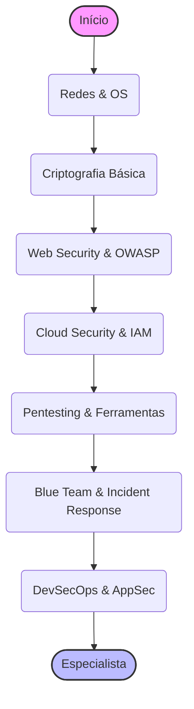

# 🔐 Trilha Cybersecurity: O Guardião Digital

> **Edição 2026:** Focado em Zero Trust, DevSecOps e Segurança de IA (AI Red Teaming).

Em um mundo onde tudo está conectado, a segurança não é um "extra", é a fundação. O profissional de cibersegurança é o estrategista que protege os dados, a infraestrutura e a reputação das empresas contra ameaças cada vez mais sofisticadas.

Esta trilha está dividida em níveis para guiar sua evolução profissional.

---

## 🐣 Nível Iniciante (Júnior)

O foco aqui é entender como os computadores conversam e como trancar as portas digitais.

### 🌐 Redes e Protocolos (A Base de Tudo)
Você não pode proteger o que não entende.
- **Modelo OSI/TCP-IP:** Camadas de transporte, rede e aplicação.
- **Protocolos:** DNS (e DNS Sec), HTTP vs HTTPS (TLS/SSL), SSH, FTP.
- **Ferramentas:** Wireshark (analisar pacotes), Nmap (scan de portas).

### 🐧 Sistemas Operacionais & Hardening
- **Linux:** Permissões, logs (`/var/log`), firewall (`iptables`/`ufw`).
- **Windows:** Active Directory, Group Policies (GPO), PowerShell.
- **Hardening:** O processo de fechar brechas padrão (desabilitar serviços inúteis, fechar portas).

### 🔑 Criptografia Básica
- **Simétrica vs Assimétrica:** Chaves públicas e privadas.
- **Hashing:** Entenda que MD5/SHA-1 estão mortos. Use SHA-256 ou Argon2 para senhas.
- **Certificados Digitais:** Como funciona a confiança na web (PKI).

---

## 🚀 Nível Intermediário (Pleno)

Aqui você começa a atacar (para testar) e defender sistemas reais.

### 🕸️ Web Security (AppSec)
- **OWASP Top 10:** A bíblia das vulnerabilidades. SQL Injection, XSS, Broken Access Control.
- **Ferramentas:** Burp Suite (Proxy de interceptação), OWASP ZAP.

### ☁️ Cloud Security
A nuvem é o novo perímetro.
- **IAM (Identity and Access Management):** Princípio do Menor Privilégio. Nunca use chaves de root.
- **Segurança de Infra:** Security Groups, WAF (Web Application Firewall), VPCs privadas.
- **Compliance:** CIS Benchmarks para AWS/Azure.

### ⚔️ Pentesting Básico (Red Team)
- **Reconhecimento (Recon):** OSINT (Open Source Intelligence).
- **Exploração:** Metasploit Framework.
- **Escalação de Privilégio:** Como virar admin depois de entrar.

---

## 🧙‍♂️ Nível Avançado (Sênior / Especialista)

Onde você projeta arquiteturas resilientes e lidera a resposta a incidentes.

### 🛡️ DevSecOps & Pipeline Security
Segurança automatizada no ciclo de desenvolvimento.
- **SAST/DAST:** SonarQube, Snyk. Achar bugs antes do deploy.
- **Dependency Scanning:** Evitar vulnerabilidades em bibliotecas de terceiros (Log4Shell).
- **Container Security:** Trivy para scannear imagens Docker.

### 🚫 Zero Trust Architecture
"Nunca confie, sempre verifique."
- **Conceitos:** Micro-segmentação, autenticação contínua, acesso condicional.
- **BeyondCorp:** O modelo do Google que matou a VPN corporativa.

### 🚨 Blue Team & Incident Response
- **SIEM (Security Information and Event Management):** Splunk, Elastic Security. Centralizar logs para achar anomalias.
- **Threat Hunting:** Procurar ativamente por ameaças que passaram pelas defesas.
- **Forensics:** Analisar memória e disco para entender o que o atacante fez.

### 🤖 AI Security (O Novo Front de 2026)
- **Prompt Injection:** Como impedir que usuários manipulem seu LLM.
- **Model Theft:** Proteger os pesos do seu modelo de IA.
- **AI Red Teaming:** Simular ataques adversários contra agentes autônomos.

### 🏆 Desafios Práticos (Projetos)

- **Júnior:** Configure um servidor Linux em uma VM, feche todas as portas exceto SSH (com chave, sem senha) e configure um firewall (UFW). Use o Nmap para verificar se está seguro.
- **Pleno:** Suba uma aplicação vulnerável (ex: OWASP Juice Shop) em um container isolado e use o Burp Suite para explorar 3 vulnerabilidades do OWASP Top 10. Documente como corrigir.
- **Sênior:** Implemente um pipeline de CI/CD no GitHub Actions que bloqueie o deploy se encontrar segredos (chaves de API) no código ou vulnerabilidades críticas nas dependências (usando Trivy/Snyk).

---

## ↩️ Navegação

*   [**Voltar para o Início**](../../index.md)
*   [**Ver Conselhos de Carreira**](../../advices.md)
