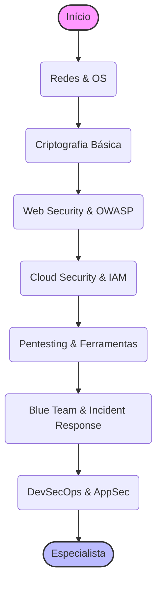

# 🔐 Trilha Cybersecurity: O Guardião Digital

> **Edição 2026:** Focado em Zero Trust, DevSecOps e Segurança de IA (AI Red Teaming).

```mermaid
flowchart TD
    Start([Início]) --> Base(Redes & OS)
    Base --> Crypto(Criptografia Básica)
    Crypto --> Web(Web Security & OWASP)
    Web --> Cloud(Cloud Security & IAM)
    Cloud --> Pentest(Pentesting & Ferramentas)
    Pentest --> Blue(Blue Team & Incident Response)
    Blue --> DevSec(DevSecOps & AppSec)
    DevSec --> Spec([Especialista])

    style Start fill:#f9f,stroke:#333,stroke-width:2px
    style Spec fill:#bbf,stroke:#333,stroke-width:2px
```

Em um mundo onde tudo está conectado, a segurança não é um "extra", é a fundação. O profissional de cibersegurança é o estrategista que protege os dados, a infraestrutura e a reputação das empresas contra ameaças cada vez mais sofisticadas.

Esta trilha está dividida em níveis para guiar sua evolução profissional.

---

## 🐣 Nível Iniciante (Júnior)

O foco aqui é entender como os computadores conversam e como trancar as portas digitais.

### 🌐 Redes e Protocolos (A Base de Tudo)

Você não pode proteger o que não entende.

- **Modelo OSI/TCP-IP:** Camadas de transporte, rede e aplicação.
- **Protocolos:** DNS (e DNS Sec), HTTP vs HTTPS (TLS/SSL), SSH, FTP.
- **Ferramentas:** Wireshark (analisar pacotes), Nmap (scan de portas).

### 🐧 Sistemas Operacionais & Hardening

- **Linux:** Permissões, logs (`/var/log`), firewall (`iptables`/`ufw`).
- **Windows:** Active Directory, Group Policies (GPO), PowerShell.
- **Hardening:** O processo de fechar brechas padrão (desabilitar serviços inúteis, fechar portas).

### 🔑 Criptografia Básica

- **Simétrica vs Assimétrica:** Chaves públicas e privadas.
- **Hashing:** Entenda que MD5/SHA-1 estão mortos. Use SHA-256 ou Argon2 para senhas.
- **Certificados Digitais:** Como funciona a confiança na web (PKI).

---

## 🚀 Nível Intermediário (Pleno)

Aqui você começa a atacar (para testar) e defender sistemas reais.

### 🕸️ Web Security (AppSec)

- **OWASP Top 10:** A bíblia das vulnerabilidades. SQL Injection, XSS, Broken Access Control.
- **Ferramentas:** Burp Suite (Proxy de interceptação), OWASP ZAP.

### ☁️ Cloud Security

A nuvem é o novo perímetro.

- **IAM (Identity and Access Management):** Princípio do Menor Privilégio. Nunca use chaves de root.
- **Segurança de Infra:** Security Groups, WAF (Web Application Firewall), VPCs privadas.
- **Compliance:** CIS Benchmarks para AWS/Azure.

### ⚔️ Pentesting Básico (Red Team)

- **Reconhecimento (Recon):** OSINT (Open Source Intelligence).
- **Exploração:** Metasploit Framework.
- **Escalação de Privilégio:** Como virar admin depois de entrar.

---

## 🧙‍♂️ Nível Avançado (Sênior / Especialista)

Onde você projeta arquiteturas resilientes e lidera a resposta a incidentes.

### 🛡️ DevSecOps & Pipeline Security

Segurança automatizada no ciclo de desenvolvimento.

- **SAST/DAST:** SonarQube, Snyk. Achar bugs antes do deploy.
- **Dependency Scanning:** Evitar vulnerabilidades em bibliotecas de terceiros (Log4Shell).
- **Container Security:** Trivy para scannear imagens Docker.

### 🚫 Zero Trust Architecture

"Nunca confie, sempre verifique."

- **Conceitos:** Micro-segmentação, autenticação contínua, acesso condicional.
- **BeyondCorp:** O modelo do Google que matou a VPN corporativa.

### 🚨 Blue Team & Incident Response

- **SIEM (Security Information and Event Management):** Splunk, Elastic Security. Centralizar logs para achar anomalias.
- **Threat Hunting:** Procurar ativamente por ameaças que passaram pelas defesas.
- **Forensics:** Analisar memória e disco para entender o que o atacante fez.

### ⚛️ Criptografia Pós-Quântica (PQC)

Computadores quânticos vão quebrar RSA e ECC em breve. Prepare-se agora.

- **Ameaça "Harvest Now, Decrypt Later":** Atacantes estão salvando dados criptografados hoje para quebrar no futuro.
- **Novos Padrões NIST:** Migre para algoritmos resistentes a ataques quânticos.
  - **Kyber (ML-KEM):** Para troca de chaves (Key Encapsulation).
  - **Dilithium (ML-DSA):** Para assinaturas digitais.

### 🤖 AI Security & AI Red Teaming (O Novo Front de 2026)

Onde há código, há vulnerabilidade. A Inteligência Artificial trouxe um oceano inteiro de novas superfícies de ataque para 2026.

- **OWASP Top 10 para LLMs:** A extensão natural das vulnerabilidades tradicionais aplicadas para a era GenAI.
- **Prompt Injection e Jailbreaking (Avançado):** Usuários forçando modelos corporativos a exfiltrarem chaves de banco de dados e senhas via injeção de comandos maliciosos disfarçados de linguagem natural.
- **Data Poisoning & Supply Chain Attacks (HuggingFace):** Risco de corromper o output de um modelo de IA ao importar pesos infectados do HuggingFace ou ao usar dados maliciosos durante o Fine-Tuning.
- **AI Red Teaming:** O papel mais valorizado em 2026. Você ataca seu próprio modelo, simulando atores maliciosos. Tenta fazê-lo gerar conteúdo tóxico ou vazar segredos financeiros, para que a equipe aplique o alinhamento adequado (Guardrails).
- **Model Theft (Roubo de Pesos):** Proteger o segredo industrial, o intelecto treinado do seu modelo LLM privado, contra vazamentos de instâncias.

### 🧠 Soft Skills & Diferencial Humano

- **Paranoia Saudável vs Usabilidade:** Segurança que impede o trabalho será contornada. Encontre o equilíbrio.
- **Comunicação sob Pressão:** Durante um ataque, a diretoria vai querer respostas. Aprenda a comunicar fatos sem causar pânico.
- **Curiosidade Infinita:** O hacker só precisa acertar uma vez; você precisa acertar sempre. Estude as novas técnicas de ataque antes que elas cheguem em você.

### 🏆 Desafios Práticos (Projetos)

- **Júnior:** Configure um servidor Linux em uma VM, feche todas as portas exceto SSH (com chave, sem senha) e configure um firewall (UFW). Use o Nmap para verificar se está seguro.
- **Pleno:** Suba uma aplicação vulnerável (ex: OWASP Juice Shop) em um container isolado e use o Burp Suite para explorar 3 vulnerabilidades do OWASP Top 10. Documente como corrigir.
- **Sênior:** Implemente um pipeline de CI/CD no GitHub Actions que bloqueie o deploy se encontrar segredos (chaves de API) no código ou vulnerabilidades críticas nas dependências (usando Trivy/Snyk).

---

## 📚 Materiais de Estudo Recomendados

Para formar o Desenvolvedor Completo em 2026 (do Júnior ao Especialista), reunimos os conteúdos mais atualizados e de altíssima qualidade do mercado:

### 🐣 Para Nível Júnior (Fundamentos de Redes, Linux e OWASP)

- **[TryHackMe (Plataforma Completa)](https://tryhackme.com/):** O lugar definitivo em 2026 para iniciar sua jornada, focado enormemente em fundamentos de Linux, TCP/IP, criptografia e vetores iniciais de penetração Web em uma abordagem super gamificada.
- **[OWASP Top 10 (Documentação)](https://owasp.org/www-project-top-ten/):** A cartilha mundial absoluta que baseia quase todo o escopo primário e avançado dos perigos lógicos para todas as aplicações web globais.
- **[PortSwigger Web Security Academy](https://portswigger.net/web-security):** Criado pelos fundadores do Burp Suite. Gratuito, moderno, com laboratórios gigantescos essenciais desde Injections até perigos baseados em OAuth e JWT.

### 🚀 Para Nível Pleno (DevSecOps e Offensive / Defensive Security)

- **[Hack The Box (HTB)](https://www.hackthebox.com/):** Mergulho aprimorado em "máquinas" complexas, testes diretos com ambientes Active Directory corporativos gigantes, engenharia reversa pesada e desafios fortíssimos contra as proteções e defesas modernas de sistemas operacionais.
- **[TruffleHog e CodeQL](https://trufflesecurity.com/trufflehog/):** Entre a fundo nas documentações e ecossistemas open-source sobre detecções corporativas pesadas de segredos, além de rastreamentos semânticos no código-fonte em processos contínuos de DevSecOps via pipelines no GitHub Actions e GitLab CI.
- **[CyberMentor / TCM Security](https://tcm-sec.com/):** Excelentes trilhas independentes sobre Ethical Hacking completo, análise pesada sobre Ransomwares corporativos em redes da empresa, mitigação, análise profunda de Malwares (Engenharia Reversa) e OSINT Avançado no mercado civil atual.

### 🏛️ Para Nível Sênior/Especialista (Zero Trust, eBPF e IA Red Teaming)

- **[CISA e NIST (Arquiteturas Globais de Confiança Zero - Zero Trust)](https://www.cisa.gov/zero-trust-maturity-model):** Todo especialista profundo se baseia em relatórios rigorosos criados pelo NIST. O conhecimento vital e holístico da matriz cibernética corporativa baseada exclusivamente nos modelos avançados e certificados na adoção mundial (RBAC/ABAC), arquitetura governamental de Confiança Zero.
- **[eBPF.io (Segurança Absoluta do Kernel via Cilium)](https://ebpf.io/):** Uma quebra histórica no isolamento de rede global e da segurança mundial através da execução rigorosa via máquinas virtuais isoladas internamente na estrutura monolítica do kernel do Linux sem dependência pesada baseada no IPTable, proporcionando filtragens na camada L7 em microsserviços modernos ultrarrápidos e seguros de maneira transparente às aplicações corporativas do lado do desenvolvedor.
- **[AI Red Teaming & OWASP Machine Learning Security Top 10](https://owasp.org/www-project-machine-learning-security-top-10/):** Domínio vital na Fronteira 2026 mundial abordando o estudo maciço contra a Injeção de Prompts indiretos massivos (Prompt Injection) invadindo frameworks de Inteligência Artificial na empresa, exfiltração oculta de modelos SLM/LLM rodando localmente (Data Poisoning) por invasores modernos globais que subvertem LLMs e desviam dados sigilosos e sensíveis dos processos automatizados de forma transparente e sutil (Sleeper Agents / Jailbreaks em LLMOps).
- **[PicoCTF (Carnegie Mellon University)](https://picoctf.org/):** Jogue Capture The Flag de alta classe universitária e foque intensamente em "Reverse Engineering", "Binary Exploitation" e Criptografia.
- **[AI Red Teaming (Microsoft / NVIDIA)](https://www.microsoft.com/en-us/security/blog/2023/08/07/microsoft-ai-red-team-building-future-of-safer-ai/):** Guias de elite sobre como hackear e auditar modelos fundacionais e LLMs com Prompt Injection, Jailbreaks estruturados e extração de dados.

---

## ↩️ Navegação

- [**Voltar para o Início**](../../index.md)
- [**Ver Conselhos de Carreira**](../../advices.md)
