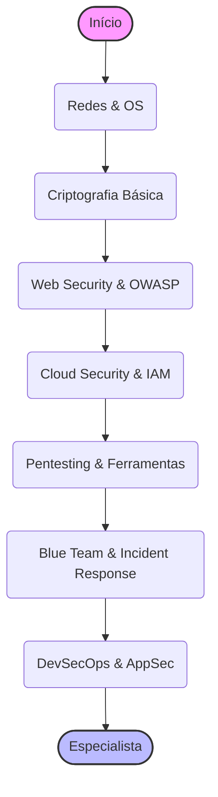

# 🔐 Trilha Cybersecurity: O Guardião Digital

> **Edição 2026:** Zero Trust, DevSecOps, cadeia de suprimentos, criptografia pós-quântica e segurança de IA (LLMs e agentes).

```mermaid
flowchart TD
    Start([Início]) --> Base(Redes & OS)
    Base --> Crypto(Criptografia Básica)
    Crypto --> Web(Web Security & OWASP)
    Web --> Cloud(Cloud Security & IAM)
    Cloud --> Pentest(Pentesting & Ferramentas)
    Pentest --> Blue(Blue Team & Incident Response)
    Blue --> DevSec(DevSecOps & AppSec)
    DevSec --> Spec([Especialista])

    style Start fill:#f9f,stroke:#333,stroke-width:2px
    style Spec fill:#bbf,stroke:#333,stroke-width:2px
```

Segurança faz parte do produto, não é etapa final. O profissional da área protege dados, infraestrutura e sistemas, e ajuda times a reduzir risco com controles práticos e mensuráveis.

Esta trilha está dividida em níveis para guiar sua evolução profissional.

---

## 🐣 Nível Iniciante (Júnior)

O foco aqui é entender como os computadores conversam e como trancar as portas digitais.

### 🌐 Redes e Protocolos (A Base de Tudo)

Você não pode proteger o que não entende.

- **Modelo OSI/TCP-IP:** Camadas de transporte, rede e aplicação. **Protocolos:** DNS (e DNSSEC), HTTP/HTTPS com TLS 1.3, HTTP/3 (QUIC), SSH, SMTP com SPF/DKIM/DMARC.
- **Ferramentas:** Wireshark (analisar pacotes), Nmap (scan de portas).

### 🐧 Sistemas Operacionais & Hardening

- **Linux:** Permissões, logs (`/var/log`), firewall (`iptables`/`ufw`). **Windows:** Active Directory, Group Policies (GPO), PowerShell.
- **Hardening:** O processo de fechar brechas padrão (desabilitar serviços inúteis, fechar portas).

### 🔑 Criptografia Básica

- **Simétrica vs Assimétrica:** Chaves públicas e privadas.
- **Hashing:** MD5 e SHA-1 não servem para segurança. Use SHA-256/SHA-3 para integridade e Argon2id (ou scrypt/bcrypt) para senhas.
- **Certificados Digitais:** PKI, ACME/Let's Encrypt e a redução da validade dos certificados TLS públicos (rumo a 47 dias), que exige automação da renovação.

### 🔐 Identidade e Autenticação

- **MFA e Passkeys (FIDO2/WebAuthn):** Passkeys resistem a phishing e substituem senhas. Prefira-as a SMS e TOTP quando possível.
- **OAuth 2.1, OpenID Connect e JWT:** Fluxos corretos (Authorization Code com PKCE) e erros comuns na validação de tokens.

---

## 🚀 Nível Intermediário (Pleno)

Aqui você começa a atacar (para testar) e defender sistemas reais.

### 🕸️ Web Security (AppSec)

- **OWASP Top 10:2025:** Referência para riscos web: Broken Access Control (continua em 1º), Security Misconfiguration, falhas na cadeia de suprimentos de software, falhas criptográficas, injeção (SQLi, XSS), design inseguro e tratamento inadequado de condições excepcionais. Confira a lista vigente no site da OWASP.
- **APIs:** OWASP API Security Top 10 (2023): BOLA, autenticação quebrada, SSRF. **Ferramentas:** Burp Suite (proxy de interceptação), ZAP (Checkmarx).

### ☁️ Cloud Security

A nuvem é o novo perímetro.

- **IAM (Identity and Access Management):** Princípio do Menor Privilégio. Nunca use chaves de root.
- **Segurança de Infra:** Security Groups, WAF (Web Application Firewall), VPCs privadas.
- **CSPM e IaC:** Escaneie Terraform/Kubernetes antes do deploy (Checkov, Trivy) e monitore a configuração em produção (Prowler, ScoutSuite).
- **Compliance:** CIS Benchmarks para AWS/Azure/GCP, LGPD, ISO/IEC 27001 e SOC 2.

### ⚔️ Pentesting Básico (Red Team)

- **Reconhecimento (Recon):** OSINT (Open Source Intelligence). **Exploração:** Metasploit Framework, Nmap Scripting Engine, sqlmap. Pratique apenas em ambientes autorizados.
- **Escalação de Privilégio:** Como virar admin depois de entrar.

---

## 🧙‍♂️ Nível Avançado (Sênior / Especialista)

Onde você projeta arquiteturas resilientes e lidera a resposta a incidentes.

### 🛡️ DevSecOps & Pipeline Security

Segurança automatizada no ciclo de desenvolvimento.

- **SAST/DAST:** CodeQL, Semgrep, SonarQube e ZAP no pipeline. Triagem de falsos positivos é parte do trabalho.
- **Dependências e Cadeia de Suprimentos:** SCA (Dependabot, Renovate, Snyk, OSV-Scanner), SBOM (CycloneDX/SPDX), assinatura com Sigstore/cosign, níveis SLSA e proteção contra pacotes maliciosos e typosquatting (ataques recentes a npm e PyPI).
- **Segredos:** Detecção com TruffleHog ou Gitleaks, push protection e rotação automática. Prefira credenciais efêmeras (OIDC) a chaves de longa duração no CI.
- **Containers e Kubernetes:** Trivy/Grype para imagens, Pod Security Standards, políticas com Kyverno ou OPA Gatekeeper, e detecção em runtime com Falco.

### 🚫 Zero Trust Architecture

"Nunca confie, sempre verifique."

- **Conceitos:** Micro-segmentação, autenticação contínua, acesso condicional.
- **Referências:** NIST SP 800-207 (Zero Trust Architecture) e o modelo de maturidade da CISA. BeyondCorp (Google) é um caso de estudo de acesso sem VPN tradicional.
- **Identidade como perímetro:** SSO, acesso condicional, privilégio just-in-time e proteção contra roubo de tokens de sessão.

### 🚨 Blue Team & Incident Response

- **SIEM, EDR/XDR e SOAR:** Splunk, Elastic Security, Microsoft Sentinel, Wazuh (open source). Centralize logs e automatize respostas repetitivas.
- **Detecção como código:** Regras Sigma, mapeamento no MITRE ATT&CK e testes de detecção. **Threat Hunting e Threat Intelligence:** Hipóteses baseadas em TTPs, não só em IOCs.
- **Resposta a incidentes:** Ciclo do NIST SP 800-61 (Rev. 3, alinhado ao CSF 2.0), playbooks, comunicação e exercícios de mesa. Ransomware: backups imutáveis e testados.
- **Forensics:** Memória (Volatility), disco e logs de nuvem. **Frameworks:** NIST Cybersecurity Framework 2.0 (inclui a função Govern) e CIS Controls v8.

### ⚛️ Criptografia Pós-Quântica (PQC)

Computadores quânticos capazes de quebrar RSA e ECC ainda não existem, mas dados com vida longa já correm risco.

- **"Harvest Now, Decrypt Later":** Tráfego cifrado hoje pode ser armazenado e decifrado no futuro.
- **Padrões NIST (agosto/2024):** **ML-KEM** (FIPS 203, baseado em CRYSTALS-Kyber) para troca de chaves, **ML-DSA** (FIPS 204, Dilithium) e **SLH-DSA** (FIPS 205, SPHINCS+) para assinaturas. O **HQC** foi selecionado em 2025 como algoritmo adicional de KEM.
- **Migração na prática:** Faça inventário criptográfico (CBOM), adote modo híbrido (ex.: X25519MLKEM768 no TLS, já disponível em navegadores e bibliotecas atuais) e planeje agilidade criptográfica. O NIST prevê desativar RSA/ECC de 112 bits até 2030 e proibi-los até 2035 (NIST IR 8547).

### 🤖 AI Security & AI Red Teaming

IA adiciona novas superfícies de ataque, principalmente quando modelos recebem ferramentas e acesso a dados.

- **OWASP Top 10 para LLMs (2025):** Prompt Injection, Divulgação de Informações Sensíveis, Cadeia de Suprimentos, Envenenamento de Dados e Modelos, Tratamento Inadequado de Saída, Agência Excessiva, Vazamento de System Prompt, Fraquezas em Vetores e Embeddings, Desinformação e Consumo Ilimitado. Há também o OWASP Top 10 para Aplicações Agênticas.
- **Prompt Injection (direta e indireta):** Instruções escondidas em e-mails, páginas ou documentos que o agente lê. Mitigação: privilégio mínimo, separação entre dados e instruções, confirmação humana para ações sensíveis, sandbox e filtragem de saída.
- **Segurança de MCP e agentes:** Servidores MCP não confiáveis, "tool poisoning", tokens com escopo amplo e exfiltração por ferramentas. Autentique com OAuth, restrinja escopos e revise servidores de terceiros como qualquer dependência.
- **Cadeia de suprimentos de modelos:** Pesos e datasets de hubs públicos podem conter código malicioso (pickle). Prefira o formato safetensors, verifique origem e escaneie artefatos.
- **AI Red Teaming:** Teste adversarial do seu próprio sistema com ferramentas como garak, PyRIT e promptfoo, guiado por MITRE ATLAS e NIST AI 100-2 (taxonomia de ataques adversariais).
- **Governança:** NIST AI RMF, ISO/IEC 42001 e EU AI Act.
- **IA na defesa e no ataque:** Triagem de alertas assistida por IA exige validação humana; atacantes também usam IA para phishing e deepfakes, o que reforça verificação fora de banda e passkeys.

### 🧠 Soft Skills & Diferencial Humano

- **Paranoia Saudável vs Usabilidade:** Segurança que impede o trabalho será contornada. Encontre o equilíbrio.
- **Comunicação sob Pressão:** Durante um ataque, a diretoria vai querer respostas. Aprenda a comunicar fatos sem causar pânico.
- **Curiosidade Infinita:** O hacker só precisa acertar uma vez; você precisa acertar sempre. Estude as novas técnicas de ataque antes que elas cheguem em você.

### 🏆 Desafios Práticos (Projetos)

- **Júnior:** Configure um servidor Linux em uma VM, feche todas as portas exceto SSH (com chave, sem senha) e configure um firewall (UFW). Use o Nmap para verificar se está seguro.
- **Pleno:** Suba uma aplicação vulnerável (ex: OWASP Juice Shop) em um container isolado e use o Burp Suite para explorar 3 vulnerabilidades do OWASP Top 10. Documente como corrigir e adicione um teste automatizado que impeça a regressão.
- **Sênior:** Implemente um pipeline de CI/CD no GitHub Actions que bloqueie o deploy se encontrar segredos (chaves de API) no código ou vulnerabilidades críticas nas dependências (usando Gitleaks/TruffleHog, Trivy ou OSV-Scanner), gere um SBOM e assine a imagem com cosign.
- **Especialista:** Escreva um agente com ferramentas MCP e ataque-o com prompt injection indireta. Documente as mitigações e meça a taxa de sucesso antes e depois.

---

## 📚 Materiais de Estudo Recomendados

Para formar o Desenvolvedor Completo em 2026 (do Júnior ao Especialista), reunimos os conteúdos mais atualizados e de altíssima qualidade do mercado:

### 🐣 Para Nível Júnior

- **[TryHackMe](https://tryhackme.com/):** Trilhas guiadas de Linux, redes, criptografia e web.
- **[OWASP Top 10](https://owasp.org/www-project-top-ten/):** Lista de riscos web, edição 2025.
- **[PortSwigger Web Security Academy](https://portswigger.net/web-security):** Laboratórios gratuitos, de injeções a OAuth e JWT.
- **[OverTheWire](https://overthewire.org/wargames/):** Wargames para treinar Linux e linha de comando.

### 🚀 Para Nível Pleno

- **[Hack The Box](https://www.hackthebox.com/):** Máquinas e cenários de Active Directory.
- **[TCM Security](https://tcm-sec.com/):** Cursos de ethical hacking e segurança de redes.
- **[OWASP Cheat Sheet Series](https://cheatsheetseries.owasp.org/):** Guias práticos de defesa por tema.
- **[Flaws.cloud](https://flaws.cloud/) e [CloudGoat](https://github.com/RhinoSecurityLabs/cloudgoat):** Prática de segurança em AWS.
- **[CodeQL](https://codeql.github.com/docs/) e [TruffleHog](https://github.com/trufflesecurity/trufflehog):** Análise de código e detecção de segredos no CI.

### 🏛️ Para Nível Sênior/Especialista

- **[NIST SP 800-207 (Zero Trust)](https://csrc.nist.gov/pubs/sp/800/207/final) e [CISA Zero Trust Maturity Model](https://www.cisa.gov/zero-trust-maturity-model):** Arquitetura e maturidade.
- **[NIST Post-Quantum Cryptography](https://csrc.nist.gov/projects/post-quantum-cryptography):** Padrões FIPS 203, 204 e 205 e guias de migração.
- **[NIST Cybersecurity Framework 2.0](https://www.nist.gov/cyberframework):** Estrutura de gestão de risco.
- **[MITRE ATT&CK](https://attack.mitre.org/) e [MITRE ATLAS](https://atlas.mitre.org/):** Técnicas de ataque a sistemas tradicionais e de IA.
- **[OWASP Top 10 para LLMs](https://genai.owasp.org/llm-top-10/):** Riscos de aplicações com IA generativa.
- **[Microsoft AI Red Team](https://learn.microsoft.com/en-us/security/ai-red-team/):** Guias e a ferramenta PyRIT.
- **[SLSA](https://slsa.dev/) e [Sigstore](https://www.sigstore.dev/):** Integridade da cadeia de suprimentos.
- **[eBPF.io](https://ebpf.io/) e [Cilium](https://cilium.io/):** Observabilidade e políticas de rede/segurança no kernel Linux.
- **[picoCTF](https://picoctf.org/):** CTFs de engenharia reversa, exploração e criptografia.

---

## ↩️ Navegação

- [**Voltar para o Início**](../../index.md) [**Ver Conselhos de Carreira**](../../advices.md)
